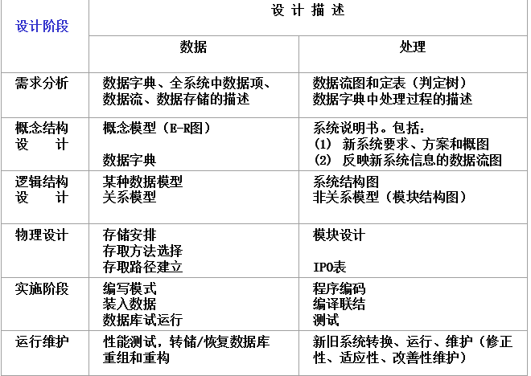
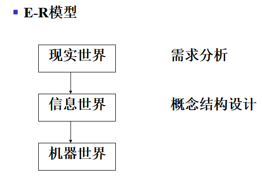
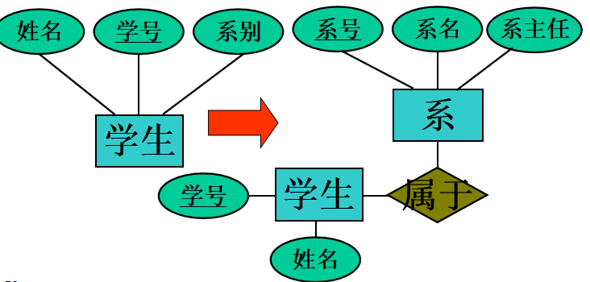
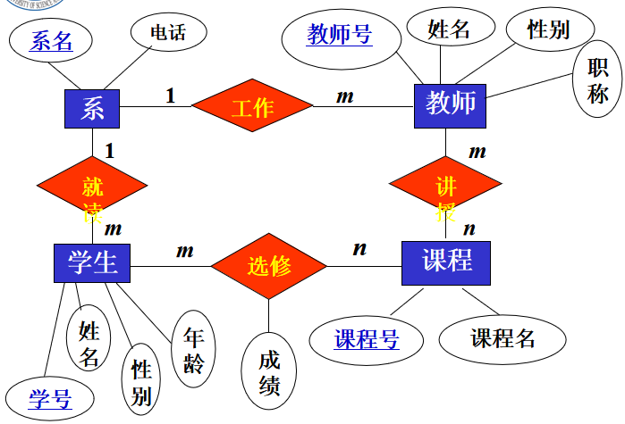

[toc]

# 10.1 数据库设计概述

## 10.1.1 数据库设计的任务和内容

- 根据用户需求研制数据库结构的过程
- **狭义的讲**：是设计数据库的各级模式并建立数据库。
- 详细解释：对于一个给定的应用环境，构造最优的数据库模式，建立**数据库**及其**应用系统**，使之能有效的存储，管理数据，满足用户的信息要求和处理要求。
- 数据库设计的内容：**静态结构设计**+**动态行为设计**
  - 数据库模式/子模式设计，模式是**静态**的、稳定的
  - 用户的行为与动作，即应用程序的设计，是**动态**的。

## 10.1.2 数据库设计的特点

- 硬件、软件与干件相结合

  三分技术，七分管理，十二分基础数据（数据收集，整理，组织，更新才是数据库建设中的重要环节）

- 反复设计、逐步求精

- 结构设计与行为设计相结合

## 10.1.3 数据库设计的方法

### 直观设计法(手工试凑法)

纯手工试咯。

### 规范设计法

- 基于E-R模型的数据库设计方法 

- ==基于3NF==的数据库设计方法

  > 模式中不符合3NF的约束条件，将其进行投影分解，规范成若干个3NF关系模式的集合。
  >
  > 2NF——**非主属性**都要**完全函数依赖**依赖于码
  >
  > 3NF——则每一个==非主属性==既不部分依赖于码也不传递依赖于码，消除了非主属性的传递依赖。

  

- 基于视图的数据库设计方法

  其基本思想是为每个应用建立自己的视图，然后再把这些视图汇总起来合并成整个数据库的概念模式

规范设计法从<u>本质上来说仍然是**手工设计方法**</u>，其基本思想是**过程迭代**和**逐步求精**。

### 计算机辅助设计法

以人的知识或经验为主导，通过人机交互方式实现设计中的某些部分。

### 自动化设计法。

## 10.1.4 数据库设计的步骤

也就是后面几部分的内容

- 需求分析阶段
  综合各个用户的应用需求

- 概念设计阶段
  形成独立于机器特点，独立于各个DBMS产品的概念模式(E-R图)

  > 上述两个阶段可独立于任何DBMS

- 逻辑设计阶段

  - 首先<u>将E-R图转换成具体的数据库产品支持的数据模型</u>，如关系模型，形成数据库逻辑**模式**
  - 然后根据用户处理的要求、安全性的考虑，在基本表的基础上再建立必要的视图(View)，形成数据的**外模式**

- 物理设计阶段
  根据DBMS特点和处理的需要，进行物理存储安排，建立索引，形成数据库**内模式**

# 10.2 需求分析

### 10.2.1 需求分析的任务

- 通过详细调查现实世界要处理的对象（组织、部门、企业等），充分了解原系统（手工系统或计算机系统）工作概况，**明确用户的各种需求**
- 在此基础上**确定新系统的功能**。新系统必须充分考虑今后可能的扩充和改变，不能仅仅按当前应用需求来设计数据库
- 需求分析的**重点**是调查、收集与分析用户在数据管理中的<u>信息要求、处理要求、安全性与完整性要求。</u>
- 提交需求说明文档

### 10.2.2 需求分析的过程

1. 发现和分析问题
2. 获取需求
3. 归档和分析需求
4. 编写需求文档
5. 需求评审
6. 需求管理

### 10.2.3 需求分析的方法

- 调查组织机构情况
  组织部门的组成情况
  各部门的职责等
- 调查各部门的业务活动情况。调查重点之一。
  各个部门输入和使用什么数据
  如何加工处理这些数据
  输出什么信息
  输出到什么部门
  输出结果的格式是什么
- 在熟悉业务活动的基础上，协助用户明确对新系统的各种要求。调查重点之二。
  信息要求
  处理要求
  完全性
  完整性要求
- 对前面调查的结果进行初步分析
  确定新系统的边界
  确定哪些功能由计算机完成或将来准备让计算机完成
  确定哪些活动由人工完成
- 分析与表达用户需求常用的方法
  面向数据的方法 
  面向过程的方法
- 结构化分析(Structured Analysis, SA)方法
  从最上层的系统组织结构入手，采用自顶向下、逐层分解的方式分析系统
  用数据流图和数据字典描述系统

### 10.2.4 数据流图与数据字典:arrow_up_small:

- 数据字典是**各类数据描述的集合**
- 数据字典是进行详细的数据收集和数据分析所获得的主要结果
- 数据字典在数据库设计中占有很重要的地位

> “它是关于数据库中数据的描述，即元数据，而不是数据本身。数据字典是在需求分析阶段建立，在数据库设计过程中不断修改，充实，完善的。它在数据库中占很重要的地位。

- 数据字典的内容

  1. 数据项

     - 数据项是**不可再分的数据单位**

     - 数据项描述＝｛数据项名，数据项含义说明，别名，数据类型，长度，取值范围，取值含义，与其他数据项的逻辑关系｝

     - 取值范围、与其他数据项的逻辑关系定义了数据的完整性约束条件

       > 数据项：　学号
       > 含义说明：唯一标识每个学生
       > 别名：　　学生编号
       > 类型：　　字符型
       > 长度：　　 8
       > 取值范围：00000000至99999999
       > 取值含义：前两位标别该学生所在年级，后六位按顺序编号
       > 与其他数据项的逻辑关系：

  2. 数据结构

     - 数据结构**反映了数据之间的组合关系**。

     - **一个数据结构可以由若干个数据项组成**，也可以由若干个数据结构组成，或由若干个数据项和数据结构混合组成。

     - 数据结构描述＝｛数据结构名，含义说明，组成:｛数据项或数据结构｝｝

       > 数据结构：　学生
       > 含义说明：　是学籍管理子系统的主体数据结构，定义了一个学生的有关信息
       > 组成：　　学号，姓名，性别，年龄，所在系，年级

  3. 数据流

     - 是**数据结构在系统内传输的路径**

     - 数据流描述＝｛数据流名，说明，数据流来源，数据流去向，组成:｛数据结构｝， 平均流量，高峰期流量｝

     - 数据流来源是说明该数据流来自哪个过程

     - 数据流去向是说明该数据流将到哪个过程去

     - 平均流量是指在单位时间（每天、每周、每月等）里的传输次数

     - 高峰期流量则是指在高峰时期的数据流量

       > ​    数据流：　　体检结果
       > ​    说明：　　　学生参加体格检查的最终结果
       > ​    数据流来源：体检
       > ​    数据流去向：批准
       > ​    组成：　　　……
       > 　平均流量：　……
       > 　高峰期流量：……

  4. 数据存储

     - 数据存储是**数据结构停留或保存的地方**，也是**数据流的来源和去向之一**。

     - 数据存储描述＝｛数据存储名，说明，编号，流入的数据流 ，流出的数据流 ，组成:｛数据结构｝，数据量，存取方式｝

       > ​    数据存储：　学生登记表
       > ​    说明：　　　记录学生的基本情况
       > 　流入数据流：……
       > ​    流出数据流：……
       > ​    组成：　　　……
       > ​    数据量：　　每年3000张
       > ​    存取方式：　随机存取

  5. 处理过程

     - 处理过程的具体处理逻辑一般用判定表或判定树来描述。数据字典中只需要描述处理过程的说明性信息

     - 处理过程描述＝｛处理过程名，说明，输入:｛数据流｝，输出:｛数据流｝，处理:｛简要说明｝｝

       > 　处理过程：分配宿舍
       > 　说明：　　为所有新生分配学生宿舍
       > 　输入：　　学生，宿舍，
       > 　输出：　　宿舍安排
       > 　处理：　　在新生报到后，为所有新生分配学生宿舍。要求同一间宿舍只能安排
       >                     同一性别的学生，同一个学生只能安排在一个宿舍中。

- **数据项是数据的最小组成单位**

- **若干个数据项可以组成一个数据结构**

- 数据字典通过对数据项和数据结构的定义来描述数据流、数据存储的逻辑内容。

# 10.3 概念结构设计

### 10.3.1  概念结构设计概述

### 10.3.2  概念结构设计的方法与步骤

设计概念结构的E-R模型可采用四种方法

- 自顶向下(先全局，再细化)
- 自底向上(先局部，再集成)
- 逐步扩张(先定义最重要的核心概念E-R模型，然后向外扩充，以滚雪球的方式逐步生成其他概念结构E-R模型)
- 混合策略。该方法采用自顶向下和自底向上相结合的方法，先自顶向下定义全局框架，再以它为骨架集成自底向上方法中设计的各个局部概念结构

### 10.3.3  数据抽象与局部视图设计

数据抽象的目的

- 确定实体
- 确定属性
- 确定实体间的联系

为了简化E-R图，能作为属性对待的就尽量作为属性对待。

实体与属性是相对的，如何区分?

- ==实体还可以有自已的描述信息(属性)，**属性不能具有需要再进一步描述的性质**==
- 属性不能与其它实体具有联系
- 联系只发生在实体间

例:学生由学号，姓名，系别等性质进一步描述，所以学生只能作实体，而系别又由系名，办公地，系主任等进一步描述，所以系别需独立成实体

### 10.3.4  E-R图的集成

- E-R图集成（P227）
  - 多元集成(一次集成)
  - 二元集成(累计集成)
- 集成的步骤
  - 合并：消除冲突（P229）
  - 优化：消除冗余
- 解决冲突
  - 属性冲突
    - 值、域、类型冲突(如年龄,学号有的定义的域不一样，有的类型不一样)
    - 计量单位冲突(身高:尺/cm/m)
  - 命名冲突
    - 同名异义
    - 异名同义(课本/教科书)
  - 结构冲突
    - 同一对象，有时为属性有时为实体
    - 同一实体属性集不同
    - 联系的类型在不同的局部表现不同

#### 视图集成

- 消除冗余（P230 图7.26）
  冗余的数据是指可由基本数据导出的数据
  冗余的联系是指可由其他联系导出的联系 
- 可参考规范化理论
- **不是所有的冗余都需消除，应根据整体需求取舍**
- 消除不必要的冗余后的初步E-R图称为基本E-R图

# 10.4 逻辑结构设计(==重点看下这部分==)

> 这道题目通常有一大段文字，首先会让你画出相关的E-R图，标明主码和外码，然后通过该E-R图给出你的转化生成的关系模式，所以需要熟练掌握的是E-R图的相关概念，和转化的一些原则

## 10.4.1  E-R图向关系模型的转换:smiling_imp:

- 一个实体型转化为一个关系模式

  - 关系的属性 = 实体的属性
  - 关系的码 = 实体的码

  > 实体就是可以直接转化，不用管。
  >
  > 关键是联系的转化。

  

- 一个n:m**联系**也可以转化为一个关系模式

  - 关系的属性 = 各实体的码 + 联系本身的属性
  - 关系的码 = 各实体码的组合
  - （也适用于两个实体以上的多对多联系）

- 一个1:n**联系**可以转换为一个独立的关系模式，也**可以与n端对应的关系模式合并**

  - 转换为独立的关系模式
    - 关系的属性 = 各实体的码 + 联系本身的属性
    - 关系的码 = n端实体的码 
  - 与n端实体对应的关系模式合并
    - 合并后关系的属性 = **在n端关系中加入1端关系的码和联系本身的属性**（要合并到n端那边）
    - 合并后关系的码 = 不变
  - 为减少关系模式的个数，一般采用后者

- 一个1:1联系可以转换为一个独立的关系模式，**也可以与任意一端对应的关系模式合并**

  - 转换为独立的关系模式
    - 关系的属性 = 各实体的码 + 联系本身的属性
    - 关系的码 = 每个实体的码都是候选码 
  - 与某一端实体对应的关系模式合并
    - 合并后关系的属性 = 加入对应关系的码和联系本身的属性
    - 合并后关系的码 = 不变
  - 为减少关系模式的个数，一般采用后者

- 具有相同码的关系模式可以合并、

四个实体:

- 学生（<u>学号</u>，姓名，性别，年龄）
- 课程（<u>课程号</u>，课程名）
- 教师（<u>教师号</u>，姓名，性别，职称）
- 系（<u>系名</u>，电话）

四个联系:

- 工作（<u>教师号</u>，系名）-- 1:n，可合并至教师
- 讲授（<u>教师号</u>，<u>课程号</u>）
- 选修（<u>学号</u>，<u>课程号</u>，成绩）
- 就读（系名，<u>学号</u>）-- 1:n,可合并至学生

然后变成

- 学生（<u>学号</u>，姓名，性别，年龄, 系名）
- 课程（<u>课程号</u>，课程名）
- 教师（<u>教师号</u>，姓名，性别，职称，系名）
- 系（<u>系名</u>，电话）
- **讲授（<u>教师号</u>，<u>课程号</u>）**
- **选修（<u>学号</u>，<u>课程号</u>，成绩）**

同一实体的自联系也可参照前述三种情况分别处理
具有相同码的关系可以合并

- 目的:减少关系的个数
- 方法:将其中一个关系模式的全部属性加入到另一个关系模式中，然后去掉其中的同义属性（可能同名也可能不同名），并适当调整属性的次序。

## 10.4.2  向特定DBMS规定的模型进行转换

## 10.4.3  数据模型的优化

以规范化理论为指导(P233)

- 确定数据依赖

- 确定范式的级别

- 根据实际需求，决定是否分解或合并，以期达到更高范式或降成更低一级的范式

- ==并不是规范化关系程度越高的关系就越优==

- 常用的分解方法: 水平分解，垂直分解

  > 水平分解：把关系的元组分为若干子集和，根据二八原则分
  >
  > 垂直分解：把关系的属性分成若干子集和，把常用的属性分出来。
  >
  > 这样做能提高某些事务的效率。

## 10.4.4  设计用户子模式

一般是利用视图来实现

- 定义数据库模式主要是从系统的时间效率、空间效率、易维护等角度出发。
- 定义用户外模式时应该更注重考虑用户的习惯与方便。包括三个方面：
  - 使用更符合用户习惯的别名，有些属性名不直观。
  - **针对不同级别的用户定义不同的视图，以满足系统对安全性的要求**
  - 简化用户对系统的使用（将复杂的查询定义为视图）

# 10.5 数据库的物理设计

什么是数据库的物理设计

- 数据库在物理设备上的**存储结构**与**存取方法**称为数据库的物理结构，它依赖于给定的计算机系统
- 为一个给定的逻辑数据模型选取一个**最适合应用环境的物理结构**的过程，就是数据库的物理设计

数据库物理设计的步骤

- 确定数据库的物理结构
- 对物理结构进行评价，评价的重点是**时间和空间效率**
- 如果评价结果满足原设计要求则可进入到物理实施阶段，否则，就需要重新设计或修改物理结构，有时甚至要返回逻辑设计阶段修改数据模型。

## 10.5.1  数据库的物理设计的内容和方法

- 为关系模式选择**存取方法**(建立存取路径)
- 设计关系、索引等数据库文件的**物理存储结构**

## 10.5.2  关系模式存取方法选择

### DBMS常用存取方法

- 索引方法，目前主要是B+树索引方法
- 聚簇（Cluster）方法
- HASH方法

### 索引存取方法的选择

- 对哪些属性列建立索引
- 对哪些属性列建立组合索引
- 对哪些索引要设计为唯一索引

### 1.选择B+树索引存取方法的一般规则

- 如果一个(或一组)属性<u>经常在查询条件中出现</u>，则考虑在这个(或这组)属性上建立索引(或组合索引)
- 如果一个属性<u>经常作为最大值和最小值</u>等聚集函数的参数，则考虑在这个属性上建立索引
- 如果一个(或一组)属性<u>经常在连接操作的连接条件中出现</u>，则考虑在这个(或这组)属性上建立索引

关系上定义的索引数过多会带来较多的额外开销 

### 2.Hash索引存取方法的选择

当一个关系满足下列两个条件时，可以选择HASH存取方法

1. 一个关系**大小可预知，而且不变**
2. 关系的大小动态改变，但DBMS提供了动态hash存取方法

### 3.聚簇存取方法的选择

#### 什么是聚簇

​	为了提高**某个属性（或属性组）的查询速度**，把这个或这些属性（称为聚簇码）上具有相同值的元组**集中存放**在连续的**物理块**称为聚簇

#### 为何需要索引

聚簇索引可以**大大提高按聚簇码进行查询的效率**。例如要查信息系的所有学生名单，假设信息系有500人，在极端情况下，这500人对应的数据元组分布在500个不同的物理块上，尽管有索引，避免全表扫描，但还是要进行500次I/O操作。如果击中存放，则**显著减少访问磁盘次数**。

#### 聚簇索引

- 建立聚簇索引后，基表中数据也需要按指定的聚簇属性值的升序或降序存放。也即聚簇索引的
- ==索引项顺序与表中元组的物理顺序一致。==
- 在<u>一个基本表上最多只能建立一个聚簇索引</u>
- 聚簇索引的用途：对于某些类型的查询，可以提高查询效率

#### 选取原则

1. 经常一起进行连接操作的关系可以建立聚簇
2. 一个关系的一个（或一组）属性上的值==重复率很高==。
3. 一个关系的一组属性==经常出现在相等的比较条件中==

总之，**每个聚簇码值的平均元组数不能太少**，太少了聚簇的效果不明显。

## 10.5.3  确定数据库的存储结构

确定数据库物理结构的内容

1. 确定数据的存放位置和存储结构
   - 关系
   - 索引
   - 聚簇
   - 日志
   - 备份
2. 确定系统配置 

# 10.6 数据库实施

- 数据库实施是指根据逻辑设计和物理设计的结果，在计算机上建立起实际的数据库结构、装入数据、进行测试和试运行的过程。
- 数据库实施主要包括以下工作：
  - 建立实际数据库结构(DDL)；
  - 装入数据；
  - 应用程序编码与调试；
  - 数据库试运行；
  - 整理文档。

# 10.7 数据库运行和维护

数据库运行和维护阶段的主要任务包括：

- 数据库的转储与恢复
- 据库的安全性与完整性控制
- 数据库性能的监督、分析与改造
- 数据库的重新组织和重新构

# 10.8 小结：数据库的设计过程

- 需求分析(数据流图，数据字典)
- 概念结构设计(E-R图)
- 逻辑结构设计(关系模式)
- 物理设计(索引,存储)
- 实施(定义，数据装入)
- 运行维护

**设计过程中往往还会有许多反复。**

