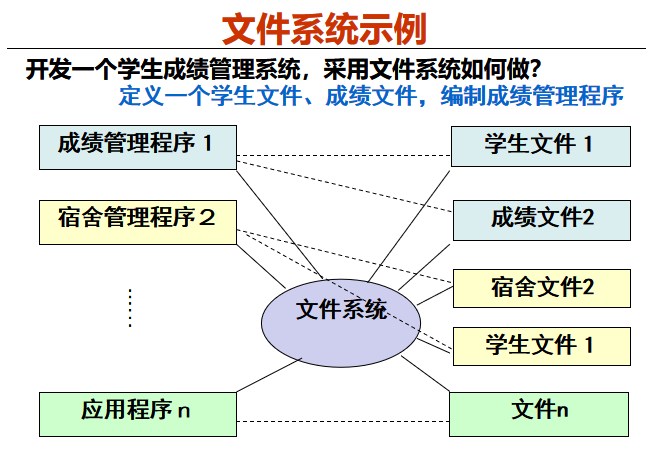

[TOC]

# 1.1 数据库系统概论                                                                                 

几个问题可以思考

- 什么是数据库系统？   位于用户与操作系统之间的一层数据管理的系统软件
- 产生DBMS的动机是什么？   文件系统的缺陷，计算机技术的成熟，需求的推动。
- 如何设计数据库？     后面的数据库设计里有
- DBMS的结构？       三级模式，二级映像
- 数据库系统的组成？    
- 从外部应用程序员的角度 ——如何使用数据库？
- 从数据库设计员的角度——如何构建数据库？
- 从内部系统组成的角度——如何实现数据库系统软件？

## 1.1.1 四个基本概念

数据(Data)：描述事物的==符号记录==，数据库中存储的基本对象。

数据库(DB)：是**长期储存**在计算机内、**有组织的**、**有关联的**、**可共享**的**大量数据**的==集合==。

数据库管理系统（DBMS）：位于用户与操作系统之间的一层数据管理==**系统软件**==，由一组相互关联的数据集合和一组访问这些数据的程序组成 。

数据库系统（DBS）：在计算机系统中引入数据库后的**系统构成**，能提供数据存储、数据访问、数据共享，支持多进程安全并发访问及异常处理 。<u>一般由DB，DBMS，应用系统，数据库管理员和用户构成</u>。

> 一般常把数据库系统简称为数据库。
>
> 下图就是

### 系统如何理解数据的语义？

数据是有语义的，存放在计算机内的数据DBMS按照什么规则理解其语义

> 例如  字符串‘李明男197205江苏南京市计算机系1990’语义是什么

### 数据库中的数据如何组织？

按**一定的数据模型**组织、描述和储存

- 可为各种用户共享
- 冗余度较小
- 数据独立性较高
- 易扩展

### DBMS的职责？

**科学地组织和存储数据、高效地获取和维护数据**，为应用提供一个高效的数据支撑环境

### 数据库系统（DBS）包括哪些？(上面也提到了)

- 数据库(DB)
- 数据库管理系统(DBMS)（及其开发工具）
- 应用系统
- 数据库管理员 （DBA，DataBase Administrator)

## 1.1.2 数据管理技术的产生和发展

人工管理阶段->文件管理阶段->数据库系统阶段

### DBMS的产生动机

- 应用**需求的推动**
- 计算机硬件，软件的发展

> 就是动力和条件都有了

### 文件系统管理数据

#### 相对于人工管理阶段的优点

1. 数据可以长期保存
2. 由文件系统管理数据（人工管理阶段是由应用程序来管理数据）

#### 存在问题

1. 独立性差
     对现有数据再加一些新应用会很困难，系统不易扩充。
2. 文件系统数据**冗余大，共享性差**
     冗余是应为都要各自建立文件。就算有相同的数据也是一样。不能共享。
3. 应用程序**希望模糊查询**
     文件系统一次一个记录的方式不支持
4. **完整性问题**
    数据库中数据必须满足一致性约束，如**学号唯一**，只能通过**`应用程序来保证`**	
5.  **故障恢复**
    计算机系统出现异常，数据库中数据应恢复到故障前状态文件系统不保证这种原子性问题。例如，**转账问题**
6.  **共享数据并发访问异常**
    文件系统只提供互斥访问共享数据，不考虑并发中的一致性保证。如，**对同一账号的两个并发取款操作**	
7.  **安全性问题**
    数据库中共享数据要求更高的共享保护，文件系统中由于应用程序与数据**密切**结合，难于保证

#### 解决方案

- 开发一种比文件系统更加强大的数据管理系统，将数据的<u>**结构语义、关联关系、冗余消除**</u>等交给该系统管理，并提供**一次一集合**的数据访问方式。

- 使用资源抽象、资源共享等**虚拟技术**，自动保证数据并发共享访问的安全性、隔离性。每个应用对各自的虚拟数据库操作，系统保证虚拟资源到物理资源的**映射**，保证物理数据库的**一致性、完整性**

- 能自动解决**共享异常、原子性、完整性**问题

  

### 数据库系统的目的

给用户提供整体数据的**抽象视图**，将磁盘上的所有物理数据集合抽象成整体结构化的**虚拟数据**，**隐藏了细节**。

系统通常采用**三层抽象**来完成：视图层、逻辑层、物理层

## 1.1.3  数据库系统的特点

### 数据结构化（是与文件系统的根本区别）

==整体数据的结构化是数据库的主要特征之一==，同时也是与文件系统的根本区别

整体结构化的含义

- 不再仅仅针对某一个应用，而是**面向全组织**
- 不仅数据内部结构化，整体是结构化的，**数据之间具有联系**

数据库中实现的是数据的真正结构化

- 数据的结构**用数据模型描述**，无需程序定义和解释
- 数据可以变长
- 数据的最小存取单位是数据项

### 数据的共享性高，冗余度低，易扩充

数据库系统从整体角度看待和描述数据，数据面向整个系统，可以被多个用户、多个应用共享使用。

数据共享的好处

- 减少数据冗余，节约存储空间
- 避免数据之间的不相容性与不一致性 
- 使系统**易于扩充**

但是显然使实现难度增加了。

### 数据独立性高

- 物理独立性

  指用户的应用程序与存储在磁盘上的数据库中数据是相互独立的。当数据的**物理存储改变了，应用程序不用改变。**数据再数据库中的存储方式由DBMS管理的，用户不需要了解。

- 逻辑独立性
  
  指用户的应用程序与数据库的逻辑结构是相互独立的。数据的**逻辑结构改变了，用户程序也可以不变。**

> 这两个数据独立性是由DBMS的**二级映像功能**来保证的，DBMS能够提供两级独立性

---

### 数据由DBMS统一管理和控制

DBMS提供的数据控制功能 (就是7-10这四章的内容)

1. 数据的安全性（Security）保护

     保护数据，以防止不合法的使用造成的数据的泄密和破坏。

2. 数据的完整性（Integrity）检查

     将数据控制在有效的范围内，或保证数据之间满足一定的关系

3. 并发（Concurrency）控制

     对多用户的并发操作加以控制和协调，防止相互干扰而得到错误的结果。

4. 数据库恢复（Recovery）

     将数据库从错误状态恢复到某一已知的正确状态。

# 1.2 数据模型

数据模型：是一种描述数据、数据联系、数据语义及一致性约束的**抽象工具**，就是**现实世界的模拟**。
<u>通常由 数据结构，数据操作，数据完整性约束条件三部分组成。</u>

> 1. 数据结构
>    描述数据库的组成<u>对象以及对象之间的联系</u>。
>    非常重要，一般按数据结构的类型来命名数据模型（也可以说是按逻辑模型命名数据模型）
>    网状结构就命名为网状模型
> 2. 数据操作
>    数据库中各种对象的值允许的<u>操作的集合和相关规则</u>
> 3. 数据完整性约束条件
>    实体完整性，参照完整性，用户自定义完整性。

数据库设计：用数据模型这个工具来抽象、表示和处理现实世界中的数据和信息。

## 1.2.1  两类数据模型

1. 概念模型**==（E-R模型）==**
     按用户的观点来对数据和信息建模，用于数据库设计，主要基于对现实世界的这样一种认识：<u>现实世界是由一组称为实体的基本对象以及这些对象间的联系组成</u> 
2. 数据模型 ==（ 逻辑模型和物理模型 ）==
   	  - **逻辑模型**主要包括<u>网状模型、层次模型、**关系模型（要学的）**</u>、面向对象模型等，按计算机系统的观点对数据建模，用于DBMS实现。
      -  **物理模型是对数据最底层的抽象**，<u>描述数据在系统内部的表示方式和存取方法</u>，在磁盘或磁带上的存储方式和存取方法。

## 1.2.2  概念模型（E-R模型）

- 实体(Entity)   客观存在并可相互区别的事物，可以是具体的人、物或抽象的概念。

- 属性(Attribute)    实体所具有的<u>某一特性</u>称为属性。实体可以由若干个属性来刻画。 

- 域(Domain)      属性的<u>取值范围</u>称为该属性的域。

- 实体型(Entity Type)  用**实体名及其属性名集合**来抽象和刻画<u>同类实体</u>，例如**学生（学号，姓名....）**就是一个实体型，（也可以说是<u>关系模式</u>）

- 实体集(Entity Set)  同一类型实体的集合称为实体集，例如**全体学生**。

- 码（key)      可以**<u>唯一标识实体</u>**的<u>最小属性集</u>称为码。

- 联系 （Relationship)  现实世界中事物内部以及事物之间的联系。例如1:1，1:n ，m:n这样的。

  **实体内部**的联系指组成实体的**各属性之间**的联系 
  **实体之间**的联系通常是指**不同实体集之间**的联系

## 1.2.3 关系模型

逻辑模型中，层次模型和网状模型都有缺点[^1]，现在用的最广泛的是关系模型。

> 它两又被称作非层次模型。
>
> 用层次模型的话，现实中许多联系是非层次的，例如多对多联系。
>
> 而网状模型结构比较复杂，用户不易掌握，其DDL,DML语言也复杂，不易使用

| **关系术语** |        **一般表格的术语**        |
| :----------: | :------------------------------: |
|    关系名    |               表名               |
|   关系模式   |        表头（表格的描述）        |
|     关系     |          （一张）二维表          |
|     元组     |             记录或行             |
|     属性     |                列                |
|    属性名    |               列名               |
|    属性值    |               列值               |
|     分量     | 一条记录（一行）中的**一个列值** |
|  非规范关系  |    表中有表（大表中嵌有小表）    |

> 关系模式就是对关系的描述，一般表示为
>
> ​	关系名（属性1，属性2，.....）

### 优点

​		关系模型把**存取路径向用户隐蔽起来**（即**存储路径对用户透明**），用户只需指出“干什么”，“找什么”，不需告知“怎么干”，“怎么找”。从而<u>大大提高了数据的独立性</u>，提高了用户的生产率。

​		概念单一，建立在严格的数学基础上。

### 缺点

​	存取路径对用户透明，导致**查询效率**不如非关系数据模型，因此为了提高性能，**需对用户的查询请求优化。增加了开发DBMS的难度**

# 1.3 数据库系统的结构[^2]

从数据库应用开发人员的角度看，数据库系统通常采用**三级模式结构**，这是数据库系统内部的系统结构

## 1.3.1数据库系统程序结构

几个简写：

1. DDL 数据定义语言  即Creat
2. DML 数据操纵语言 即Select,insert,delate,update等
3. DCL 数据控制语言 即 Grant,revock这种授予权限的。

## 1.3.2 数据库系统中数据结构

“型” 和“值” 的概念 ——分别存放在**数据文件**和**字典**中
型(Type)：对某一类数据的结构和属性的说明
值(Value)：是型的一个具体赋值

> 例如 学生记录型：(有点像那个<u>关系模式</u>，就是没有写表名而已)
>     （学号，姓名，性别，系别，年龄，籍贯）
> 一个记录值：
>     （900201，李明，男，计算机，22，江苏）

### 数据库系统的三级模式结构

#### 模  式（Schema）

> **仅涉及型，不涉及具体的值**，一个数据库只有一个。

- 模式（也称逻辑模式）
  - 数据库中==全体数据的<u>逻辑结构</u>和<u>特征</u>==的描述
  - 所有用户的公共数据视图，综合了所有用户的需求
- ==一个数据库只有一个模式==
- 模式的地位：是数据库系统模式结构的**中间层**
  - **与数据的物理存储细节和硬件环境无关**
  - 与具体的应用程序、开发工具及高级程序设计语言无关
- 模式的定义
  - 数据的逻辑结构（数据项的名字、类型、取值范围等）
  - 数据之间的联系
  - 数据有关的安全性、完整性要求

#### 外模式（External Schema）

> 通常是模式的子集。可有多个

- 外模式（也称子模式或用户模式）
  - 数据库用户（包括应用程序员和最终用户）使用的==**局部数据**的逻辑结构和特征==的描述
  - 数据库用户的数据**视图**，是与某一应用有关的数据的逻辑表示
- 外模式的地位：**介于模式与应用之间**
  - 模式与外模式的关系：一对多
    	一个数据库的多个外模式反映了不同的用户的应用需求。对模式
    中同一数据，在外模式中的结构类型、保密级别等可以不同
    
  - 外模式与应用的关系：一对多
      同一外模式也可以为某一用户的多个应用系统所使用
      
  - 但**一个应用程序只能使用一个外模式**
    
      > 看前面那个图很容易理解，就把它理解为视图也行
  
- 是**保证数据库安全的一个有力措施**，每个用户只能看见和访问对应外模式中的数据，数据库中的其他数据是不可见的。

#### 内模式（Internal Schema）

> 一个数据库只有一个内模式
> 内部存储方式

- 是数据物理结构和存储方式的描述
- 是数据在数据库内部的**组织方式**
  - 记录的存储方式（顺序存储、**B树结构**、hash存储）
  
  - 索引的组织方式（**B+树索引**，hash索引）
  
  - 数据是否压缩存储，是否加密
  
    >  B树B+树可见数据结构，简单的说，B数的叶子节点是空的，意味着查找失败，B+树的叶节点才有信息，其他节点都是索引。王道数据结构2019版P251

## 1.3.3 数据库的二级映像功能与数据独立性

> 三级模式是对数据的三个抽象级别
> 二级映象在**DBMS内部**实现这三个抽象层次的**联系和转换**
>
> 这里不需要说外模式变了怎么办，要改变外模式，删了重新建一个就是，反正是1:n的关系，只有模式，和内模式是惟一的，改变之后的处理要做好。
>
> 具体实现细节不需要知道，知道这两个映像就行。

### 1   外模式／模式映像

外模式反应数据的局部逻辑结构，模式反应数据的全局逻辑结构。

> 保证数据的**逻辑独立性** 
>
> 对每一个外模式，都有一个此映象

​	当**模式改变**时[^3]，数据库管理员修改有关的==外模式／模式映象==，使**外模式保持不变** 
​	应用程序是依据数据的外模式编写的，从而**<u>应用程序不必修改</u>**，保证了数据与程序的逻辑独立性，简称**数据的逻辑独立性**。

### 2   模式／内模式映像

> 保证了**物理独立性**。
>
> 模式，内模式两者都唯一，所以此映像**只有一个**。

当数据库的**存储结构改变（即内模式变了）**了（例如选用了另一种存储结构），数据库管理员修改==模式／内模式映象==，使**模式保持不变**，从而让应用程序不受影响。保证了数据与程序的物理独立性。

# 1.4 数据库系统的组成

没啥好说的。

- 硬件平台及数据库
- 软件
  - DBMS
  - 操作系统
  - 与数据库接口的高级语言和编译系统
- 人员
  - 数据库管理员（DBA）
  - 系统分析员，数据库设计人员
  - 应用程序员
  - 用户

[^1]: 书p26有相关解释。
[^2]: 三级模式，两级映象

[^3]: 例如增加新的关系，新的属性，改变属性的数据类型等。