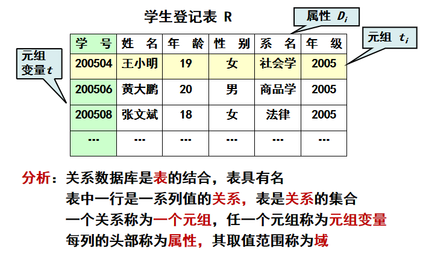
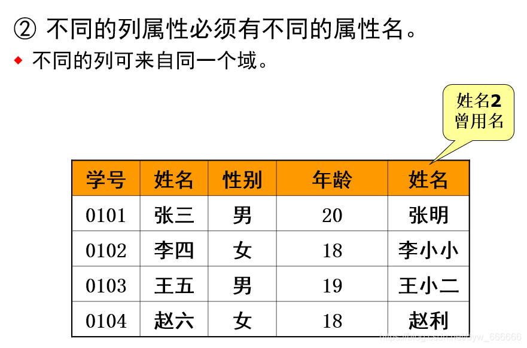
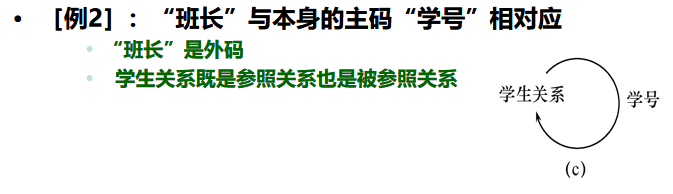
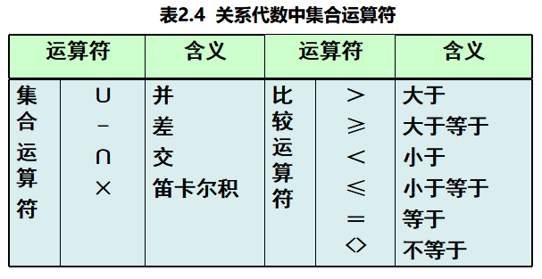
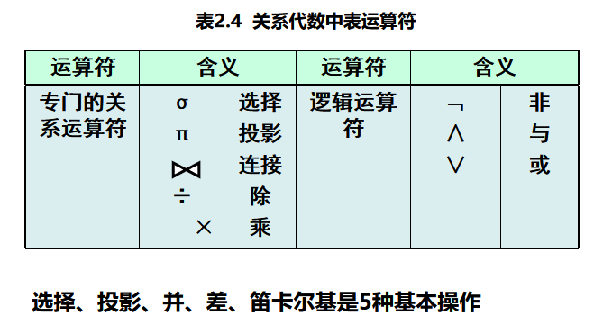
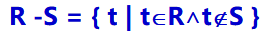
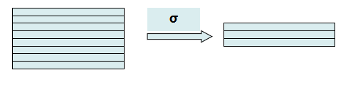

[toc]

为什么需要代数语言？

> 为了使查询需求描述自动化，自然化

依然分成三个要素来将

按照数据模型的三个要素，关系模型分成：
关系数据结构，关系操作集合，关系完整性约束。

# 2.1  关系数据结构及形式化定义

​	关系代数语言虽然**用户不友好**，但形成一套理论，可以指导数据库研究用户友好语言可以自动转换为关系代数语言，例如 SQL。

==关系数据结构——关系==

## 2.1.1 关  系

### **关系定义**

关系的本质就是一个二维表，是实体之间的多个属性的联系。

域             属性Di的值集合 ，例如{男，女}是性别值的集合，也就是它的域。

关系R       D1×D2×…×Dn 子集，**是一张表** 

元组ti         表中一行，笛卡尔积中每一个元素 （d1，d2，…，dn）

分量          一行即笛卡尔积元素（d1，d2，…，dn）中的每一个值di叫作一个分量，用t[i]表示

元组变量t  关系中R中代表元组的变量，其域为所有元组

### 什么是码？

候选码:
   设R是一个关系模式，K是R的子集。若对于R中任意两个不同的元组t1≠ t2,有t1[K]≠ t2[K],且K是这样的最小集，则称K是R的候选码

- 候选码**可能有多个**；
- 唯一确定元组；
- 最小化；

主码：    若一个关系有多个候选码，则**选定其中一个**为主码

全码：    关系模式的**所有属性组**是这个关系模式的候选码

主属性： **候选码的诸属性称为主属性**，不包含在任何侯选码中的属性称为非主属性或非码属性

### 基本关系的性质[^1]

1. 列是同质的，每一列中的分量是同一类型的数据，来自同一个域

2. 不同的列可出自同一个域

   

   > 其中的每一列称为一个属性
   > 不同的属性要给予不同的属性名

3.  列的顺序无所谓，列的次序可以任意交换

4. 任意两个元组的**候选码不能相同**

5. 行的顺序无所谓，行的次序可以任意交换

6. 分量必须取原子值，每一个分量都要是不可再分的数据项。

   > 当然也不是所有数据库都有上面6条性质，关系数据库要满足这些吧。

### 关系数据库中表（三种表）

基本关系（基本表或基表）：**实际存在**的表，是实际存储数据的逻辑表示

查询表：**查询结果**对应的表，虚表

视图表：由基本表或其他视图表导出的表，是**虚表**，不对应实际存储的数据

## 2.12 关系模式[^2]

关系模式是一个5元组，形式化为:

`R  (U，D，dom，F)`

R：关系名（Relation）

U：组成该关系的**属性名集合。**

D：属性组U中属性所来自的域（Domin）

dom：属性向域映象集合

F：属性间数据的依赖关系集合

通常简记为`R(U)`或`R(A1,A2....An)`Ai为属性名。

关系是关系模式在某一时刻的状态或内容，==关系是动态的，关系模式是静态的==

> 即属性名，表名，域等东西一般不变，其内容，数据会变

# 2.2  关系操作

- 关系操作 ：<u>对关系表进行运算</u>的运算符，这些运算符描述了应用对数据库的数据处理需求

- 关系代数语言：用对关系的<u>代数运算表达式</u>来表达查询要求   代表：ISBL

- 关系演算语言： 用<u>谓词逻辑语言</u>来表达查询要求[^6]
  - 元组关系演算语言   谓词变元的基本对象是元组变量     代表：APLHA, QUEL
  - 域关系演算语言       谓词变元的基本对象是域变量         代表：QBE
  
- **具有关系代数和关系演算双重特点的语言**
      代表：**SQL**（Structured Query Language）
  
  > 集DML,DDL,DCL与一体
  
- 关系操作特点
     一次一集合。关系操作的结果是一个关系

# 2.3  关系的完整性

### 三类完整性约束

实体完整性和参照完整性：
    关系模型**必须满足**的完整性约束条件。称为==关系的两个不变性==，应该由关系系统自动支持

用户定义的完整性：
       应用领域需要遵循的约束条件，体现了具体领域中的语义约束 

### 实体完整性

若属性A是基本关系R的**主属性**（候选码的属性），则属性A不能取空值

### 外码/引用

R：学生（<u>学号</u>，姓名，专业，专业号`F`，年龄）

S：专业（<u>专业号</u>`Ks`，专业名）

> F是R的外码
>
> R：参照关系
>
> S：被参照关系/目标关系
>
> R与S**不一定是不同关系**，同一关系内部可能存在引用

### 参照完整性规则

若属性（或属性组）F 是基本关系R 的外码，它与基本关系S 的主码Ks相对应（基本关系R 和S 不一定是不同的关系），则对于R 中每个元组在**F上的值**必须为：

- 或者**取空值**（**外码F 的==每个属性值==均为空值**，这里是说外码F不一定只有一个属性列，可能有多个列，要取空值就都取空值）
- 或者等于S 中某个元组的主码值（正常情况）

# 2.4  关系代数

### 2.4.1 传统集合运算[^3]

​	这部分略过，比较简单。可见P57

> R - S  		  仍为n目关系，由属于R 而不属于S 的所有元组组成
>  
>
> 笛卡尔积× 	结果变成(n+m)目关系，严格的讲应该叫广义笛卡尔积

### 2.4.2 专门的关系运算

#### 选择运算σ

选择运算是从关系R中选取使逻辑表达式F为真的元组， 
是从行的角度进行的运算，其语义为按照行分解一张表

#### 投影运算π

从系统实现角度考虑，**消除重复行开销大**，投影运算没必要消除重复行，再定义一个消除重复行运算可以满足应用需求（注意，书中定义自动消除了重复）

#### 连接运算θ

笛卡尔连接运算存在的问题：

>  观察上例中表达式SC×Course，其结果中包含 所有的选课与所有课程的组合，而实际中，一个学生不可能选所有课程，这样**结果元组中许多是无意义的**。

所以引入连接运算：从两个关系的**笛卡尔积中**选取属性间**满足一定条件的元组**

##### 等值连接 

​    

θ为“＝”的连接运算称为等值连接 
​    从关系R 与S 的广义笛卡尔积中选取A、B 属性值相等的那些元组

##### 自然连接 

​     自然连接是一种特殊的等值连接，比较的分量必须是相同的属性组，在结果中**去掉重复属性列**

> 自然连接的符号就是**连接运算的符号下面不写条件。**

#### 常用的代数思维解决方法

整体法和分步法[^4]

#### 外连接

问题    自然连接会**丢失信息**，需引入新的连接运算
例如    `student` 自然连接 `sc`会将一个未选课的学生丢失

如果把**舍弃的元组（又叫悬浮元组）也保存在结果关系**中，而在其他属性上填空值(Null)，这种连接就叫做外连接（OUTERJOIN）。

外连接就是两边的悬浮元组都保存。

#### 左外连接

如果只把**左边关系R**中的悬浮元组保留，就叫做左外连接(LEFT OUTER JOIN或LEFT JOIN)

#### 右外连接

如果只把**右边关系S**中要舍弃的元组**保留**就叫做右外连接(RIGHT OUTER JOIN或RIGHT JOIN)。 

### 2.4.3 附加运算 

关系代数的基本运算足以表达任何查询，但使用不方便，写出的表达式太长。
定义一些附加运算，不能增加关系代数功能，但能简化表达式

#### 更名运算   

E代表计算结果。当然可以不改属性名也可以，这样可以省略属性名不写。ρ~x~(E)就行

#### 聚集运算 

将表按照属性分组，即将元组按照属性值重新组合

G，即Group by

  

聚集函数    输入为集合，输出为单一值的函数。
                   sum(),  avg(),  min(),  count()
应用          **聚集函数往往和聚集运算组合使用**
                 对于聚集运算后的结果，对每个组再运用聚集函数处理

#### 去除相同元素

​	`distinct`操作符，其含义是消除相同元素

#### 广义投影 

指在投影的时候可以做运算。

#### 除（Division） 

引入动机   在查询中，经常需要查询包含短语**“所有的”**这样的查询。例如，找出选过学分为3分的所有课程的学生？

这个解释在书上写的比较好，我写了笔记，在P63

#### 数据库修改

就一定要是左箭头么，不能是右箭头？

#### 视图操作 

# 2.5  关系演算[^5]

#### 2.5.1 元组关系演算语言ALPHA

#### 2.5.2 域关系演算语言QBE

# 2.6 小结

+ 关系数据库是目前使用的最广的数据库

+ 关系系统只有==表==这一种数据结构，非关系系统还有其他数据结构

+ **如何使用5种基本运算（并、差、笛卡儿积、投影、选择）来描述其他三种运算（交、连接和除）**
  这是第二章的课后题

  

  就是除运算有点难，其实比较像NOT EXISTS双层嵌套。

---

[^1]: 可见书p50
[^2]: P51
[^3]: P57
[^4]: 第二个PPT的46页开始
[^5]: 见书P64，貌似不要求掌握。
[^6]: 应该不考，书上都是标的星号，研究生课程吧。