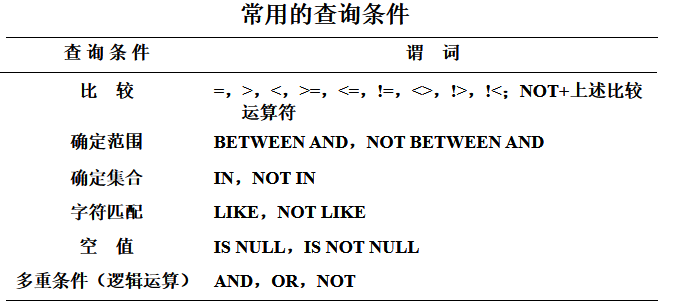

[TOC]

# 1.  SQL概述

结构化查询语言，是关系数据库的标准语言

## 1.1 SQL的特点

1. 综合统一

   - ==集数据定义语言（DDL），数据操纵语言（DML），数据控制语言（DCL）==功能于一体。
   - 可以独立完成数据库生命周期中的全部活动
   - 用户数据库投入运行后，可根据需要随时逐步修改模式，不影响数据的运行。
   - 数据操作符统一

2. 高度**非过程化**

   - SQL只要提出“做什么”，无须了解存取路径。
   - 存取路径的选择以及SQL的操作过程由系统自动完成

3. **面向集合**的操作方式

   - 非关系数据模型采用面向记录的操作方式，操作对象是一条记录
   - SQL采用集合操作方式
     - 可以是**元组的集合**
     - 一次插入、删除、更新操作的对象可以是**元组的集合**

4. 以同一种语法结构提供多种使用方式

   - SQL是<u>独立的语言</u>，能够独立地用于联机交互的使用方式
   - SQL又是<u>嵌入式语言</u>，能够嵌入到高级语言（例如C，C++，  Java）程序中，供程序员设计程序时使用

5. 语言简洁，易学易用

   

## 1.2 SQL的基本概念


- 基本表
  - 本身独立存在的表
  - SQL中一个关系就对应一个基本表
  - 一个(或多个)基本表对应一个存储文件
  - 一个表可以带若干索引
- 存储文件
  - 逻辑结构组成了关系数据库的内模式
  - 物理结构是任意的，对用户透明
- 视图
  - 从一个或几个基本表导出的表
  - 数据库中只存放视图的定义而不存放视图对应的数据
  - 视图是一个虚表
  - 用户可以在视图上再定义视图

# 2.  数据定义[^2]

>  模式定义、表定义、视图和索引的定义 


- 最新版索引也能修改
- SQL不提供修改模式和视图，想修改只能删了重新创建

## 2.1   模式的定义与删除[^1]

### 1）定义模式

  `CREATE SCHEMA  <模式名>   AUTHORIZATION <用户名>`

要创建模式，调用该命令的用户表必须拥有数据库管理员的权限<u>如果没有指定   <模式名> ，那么，<模式名>  隐含为  <用户名></u>

### 2）删除模式

`DROP SCHEMA <模式名> <CASCADE| RESTRICT>`

CASCADE(级联) ：表示在删除模式的同时，把该模式中的所有数据库对象全部一起删除；

RESTRICT(限制)：表示如果该模式下已经定义了下属的数据库对象（如：表），**则拒绝该删除语句的执行**，若没有任何下属数据库对象，则执行删除。

## 2.2   基本表的定义、删除与修改

### 1）定义基本表[^3]

```sql
CREATE TABLE <表名>
   （  <列名>  <数据类型>  [ <列级完整性约束条件> ]，
         <列名>  <数据类型>  [ <列级完整性约束条件 >],
           …，
          [ <表级完整性约束条件> ] 
     ）； 
```

如果完整性约束条件**涉及到该表的多个属性列，则必须定义在表级上**，否则既可以定义在列级也可以定义在表级。 

### 2）表和模式[^1]

每一个表都属于某一个模式，一个模式包含多个基本表，当定义基本表时如何定义它所属的模式呢
1）**在表名中明显地给出模式名**
                ```   CREATE TABLE “S-T”.Student (  ) ;```
2） 在创建模式语句中同时创建表 

``` sql
CREATE SCHEMA “S-T”  AUTHORIZATION  ZHAO
CREAT TABLE Student  (Sno  CHAR(5)  NOT NULL,
                      Sname CHAR(30)  UNIQUE,
                      Ssex CHAR(1),
                      Sage INT
                    );
```

### 3）修改基本表

```sql
ALTER TABLE  <表名>
[ ADD [COLUMN] <新列名> <数据类型> [ 完整性约束 ] ]
[ ADD <表级完整性约束>]
[ DROP [COLUMN] <列名> [CASCADE|RESTRICT]]
[ DROP CONSRAINT<完整性约束名> [CASCADE|RESTRICT]]
[ ALTER COLUMN<列名> <数据类型> ]；
```

- ADD  用于增加**新列**和**新的完整性约束条件**
- DROP 用于删除指定的**完整性约束条件**或删除**列**
- ALTER COLUMN 用于修改原有的列定义，包括修改列名和数据类型。

> 这部分也不太可能考，真要我改，我不如直接删了这个表重新定义一个。一般都只考定义基本表。

### 4） 删除基本表

`DROP TABLE <表名>［RESTRICT| CASCADE］`

- RESTRICT：删除表是有限制的。
  - 欲删除的基本表不能被其他表的约束所引用
  - 如果存在依赖该表的对象，则此表不能被删除
- CASCADE：删除该表没有限制。级联
  - 在删除基本表的同时，相关的依赖对象一起删除 

### 5） 数据类型

- SQL中域的概念用数据类型来实现
- 定义表的属性时 需要指明其数据类型及长度 
- 选用哪种数据类型 
  - 取值范围 
  - 要做哪些运算 
- 这个VARchar比较常用
- **注意中文字符一个要占两个char长度**，另外sql好像有那种nchar，一个长度代表一个中文字符长.


## 2.3   索引的建立与删除

- 建立索引的目的：==加快查询速度==
- 谁可以建立索引
  - DBA 或 表的属主（即建立表的人）
  - DBMS一般会**自动建立以下列上的索引**
     - PRIMARY  KEY
     - UNIQUE
- 谁维护索引
       DBMS自动完成 
- 使用索引
       DBMS自动选择是否使用索引以及使用哪些索引

---

###  1）索 引

- DBMS中索引一般采用B+树、HASH索引来实现
- 索引是关系数据库的内部实现技术，属于**内模式**的范畴 
- 虽然能加速查询，但是要占一定的空间。

### 2）建立索引

`CREATE [UNIQUE] [CLUSTER] INDEX <索引名> ON <表名>(<列名>[<次序>][,<列名>[<次序>] ]…)；`

- 次序可以是ASC ,DESC，默认ASC

- UNIQUE 表明此索引的**每一索引值只对应唯一的数据记录**；

- CLUSTER 表明要建立的索引是**聚簇索引**。聚簇索引是指索引项的顺序**与表中记录的物理顺序一致的索引组织。**

  > 为了提高某个属性的查询速度，把这个属性上**具有相同值的元组集中存放在连续的物理块中**称聚簇

- 在最经常查询的列上建立聚簇索引以提高查询效率 

- 一个基本表上最多**只能建立一个聚簇索引** 

- 经常更新的列不宜建立聚簇索引 

> 所以**聚簇索引**这玩意儿就是用来加速查询效率的

### 3）删除索引 

DROP INDEX <索引名>

当然索引也不修改，直接删了重建

# 3.  数据查询[^4]

语句格式：

```sql
SELECT [ALL|DISTINCT] <目标列表达式>
                        [，<目标列表达式>] …
FROM <表名或视图名>[， <表名或视图名> ] …
[ WHERE <条件表达式> ]
[ GROUP BY <列名1> [ HAVING <条件表达式> ] ]
[ ORDER BY <列名2> [ ASC|DESC ] ]；
```

> 1. **sum()这种聚集函数不能出现在where里**，只能在select或having里
> 2. HAVING短语**必须与GROUP BY短语**同时使用，不能单独出现

## 3.1  单表查询

### 3.1.1    选择表中的若干列

```sql
【例】 查询全体学生的学号与姓名。
SELECT Sno，Sname
FROM Student； 

【例】查询全体学生的姓名、学号、所在系。
SELECT Sname，Sno，Sdept
FROM Student；

选出所有属性列：
SELECT  *
FROM Student； 
```

SELECT子句的<目标列表达式>可以为：
		算术表达式、字符串常量、函数、列别名 

```sql
【例】  查全体学生的姓名及其出生年份
SELECT Sname，2013-Sage    /*假定当年的年份为2013年*/
FROM Student；

【例】 查询全体学生的姓名、出生年份和所有系，要求用小写字母表示所有系名
SELECT Sname，'Year of Birth:'，2012-Sage，LOWER(Sdept)
FROM Student；
结果见下图

【例】使用列别名改变查询结果的列标题:
//相当于重命名操作。
SELECT Sname NAME，'Year of Birth:'  BIRTH，2012-Sage  BIRTHDAY，LOWER(Sdept)  DEPARTMENT
FROM Student；
见下图2
```


### 3.1.2    选择表中的若干元组



#### 1. 消除取值重复的行

 如果没有指定DISTINCT关键词，则缺省为ALL 

> DISTINCT为去重

#### 2. 匹配串为含通配符的字符串

%  表示**任意长度的字符串**，比如a%b则表示以a开头，b结尾的任意长度的字符串，如ab, acb, adefgb等；` LIKE ‘刘%`

 _  则表示任意的**单个字符**  ` LIKE '欧阳__' `

> 有点正则表达式的意思，不过太简易了
>
> LIKE  和  "="  的区别？
>
> “=” 适用于确定的值
>
> “like”适用于不确定的，比如   LIKE '刘%'

ESCAPE '＼' 表示“ ＼” 为换码字符 

`    WHERE  Cname LIKE  'DB\_%i_ _'  ESCAPE ' \ ' ;`     这样就会查DB_开头，且倒数第三个字符为i的字符串了。

### 3.1.3    ORDER BY子句

- ORDER BY子句
  - 可以按一个或多个属性列排序
  - 升序：ASC   缺省值为升序
  - 降序：DESC
- 当排序列含空值时
  - ASC：从小到大排序，排序列为空值的元组最后显示 
  - DESC：从大到小排序，排序列为空值的元组最先显示 

### 3.1.4    聚集函数

- 计数
  COUNT（[DISTINCT|ALL] *）
  COUNT（[DISTINCT|ALL] <列名>）
- 计算总和
  SUM（[DISTINCT|ALL] <列名>）	
- 计算平均值
  AVG（[DISTINCT|ALL] <列名>）
- 最大最小值
  MAX（[DISTINCT|ALL] <列名>）
  MIN（[DISTINCT|ALL] <列名>）

> 注意：
>
> Where子句中是不能用聚集函数作为条件表达式的。
> ==聚集函数只能用于Select子句和Group by中的Having 子句==
>
> 不能说  Where  min(score)=30 这种

### 3.1.5    GROUP BY子句

细化聚集函数的作用对象。
也就是关系数据库中的聚集运算。

- 未对查询结果分组，聚集函数将作用于**整个查询结果**
- 对查询结果分组后，聚集函数将**分别作用于每个组** 
- 作用对象是查询的中间结果表
- 按指定的一列或多列值分组，值相等的为一组

### 3.1.6  Having 子句

- 问题： 有时，对于一个分组以后的结果集合希望使用<u>限定条件选择部分分组</u>，则可以使用Having 子句。
- 格式： Having   P;       P是谓词
- 注意： 由于Having 子句中的谓词P是在分组以后起作用的，因此**P中可以使用聚集函数**

```SQL
[例]  查询选修了3门以上课程的学生学号。
        SELECT Sno
        FROM  SC
        GROUP BY Sno
        HAVING  COUNT(*) >3 ; //算出每个组里面，大于三个记录的组，也就是选修三门以上课程的学生学号。
```

HAVING短语与WHERE子句的区别：

- WHERE子句作用于基表或视图，从中选择满足条件的元组
- HAVING短语**作用于组（group by之后的分组）**，从中选择满足条件的组。 
- ==HAVING短语必须与GROUP BY短语同时使用==

## 3.2 连接查询

同时涉及多个表的查询

- 嵌套循环法(NESTED-LOOP)[^5]
  - 首先在表1中找到第一个元组，然后从头开始扫描表2，逐一查找满足连接件的元组，找到后就将表1中的第一个元组与该元组拼接起来，形成结果表中一个元组。
  - 表2全部查找完后，再找表1中第二个元组，然后再从头开始扫描表2，逐一查找满足连接条件的元组，找到后就将表1中的第二个元组与该元组拼接起来，形成结果表中一个元组。
  - 重复上述操作，直到表1中的全部元组都处理完毕 
  - *当然，如果有索引就不用从头扫描了，直接用索引就能找到相应的元组*
- 排序合并法(SORT-MERGE), ==常用于 等值 连接==
  - 首先按连接属性对表1和表2**排序**
  - 对表1的第一个元组，从头开始扫描表2，顺序查找满足连接条件的元组，找到后就将表1中的第一个元组与该元组拼接起来，形成结果表中一个元组。**当遇到表2中第一条大于表1连接字段值的元组时，对表2的查询不再继续**
  - 找到表1的第二条元组，然后从刚才的中断点处继续顺序扫描表2，查找满足连接条件的元组，找到后就将表1中的第一个元组与该元组拼接起来，形成结果表中一个元组。直接遇到表2中大于表1连接字段值的元组时，对表2的查询不再继续
  - 重复上述操作，直到表1或表2中的全部元组都处理完毕为止 

#### 3.2.1  等值与非等值连接查询 

等值连接：连接运算符为 =

``` sql
查询每个学生及其选修课程的情况
SELECT  Student.*，SC.*		//Select *不行么
FROM     Student，SC
WHERE  Student.Sno = SC.Sno；
```

#### 3.2.2  自身连接

- 自身连接：一个表与其自己进行连接
- 需要给表==起别名以示区别==, 如FIRST, SECOND
- 由于所有属性名都是同名属性，因此==必须使用别名前缀==

``` sql
【例】查询每一门课的间接先修课（即先修课的先修课）
    SELECT  FIRST.Cno，SECOND.Cpno
     FROM  Course  FIRST，Course  SECOND
     WHERE FIRST.Cpno = SECOND.Cno；
```

#### 3.2.3  外连接

外连接与普通连接的区别

- 普通连接操作只输出满足连接条件的元组
- 外连接操作以指定表为连接主体，将主体表中不满足连接条件的元组一并输出

``` sql
【例】 改写前例,左外连接
SELECT Student.Sno，Sname，Ssex，Sage，Sdept，Cno，Grade
FROM  Student  LEFT OUT JOIN SC //左外连接，保留左边的全部信息
ON (Student.Sno=SC.Sno)； 
```


> 可以看到==保留了左边的==不满足条件的元祖，所以叫左外连接，左边所有的元组都被保存了下来。

#### 3.2.4  复合条件连接

复合条件连接：WHERE子句中含多个连接条件

``` sql
【例】查询每个学生的学号、姓名、选修的课程名及成绩
SELECT Student.Sno，Sname，Cname，Grade
FROM    Student，SC，Course    /*多表连接*/
WHERE Student.Sno = SC.Sno 
      and SC.Cno = Course.Cno；
```

## 3.3 嵌套查询

- 一个SELECT-FROM-WHERE语句称为一个查询块
- 将一个查询块嵌套在另一个查询块的WHERE子句或HAVING短语的条件中的查询称为嵌套查询
- ==子查询的限制：不能使用ORDER BY子句==
- 层层嵌套方式反映了 SQL语言的结构化
- **有些嵌套查询可以用连接运算替代**

---

- ==不相关子查询==——子查询的查询条件**不依赖于父查询**
  - 由里向外逐层处理。即每个子查询在上一级查询处理之前求解，子查询的结果用于建立其父查询的查找条件。
- 相关子查询 —— 子查询的查询条件**依赖于父查询**
  - 首先取外层查询中表的第一个元组，根据它与内层查询相关的属性值处理内层查询，若WHERE子句返回值为真，则取此元组放入结果表
  - 然后再取外层表的下一个元组
  - 重复这一过程，直至外层表全部检查完为止

####   3.3.1  带有IN谓词的子查询 

``` sql
【例】  查询与“刘晨”在同一个系学习的学生
此查询要求可以分步来完成

1. 确定“刘晨”所在系名             
       SELECT  Sdept  
       FROM    Student                            
       WHERE   Sname= ' 刘晨 '；
       查出是CS系的
2. 查找所有在CS系学习的学生。    
       SELECT    Sno，Sname，Sdept     
       FROM    Student                 
       WHERE   Sdept= ' CS '；
       
//而综合起来就是这样
SELECT  Sno，Sname，Sdept
FROM  Student
WHERE  Sdept  IN
        (   SELECT  Sdept
            FROM   Student
            WHERE  Sname= '刘晨'
        )；
此查询为不相关子查询。可以直接先得出子查询的结果，再处理父查询。

//用自身连接完成上例的查询要求:
SELECT    S1.Sno，S1.Sname，S1.Sdept
FROM      Student S1，Student S2
WHERE     S1.Sdept = S2.Sdept  AND
          S2.Sname = '刘晨'；
注意到这里的给表起别名的操作
```

####   3.3.2 带有比较运算符的子查询

当能**确切知道内层查询返回==单值==**时，可用比较运算符（>，<，=，>=，<=，!=或< >）。


> 子查询一定要跟在比较符之后，比如上图就是跟在=后面

####   3.3.3 带有ANY（SOME）或ALL谓词的子查询

ANY：任意一个值
ALL：所有值

- \>ANY	大于子查询结果中的某个值 ，大于最小值即可
- \>ALL	大于子查询结果中的所有值
- < ANY	小于子查询结果中的某个值  ，小于最大值即可
- < ALL	小于子查询结果中的所有值
- = ANY	等于子查询结果中的某个值        
- = ALL	等于子查询结果中的所有值（通常没有实际意义）
- !=（或<>）ANY	不等于子查询结果中的某个值
- !=（或<>）ALL	不等于子查询结果中的任何一个值


```sql
【例】  查询其他系中比计算机科学某一学生年龄小的学生姓名和年龄 
SELECT   Sname，Sage
FROM     Student
WHERE    Sage < ANY (  SELECT  Sage
                       FROM    Student
                       WHERE   Sdept= 'CS')
         AND Sdept != 'CS' ;           /*父查询块中的条件 */
         
1.RDBMS执行此查询时，首先处理子查询，找出CS系中所有学生的年龄，构成一个集合(20，19)
2. 处理父查询，找所有不是CS系且年龄小于20 或 19的学生，其实就是小于集合中的最大值就可以了

用聚集函数实现该例：
SELECT  Sname，Sage
FROM    Student
WHERE   Sage < 
        (   SELECT  MAX(Sage)
            FROM  Student
            WHERE  Sdept= 'CS')
        AND Sdept <> 'CS';
```

所以一般要用到any 或者 or 的查询一般都能用聚集函数实现。


####   3.3.4 带有EXISTS谓词的子查询

- 存在量词 $\exists$
- 带有EXISTS谓词的子查询==不返回任何数据==，只产生逻辑真值“true”或逻辑假值“false”。
- 若内层查询结果**非空**，则外层的**WHERE子句返回真值**(not exists 正好相反)
- 若内层查询结果为空，则外层的WHERE子句返回假值
- 由EXISTS引出的子查询，其目标列表达式通常都用* ，<u>因为带EXISTS的子查询只返回真值或假值，==给出列名无实际意义==</u>

> 对于父子关联存在判断exists子查询，直接从字面上理解是很不明确的，但是如果改为从是否存在某一张表（父表）与另一张表（子表）的交集或非交集这个角度来理解，那么其逻辑就会变得比较清晰、易懂了。
>
> ==EXISTS是输出交集，NOT EXISTS 是输出非交集==

```sql
【例】 查询所有选修了1号课程的学生姓名。
思路分析：
- 本查询涉及Student和SC关系
- 在Student中依次取每个元组的Sno值，用此值去检查SC关系
- 若SC中存在这样的元组，其Sno值等于此Student.Sno值，并且其Cno= '1'，则取此Student.Sname送入结果关系

用嵌套查询：
SELECT  Sname
FROM  Student
WHERE   EXISTS
        (    SELECT *
             FROM SC
             WHERE Sno=Student.Sno AND Cno= ' 1 ')；
/*注意这是相关子查询，先取外层的第一个元组，与内层查询的相关属性值(Sno)处理内层查询。若where返回值为真
则取外层查询的Sname放入结果；接着再取Student表的下一个元组，重复这个过程。
  */           
用连接运算：
SELECT   Sname
FROM   Student, SC
WHERE   Student.Sno=SC.Sno 
        AND SC.Cno= '1';
```

- 一些带EXISTS或NOT EXISTS谓词的子查询不能被其他形式的子查询等价替换
- 所有带IN谓词、比较运算符、ANY和ALL谓词的子查询都能用带EXISTS谓词的子查询等价替换
- 但是这玩意如果层层嵌套的话很难理解，所以建议少用。书P112有个双层NOT EXISTS的例子。

## 3.4 集合查询[^10]

- 集合操作的种类
  - 并操作UNION
  - 交操作INTERSECT
  - 差操作EXCEPT
- 参加集合操作的各查询结果的**列数必须相同**；对应项的**数据类型也必须相同** 
- 标准sql中没有提供集合交操作和集合差操作，所以这个查询不实用，==了解即可==

#### 3.4.1  并union

和or的意思一样

```sql
【例】 查询计算机科学系的学生及年龄不大于19岁的学生。
方法一：
SELECT *
FROM Student
WHERE Sdept= 'CS'
UNION
SELECT *
FROM Student
WHERE Sage<=19；

方法二：
SELECT  DISTINCT  *
FROM Student
WHERE Sdept= 'CS'  OR  Sage<=19；
```

- UNION：将多个查询结果合并起来时，系统自动去掉重复元组。
- UNION ALL：将多个查询结果合并起来时，保留重复元组 

#### 3.4.2 交intersect

就是and

```sql
查询计算机科学系的学生与年龄不大于19岁的学生的交集
SELECT *
FROM Student
WHERE Sdept='CS' 
INTERSECT
SELECT *
FROM Student
WHERE Sage<=19 


SELECT *
FROM Student
WHERE Sdept= 'CS' AND  Sage<=19；
```

#### 3.4.3  差except

实际上就是 A-B的运算，可以用交来实现。
当然也可以用except实现。

```sql
【例】  查询计算机科学系的学生与年龄不大于19岁的学生的差集
        SELECT *
        FROM   Student
        WHERE  Sdept='CS'
 EXCEPT
        SELECT  *
        FROM  Student
        WHERE  Sage <=19;

实际上是查询计算机科学系中年龄大于19岁的学生
        SELECT *
        FROM Student
        WHERE  Sdept= ‘CS’  AND   Sage>19；
```

可以看到小于等于变成 大于。

## 3.5 Select语句的一般形式

```sql
 SELECT [ALL|DISTINCT]  
   <目标列表达式> [别名] [ ，<目标列表达式> [别名]] …
 FROM     <表名或视图名> [别名] 
             [ ，<表名或视图名> [别名]] …
 [WHERE <条件表达式>]
 [GROUP BY <列名1>
 [HAVING     <条件表达式>]]
 [ORDER BY <列名2> [ASC|DESC] 
```

# 4.  数据更新

## 4.1 插入数据

### 1）  插入元组

```sql
语句格式
	INSERT
	INTO <表名> [(<属性列1>[，<属性列2 >…)]
	VALUES (<常量1> [，<常量2>]    …           )
功能：将新元组插入指定表中,其中属性列1的值为常量1，属性列2的值为常量2，……
```

- INTO子句
  - 属性列的顺序可与表定义中的**顺序不一致**（在指定了属性列的前提下）
  - 没有指定属性列：
          插入的元组在**每个属性列上均有值**，次序与creat table中的次序是一样的。
  - 指定部分属性列：
         没有指定的属性列取空值。
         但是取空值的这个列定义的时候不能说明NOT NULL属性，不然会冲突。

### 2）  插入子查询结果：可以一次插入多个元组 

```sql
语句格式
     INSERT 
     INTO <表名>  [(<属性列1> [，<属性列2>…  )]
     子查询；
功能
     将子查询结果插入指定表中
```

SELECT子句目标列必须与INTO子句匹配

- 值的个数
- 值的类型


## 4.2 修改数据[^6]

```sql
语句格式
      UPDATE  <表名>
      SET  <列名>=<表达式>[，<列名>=<表达式>]…
      [WHERE <条件>]；
SET子句
	指定修改方式
	要修改的列
	修改后取值
WHERE子句
	指定要修改的元组
	缺省表示要修改表中的所有元组
```

三种修改方式

1. 修改某一个元组的值
2. 修改多个元组的值
3. 带子查询的修改语句

## 4.3 删除数据 

```SQL
语句格式
       DELETE
       FROM   <表名>
       [WHERE <条件>]；
功能
    删除指定表中满足WHERE子句条件的元组
WHERE子句
    指定要删除的元组
    缺省表示要删除表中的全部元组，表的定义仍在字典中
```

三种删除方式
1） 删除某一个元组的值
2） 删除多个元组的值
3） 带子查询的删除语句

> 注意是删元组哦

# 5.  视图

视图的特点

- 虚表，是从一个或几个基本表（或视图）导出的表
- 只存放视图的定义，不存放视图对应的数据
- 基表中的数据发生变化，从视图中查询出的数据也随之改变

基于视图的操作

- 查询
-  删除
-  受限更新
-  定义基于该视图的新视图

---

- RDBMS执行CREATE VIEW语句时**只是把视图定义存入<u>数据字典</u>**，并==不执行==其中的SELECT语句。
- 在对视图查询时，按视图的定义从**基本表**中将数据查出。

## 5.1 建立视图

**组成视图的属性列名：全部省略或全部指定**，不能部分指定，想想也知道部分指定是没有道理的。

```SQL
语句格式
CREATE  VIEW 
    <视图名>  [(<列名>  [，<列名>]…)]
AS  <子查询>
[WITH  CHECK  OPTION]；

/*子查询不允许含有 ORDER BY 子句和 DISTINCT 短语*/


[例] 建立信息系学生的视图，并要求进行修改和插入操作时仍需保证该视图只有信息系的学生 。
            CREATE VIEW IS_Student
            AS 
            SELECT Sno，Sname，Sage
            FROM  Student
            WHERE  Sdept= 'IS'
            WITH CHECK OPTION；
```

加了`WITH CHECK OPTION`这句话之后。

- 修改操作：自动加上Sdept= 'IS'的条件
- 删除操作：自动加上Sdept= 'IS'的条件
- 插入操作：自动检查Sdept属性值是否为'IS' 
- 如果不是，则拒绝该插入操作
- 如果没有提供Sdept属性值，则自动定义Sdept为'IS'

## 5.2 删除视图

语句的格式：
		`DROP  VIEW  <视图名>；`

- 该语句从数据字典中**删除指定的视图定义**

- 如果**该视图上**还导出了其他视图，使用==CASCADE==级联删除语句，把该视图和由它导出的所有视图一起删除 

  > DROP VIEW IS_S1 CASCADE  ;     

- 删除**基表**时，由该基表导出的所有视图定义都必须**显式**地使用**DROP VIEW语句**删除 （因为删除基表不会级联删除视图？）

## 5.3 查询视图

- 用户角度：查询视图与查询基本表相同
- RDBMS采用**视图消解法**实现视图查询[^7]
  - 进行有效性检查
  - **转换成等价的对基本表的查询**
  - 执行修正后的查询
  - ==有些情况下，视图消解法不能生成正确查询==。
    就比如下面的情况。

```sql
[例] 在S_G视图中查询平均成绩在90分以上的学生学号和平均成绩  
    SELECT *
    FROM   S_G
    WHERE  Gavg>=90；
错误：
    SELECT Sno，AVG(Grade)
    FROM     SC
    WHERE  AVG(Grade)>=90
    GROUP BY Sno;
   // 因为 where子句中不能用集函数作为条件表达式的。
   
正确：
    SELECT  Sno，AVG(Grade)
    FROM  SC
    GROUP BY Sno
    HAVING AVG(Grade)>=90；
```

在这种不一定能正确转换的情况下，要直接对基本表进行查询。

## 5.4 更新视图

==对视图的更新最终都会变成对基本表的更新==，因为视图是个虚表，不存东西的。
可以加  ==WITH CHECK OPTION== 条件，这样在更新时都会检查满不满足视图定义中的条件，不满足就不更新。

```sql
[例]  向信息系学生视图IS_S中插入一个新的学生记录
        200215129，赵新，20岁
         INSERT     INTO IS_Student
         VALUES(‘95029’，‘赵新’，20)；
       转换为对基本表的更新：
         INSERT    INTO   Student(Sno，Sname，Sage，Sdept)
         VALUES(‘200215129’，'赵新'，20，'IS' );
                
[例]  将信息系学生视图IS_Student中学号200215122的学生姓名改为“刘辰”。
          UPDATE  IS_Student
          SET  Sname= '刘辰'
          WHERE  Sno= ' 200215122 '；
          转换后的语句：
          UPDATE  Student
          SET Sname= '刘辰'
          WHERE Sno= ' 200215122 ' AND Sdept= 'IS'；
          
[例] 删除信息系学生视图IS_Student中学号为200215129的记录 
          DELETE     FROM IS_Student
          WHERE Sno= ' 200215129 '；
         转换为对基本表的更新：
          DELETE     FROM Student
          WHERE Sno= ' 200215129 ' AND Sdept= 'IS'；
```


- 更新视图的限制：==一些视图是不可更新的，因为对这些视图的更新不能唯一地有意义地转换成对相应基本表的更新==

  ```sql
  [例]  视图S_G为不可更新视图。
              UPDATE  S_G
              SET    Gavg=90
              WHERE  Sno= ‘200215121’；
  这个对视图的更新无法转换成对基本表SC的更新，因为系统无法修改各科成绩，从而使平均分成为90。
  Gavg是在基本表中没有的，是通过计算来成为视图中的一列的。
  ```
  
- 允许对**行列子集视图**[^8]进行更新

- 对其他类型视图的更新不同系统有不同限制

- 要注意数据库的一致性，要么全做，要么全不做。

## 5.5 视图的作用

- 视图能够**简化用户的操作**
- 视图使用户能以**多种角度看待同一数据** 
- 视图对重构数据库提供了一定程度的逻辑独立性 

  > 当模式改变，通过改变外模式/模式映像，使外模式保持不变，从而不需要修改应用程序
  > 比如Student(sno,sname,sage)分成两个表a(sno,sname) ,b(sno,sage)。这时改变了模式
  >
  > 通过
  >
  > Create view Student(sno,sname,sage)
  > AS
  > Select a,sno,a,sname,b.sage from a,b where a.sno=b.sno
  >
  > 可以重现原先的表，从而应用程序可以继续使用它，不必修改。

- 视图能够对机密数据提供安全保护
- 适当的利用视图可以更清晰的表达查询

---

其后还有嵌入式SQL应该是不考的。
数据控制，授权，见第四章。

- 加了Unique,Not Null，或候选码都不能取空值

---

[^1]: 好像不考
[^2]: 这部分都不重要，随便看一看，后面的查询才是重点
[^3]: P88
[^4]: 本章的重中之重
[^5]: 这两个了解一下就行了
[^6]: 可见书P119
[^7]: 见书P125
[^8]: 只是去掉了基本表的某些行和某些列，但保留了码

[^10]: 看一眼