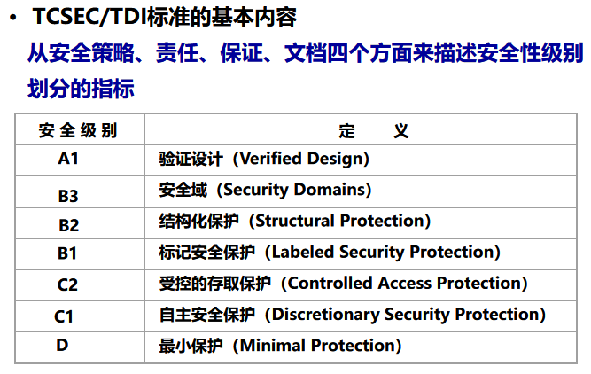
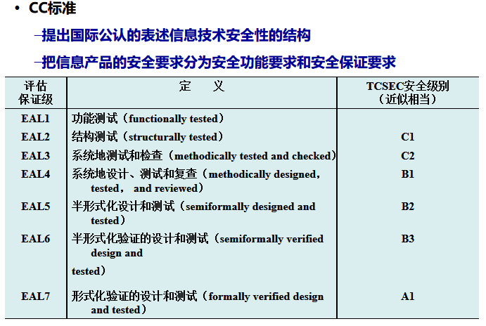
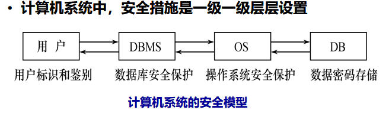
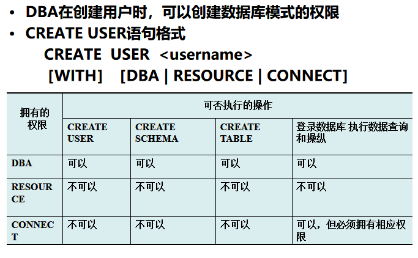
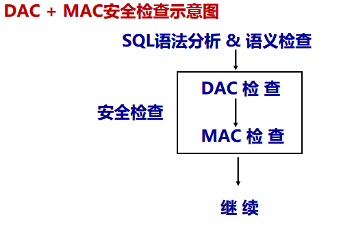

[TOC]

# 4.1  计算机安全性概述

- 问题的提出
  - 数据库的一大特点是数据可以共享
  - 数据共享必然带来数据库的安全性问题
  - 数据库系统中的数据共享不能是无条件的共享
- 计算机系统安全性
       为计算机系统建立和采取的各种安全保护措施，以保护计算机系统中的硬件、软件及数据，防止其因偶然或恶意的原因使系统遭到破坏，数据遭到更改或泄露等。
- 三类计算机系统安全性问题
  - 技术安全类
  - 管理安全类
  - 政策法律类

## TCSEC/TDI标准

美国国防部率先提出TCSEC（Trust Computer System Evaluation Criteria ）标准（1985年），后来为了更加通用化，出现了一个通用准则（Common Criteria,CC)项目，现在也是我国标准。目前CC已经替代了TCSEC

TCSEC又称桔皮书
TCSEC/TDI(Trust Database Interpretation)于1991年推出，又称紫皮书。



B2以上的系统，还处于理论研究阶段，应用多限于一些特殊的部门，如军队等。

> D最低级，一切不符合标准的都放在D级，如DOS系统
>
> 重点是C1与B1
>
> **C1**提供非常初级的自主安全保护，提供**自主存取控制（DAC）**
>
> **B1**提供标记安全保护，对标记的主体和课体都实行**强制存取措施(MAC)**，以及审计等安全措施。B1级别的产品才被认为是真正意义上的安全产品。

## CC标准

EAL1是最低级。



# 4.2  数据库安全性控制

- 非法使用数据库的情况
  - 编写合法程序绕过DBMS及其授权机制
  - 直接或编写应用程序执行非授权操作
  - 通过多次合法查询数据库从中推导出一些保密数据



## 4.2.1  用户标识与鉴别

- 用户标识与鉴别
       系统提供的最外层安全保护措施，也就是登录的时候。
- 常用识别技术
  - 用户标识
  - 静态，动态口令， 系统核对口令以鉴别用户身份 
  - 生物特征鉴别，指纹，虹膜。
- 用户名和静态口令易被窃取

## 4.2.2  存取控制

存取控制机制组成：

- 定义用户权限
- 合法权限检查 

常用存取控制方法：

- 自主存取控制（Discretionary Access Control ，简称==DAC==）
       **C2级**、**灵活**（奇怪，书上之前写的C1级支持DAC，P136）
   
   > C2将C1的DAC进一步细化，实施审计和资源隔离
   
- 强制存取控制（Mandatory Access Control，简称 ==MAC==）
       **B1级**、**严格**

## 4.2.3  SQL中自主存取控制（DAC)

- 通过 SQL 的 **GRANT** 语句和 **REVOKE** 语句实现
- 用户权限组成          **数据对象、操作类型**
- 定义用户存取权限：定义<u>用户可以在哪些数据库对象上进行哪些类型的操作</u>
- 定义存取权限称为**授权** 

## 4.2.4 授权与回收  Grant -Revoke

```sql
GRANT 语句的一般格式：
         GRANT <权限>[,<权限>]... 
         [ON <对象类型> <对象名>]
         TO <用户>[,<用户>]...
         [WITH GRANT OPTION];
语义：将对指定操作对象的指定操作权限授予指定的用户 
```

- 发出GRANT：
  - DBA、数据库对象创建者、拥有该权限的用户
- 按受权限的用户： 
  - 一个或多个具体用户、**PUBLIC（全体用户）**  
- `WITH GRANT OPTION`子句:
  - 指定：**可以再授予**（有这个子句就能再授予它自己的权限给其他用户），没有指定：不能传播
  - 那么相应回收的时候要加   `CASCADE` ，级联回收。
- **不允许循环授权**

```sql
[例] 把查询Student,Course表权限授给用户U1,U2
GRANT   SELECT 
ON   TABLE  Student,Course
TO   U1,U2;
       
[例] 把对表SC的INSERT权限授予U5用户，并允许他再将此权限授予其他用户     
GRANT INSERT 
ON TABLE SC 
TO U5
WITH GRANT OPTION;
  /* U5不仅拥有了对表SC的INSERT权限，还可以传播此权限 */
```

> 授予所有权限可以用  GRANT <u>ALL PRIVILIGES</u>   ON  <表名>  TO  <用户名>

授予的权限可以由DBA或其他授权者用**REVOKE语句收回**

```sql
REVOKE语句的一般格式为：
          REVOKE <权限>[,<权限>]... 
          [ON <对象类型> <对象名>]
          FROM <用户>[,<用户>]...;
          
[例] 把用户U4修改学生学号的权限收回
	     REVOKE UPDATE(Sno)
          ON TABLE Student 
	     FROM U4;
	       
[例] 把用户U5对SC表的INSERT权限收回
		REVOKE INSERT 
		ON TABLE SC 
		FROM U5 CASCADE ;
/*  将用户U5的INSERT权限收回的时候必须级联（CASCADE）收回 
    系统只收回直接或间接从U5处获得的权限 */
```

`CASCADE`级联收回 

---

这是创建用户 `Creat User <Username> [With][DBA|RESOURCE|CONNECT]`若无指定新用户的权限，默认为Connect。

> 这玩意儿不是SQL的标准，所以了解一下就行。

- DBA，超级用户，有权创建用户
- Resource，能创建基本表和视图，不能创建用户，可以把自己的存取权限Grant给其他用户
- Connect，只能登陆数据库，查看数据其他啥也不能干。



> 了解一下这个图。

## 4.2.5 数据库角色

### 基本操作

- 数据库角色：被命名的一组与数据库操作相关的权限

  - ==角色是权限的集合== 
    这点有点像Linux。
  - 可以**为一组具有相同权限的用户创建一个角色**
  - **简化授权的过程**

- 角色的创建

  ```sql
  CREATE  ROLE  <角色名> 
  ```

- 给角色授权 

  ```sql
  GRANT  <权限>［，<权限>］… 
  ON <对象类型>对象名  //一遍就是表名
  TO <角色>［，<角色>］…
  ```

- 将一个角色授予其他的角色或用户
      

  ```sql
  GRANT  <角色1>［，<角色2>］…
  TO  <角色3>［，<用户1>］… 
  ［WITH ADMIN OPTION］ 
  ```

  这里注意是Admin，不是之前的Grant 。虽然功能差不多。
  
- 角色权限的收回 

  ```sql
  REVOKE <权限>［，<权限>］…
  ON <对象类型> <对象名>
  FROM <角色>［，<角色>］…
  ```

### 数据库角色示例

步骤如下：

   1. 首先创建一个角色 R1   

         ```sql
         CREATE  ROLE  R1；
         ```

         

   2. 然后使用GRANT语句，使角色R1拥有Student表的SELECT、UPDATE、INSERT权限

      ```sql
      GRANT SELECT，UPDATE，INSERT 
      ON TABLE Student TO R1；
      ```

   3. 将这个角色授予王平，张明，赵玲。使他们具有角色R1所包含的全部权限

         ```sql
          GRANT  R1 
          TO 王平，张明，赵玲
         ```

         

   4. 可以一次性通过R1来回收王平的这3个权限

         ```
          REVOKE  R1 
          FROM 王平；
         ```

         

## 4.2.6  强制存取控制方法（MAC)

### 自主存取控制缺点

可能存在数据的“**无意泄露**”
原因：这种机制仅仅通过对数据的存取权限来进行安全控制，而**数据本身并无安全性标记**
解决：对系统控制下的**所有主客体**实施**强制存取控制策略**

### 强制存取控制（MAC)  的特点

- 保证更高程度的安全性
- 用户不能直接感知或进行控制
- 适用于对数据有严格而固定密级分类的部门

### 强制存取控制方法[^1]



==先进行DAC检查==，通过DAC检查的数据对象==再由系统进行MAC检查==，只有通过MAC检查的数据对象方可存取。

#### 敏感度标记(Lable)

分若干级别：绝密，机密，可信，公开

主体的敏感度标记称：**许可证级别**（Clearance Lever）

客体的敏感度标记称：**密级**（Classification Lever）

- MAC机制就是通过对比主体和客体的敏感度标记来确定主体是否能存取客体
- MAC是对数据本身进行密级标记，**无论数据如何复制，标记与数据都是一个不可分的整体。只有符合密级标记要求的用户才可以操纵数据，从而提供了更高的安全性。**

#### 规则

1. 仅当主体的许可证级别**大于或等于**客体的密级时，主体才能**读**相应客体

2. 仅当主体的许可证级别**等于**客体的密级时，主体才能**写**相应的客体

   > 第二条禁止了拥有高许可证级别的主体更新低密级的数据对象，防止敏感数据外泄

注意，在==第五版==中：仅当主体的许可证级别**==小于或等于==**客体的密级时，主体才能**写**相应的客体

**这是因为，可能用户给写入的数据对象赋予高于自己许可证级别的密级。**

> 那这样不会出现低权限主题乱写高权限客体，从而破坏数据这种事么？
>
> 还是说，严格意义上讲，只有许可证级别相等才能“修改”相应客体？

# 4.3  视图机制

视图能够把要保密的数据<u>对无权存取这些数据的用户隐藏起来</u>，因此对数据提供一定程度的安全保护 

- 主要功能是**提供数据独立性**，无法完全满足要求
- **间接实现**了支持存取谓词的用户权限定义

```sql
Creat View CS_Student
AS
Select *
from student
where Sdept='cs'

Grant select //只能检索信息。
on CS_Student
to 王平

Grant all privileges  //计算机系的系主任拥有检索和增删改计算机系学生信息的所有权限，从而实现了谓词，限制范围——计算机系的学生
ont CS_Student
to U1
```


# 4.4  审计（Audit） 

## 什么是审计  

- 系统自动建立审计日志，将用户对数据库的**所有操作记录在上面**
- DBA利用审计日志找出非法存取数据的人、时间和内容
- **C2以上**安全级别的DBMS必须具有

## 审计分类

- 用户级审计
  - 针对<u>自己创建的数据库的表或视图</u>进行审计 
  - 记录所有用户对这些表或视图的一切成功和（或）不成功的访问要求以及各种类型的<u>SQL操作</u> 
- 系统级审计 
  - DBA设置 
  - 监测成功或失败的登录要求 
  - <u>监测GRANT和REVOKE操作</u>以及其他数据库级权限下的操作

## 审计示例

AUDIT语句：设置审计功能 
NOAUDIT语句：取消审计功能 

```sql
［例］对修改SC表结构或修改SC表数据的操作进行审计
           AUDIT ALTER，UPDATE  
           ON  SC；
［例］取消对SC表的一切审计
           NOAUDIT  ALTER，UPDATE  
           ON  SC；
```


# 4.5  数据加密[^2]

- 数据加密
     防止数据库中数据在存储和传输中失密的有效手段
     
     - 存储加密
     - 传输加密（SSL）
     
- 加密的基本思想
      
  
      明文变密文，窃取者即使非法获取，不知道解密方式也无法使用
  
- 加密增加了查询处理的复杂性，查询效率会受影响。

# 4.6  统计数据库安全性

- 统计数据库
  - 允许用户查询聚集类型的信息（如合计、平均值等）
  - 不允许查询单个记录信息
- 统计数据库中特殊的安全性问题
  - 隐蔽信道：存在隐蔽的信息通道，可以通过这个通道做到不合法的信息流动，见第五版P153的例子。
  - 推理控制：避免用户能从合法的查询中推导出不合法的信息
  - 数据隐私
- 数据库安全机制的设计目标：
  - 试图破坏安全的人所花费的代价 >> 得到的利益
  - 万无一失保证数据库安全是不可能的。

# 4.7  小结

1. 数据的共享日益加强，数据的安全保密越来越重要
2. DBMS是管理数据的核心，因而其自身必须具有一整套完整而有效的安全性机制
3. TCSEC和CC
4. 实现数据库系统安全性的技术和方法
   - 存取控制技术
   - 视图技术
   - 审计技术
5. 自主存取控制功能 
   通过SQL 的GRANT语句和REVOKE语句实现
6. 角色 
   - 使用角色来管理数据库权限可以简化授权过程 
   - CREATE  ROLE语句创建角色
   - GRANT 语句给角色授权


---

[^1]: 其实也就了解一下就行
[^2]: 了解