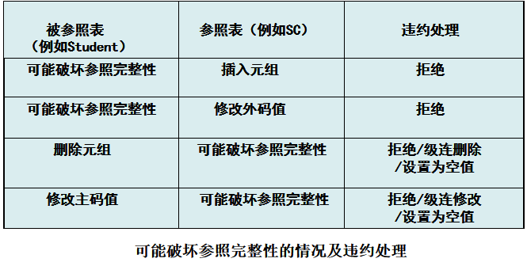

[TOC]

---

数据库的完整性

- 数据的==正确性和相容性==
- 防止数据库中存在**不符合语义**的数据，也就是防止数据库中存在**不正确的**数据

为维护数据库的完整性，DBMS必须：

- 提供**定义**完整性约束条件的机制
- 提供完整性**检查的方法**
- **违约处理**


---

# 5.1  实体完整性

- 关系模型的实体完整性
  `CREATE  TABLE`中用`PRIMARY KEY`定义主码
- 单属性构成的码有两种说明方法 
  - 定义为列级约束条件，即在该列后面直接写 Primary Key来定义
  - 定义为表级约束条件，在表定义的最后写 Primary Key(码)来定义
- 对多个属性构成的码只有一种说明方法
  
  - 定义为**表级约束条件** [^1]
- 插入或对主码列进行更新操作时，RDBMS按照==实体完整性规则==自动进行检查。包括：
  - 检查主码**值是否唯一**，如果不唯一则拒绝插入或修改
  - 检查主码的各个属性**是否为空**，只要有一个为空就拒绝插入或修改
- 检查记录中**主码值是否唯一**的一种方法是进行<u>**全表扫描**</u>

  > 显然全表扫描耗时长，所以为了避免对基本表进行全表扫描，关系数据库的DBMS一般都会在主码上自动建立一个索引（一般是B+树）

# 5.2  参照完整性

关系模型的参照完整性定义

- 在`CREATE  TABLE`中用`FOREIGN KEY`短语定义哪些列为外码
- 用`REFERENCES`短语指明这些外码参照哪些表的主码 

```sql
Creat table sc
(
Sno Char(9) not null
Cno char(4) not null
grade smallint
primary key(Sno,Cno)
foreign key(Sno) references Student(Sno)
    on delete cascade  //删除Student表中的元组时，级联删除SC中相应的元组。
    on updata no action//更新Student表中的元组造成不一致时，拒绝更新。这都是跟在foreign key后面的。
foreign key(Cno) references Course(Cno)
)
//注意主码内的属性也可以是外码的。
//外码的定义只能在表级上么？应该是的吧
```



> 设置为空值是因为外码可以为空。这个在讲外码的时候提到过。
>
> 违约处理中，拒绝执行是默认操作。
>
> 另外，设空值这个操作不一定能执行。比如上面那个例子，主码中有外码，若设SC的一个外码为空值，那么主码不为空就不满足了。

# 5.3  用户定义的完整性

> 相当于用户要求的。

- 用户定义的完整性就是<u>针对某一具体应用的数据</u>必须满足的语义要求 
- DBMS提供说明完整性接口并保证，而<u>不必由应用程序承担</u>
- 属性上的约束：在CREATE TABLE时定义
  - 列值非空（NOT NULL）
  - 列值唯一（UNIQUE）
  - 检查列值**是否满足一个布尔表达式**（CHECK）例如下例
- 元组上的约束
  - 在CREATE TABLE时可以用CHECK短语定义元组上的约束条件，即元组级的限制
  - 同属性值限制相比，元组级的限制可以设置不同属性之间的取值的相互约束条件 

```sql
［例］  创建学生表
CREATE TABLE Student
      (Sno    CHAR(9)     PRIMARY KEY，
       Sname  CHAR(8)     NOT NULL，
       Ssex   CHAR(2)，
       Sage   SMALLINT    CHECK(Sage<40) ， /*列级约束*/
       Sdept  CHAR(20)，
       CHECK (Ssex='女' OR Sname NOT LIKE 'Ms.%')); /*bool表达式 ，表级约束*/

/*性别是女性的元组都能通过该项检查，因为Ssex=‘女’成立；
当性别是男性时，要通过检查则名字一定不能以Ms.打头（Ms意味着女性）
学号为主码，姓名不能为空，年龄小于40
插入元组或修改属性的值时，RDBMS检查元组和属性上的约束条件是否被满足，不满足则拒绝执行*/ 
```


# 5.4  完整性约束命名子句[^1]

- 问题  在一张表上可以**定义多个完整性约束**，为方便起见，可用`CONSTRAINT`语句对所定义的约束条件命名

- 注意，这个`CONSTRAINT`==只能用在Create Table 语句内。==

- CONSTRAINT 约束命名子句

  ```sql
  CONSTRAINT <完整性约束条件名>
          ［PRIMARY KEY短语
           |FOREIGN KEY短语
           |CHECK短语］
  ```

  它这样就比较好批量添加和删除一些完整性约束。

```sql
［例］  建立学生登记表Student，要求学号在90000~99999之间，姓名不能取空值，年龄小于30，性别只能是“男”或“女”。
  CREATE TABLE Student
    (Sno  NUMERIC(6)
        CONSTRAINT C1 CHECK (Sno BETWEEN 90000 AND 99999)，
     Sname  CHAR(20)  
        CONSTRAINT C2 NOT NULL，
     Sage  NUMERIC(3)
        CONSTRAINT C3 CHECK (Sage < 30)，
     Ssex  CHAR(2)
        CONSTRAINT C4 CHECK (Ssex IN ( '男'，'女'))，
        CONSTRAINT StudentKey PRIMARY KEY(Sno)
      )；
 在Student表上建立了5个约束条件，包括主码约束（命名StudentKey）
 以及C1、C2、C3、C4四个列级约束。这样命名了之后就好操作。

对约束命名后，可以只用约束名进行操作

［例］ 修改表Student中的约束条件，要求学号改为在900000~999999之间，年龄由小于30改为小于40先删除原来的约束条件，再增加新的约束条件
      
   ALTER TABLE Student
   DROP CONSTRAINT C1;/*直接丢掉，好像没有提供直接修改的，都是Drop了之后再Add*/
   
   ALTER TABLE Student
   ADD CONSTRAINT C1 
       CHECK(Sno BETWEEN 900000 AND 999999);
//修改约束就直接删掉后重新加
   ALTER TABLE Student
   DROP CONSTRAINT C3;
   
   ALTER TABLE Student
   ADD CONSTRAINT C3 CHECK (Sage < 40)；
```

>  **修改约束就直接删掉再重新添加**

# *5.5  域中的完整性限制

```sql
Create domain GenderDomain CHAR(2)
	check (value in ('男','女'))
```

这种，限制性别的取值只能在男，女中取

# 5.6  触发器[^3]

- 触发器（Trigger）
      是用户定义在关系表上的一类由事件驱动的特殊过程
  - 由服务器自动激活
  - 可以进行更为复杂的检查和操作，具有更精细和更强大的数据控制能力 

## 5.6.1 定义触发器

用户可以通过CREATE TRIGGER在表上定义触发器	   

```sql
CREATE TRIGGER <触发器名>  
{ BEFORE | AFTER } <触发事件> ON <表名>
Referencing NEW|OLD ROW AS <变量> /*指出引用的变量，这句话可以不带*/
FOR EACH  { ROW | STATEMENT }
［WHEN <触发条件>］<触发动作体>  /*当触发条件为真时才执行触发动作提*/
```

### 定义触发器的语法说明:

- 由表的拥有者在<表名>的表上创建一个名为<触发器名>的触发器
-  { **BEFORE | AFTER** } 
       <u>BEFORE、AFTER</u>说明在表上发生触发事件之前或之后执行触发动作体  
- 触发事件是触发事件只能是   INSERT、DELETE、UPDATE 之中的组合或单个。
- 触发器类型
  - 行级触发器（FOR EACH **ROW**）
  - 语句级触发器（FOR EACH **STATEMENT**）

> 例如,假设在TEACHER表上创建了一个触发条件为AFTER  UPDATE的触发器，假设表TEACHER有1000行。
> 执行如下语句：
>     UPDATE TEACHER SET Deptno=5; 
> 如果该触发器为**语句级触发器**，那么执行完该语句后，触发动作只发生一次。
> 如果是**行级触发器**，触发动作将执行1000次 ；意思是每一行Deptno都会被修改成5

```sql
例子1：
定义一个BEFORE行级触发器，为教师表Teacher定义完整性规则“教授的工资不得低于4000元，如果低于4000元，自动改为4000元”。
CREATE TRIGGER Insert_Or_Update_Sal 
BEFORE INSERT OR UPDATE ON Teacher  
Referencing NEW row AS newTuple     /*指出引用的变量 */                        
FOR EACH ROW        /*行级触发器*/
BEGIN         /*定义触发动作体，是PL/SQL过程块*/ 
    IF (newTuple.Job='教授') AND (newTuple.Sal < 4000) /*不用'=='这种？Sql里的东西有点奇怪*/ 
    THEN newTuple.Sal :=4000;                
    END IF;
END;   


/*上面是第五版的写法，书P171可见。PPT上的写法略有不同，见下面*/


CREATE TRIGGER Insert_Or_Update_Sal 
BEFORE INSERT OR UPDATE ON Teacher  
/*这里没有引用变量*/   
FOR EACH ROW  
AS BEGIN   /*多了个AS，应该是不必要的*/        
    IF (new.Job='教授') AND (new.Sal < 4000) 
    THEN new.Sal :=4000;                
    END IF;
END;        
```

> 总之，可以不看这部分，定义有点麻烦，在试验指导那本书P55可以看到
>
> Referencing NEW|OLD ROW AS <变量>可以不带

## 5.6.2 激活触发器

- 触发器的执行，是由触发事件激活的，并由数据库服务器自动执行
- 一个数据表上可能定义了多个触发器
- 同一个表上的多个触发器激活时遵循如下的执行顺序：
    （1） 执行该表上的BEFORE触发器；
    （2） 激活触发器的SQL语句；
    （3） 执行该表上的AFTER触发器。

## 5.6.3 删除触发器

- 删除触发器的SQL语法：

```sql
DROP TRIGGER <触发器名> ON <表名>;
```

- 触发器必须是一个已经创建的触发器，并且只能由具有相应权限的用户删除。

```sql
  ［例］  删除教师表Teacher上的触发器Insert_Sal
              DROP TRIGGER Insert_Sal ON Teacher;
```

# 5.7 断言 Assertion[^2]

与前面的Constrain的区别：

- Constrain只能用在Create Table 语句内
- Assertion可以用在Create Table 语句外，可以定义涉及多个表或聚集操作的比较复杂的完整性约束

```sql
语句格式
Creat assertion <断言名> <Check子句>

例：限制数据库课程最多60人选修
Creat assertion ass_sc_db_num
	check(60>= (select count(*) 
                from course,sc 
                where sc.cno=course.cno and course.name='数据库') 
         )
例：限制每一门课程最多60人选修
Creat assertion ass_sc_cnum1
	check(60>= ALL(select count(*) 
                   from sc//选课表
                   group by cno) 
         )
         
删除断言
drop assertion <断言名>
```


---

[^1]: 课后补充习题里有用到
[^2]: 课后补充习题有考这个
[^3]: 我怀疑这个也不是重点，倒是补充习题上有一题。


