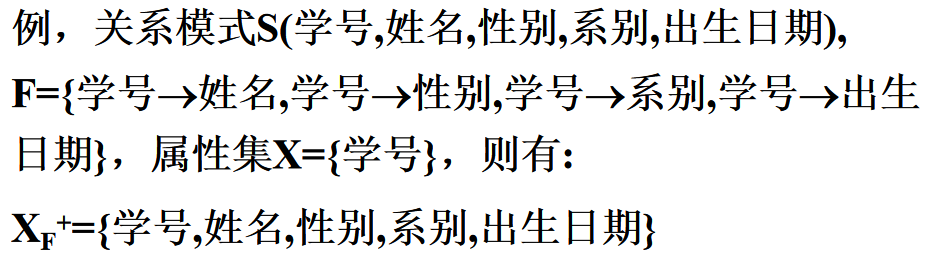
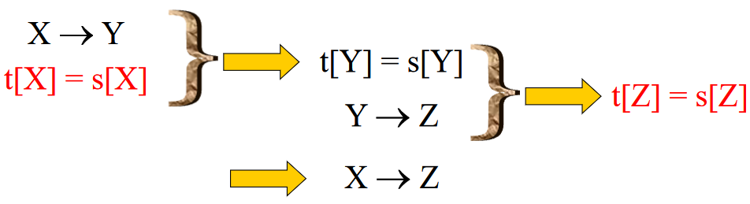
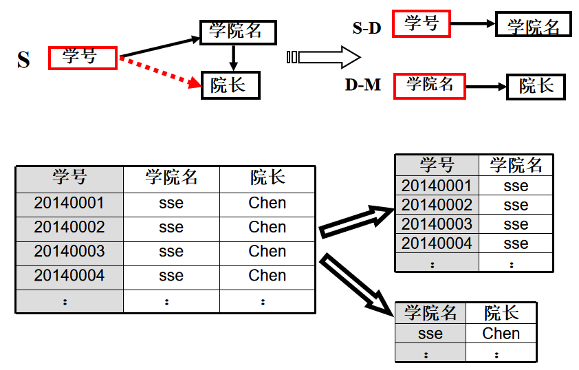

[toc]

本章讲述关系数据库规范化理论，这是数据库逻辑设计的理论依据。

> 主要侧重于对于**规范化理论的考察**，比如题目中给出的关系**满足第几范式**，然后会**评价下该范式所存在的缺点**，**少量题目会考察Armstrong公理，其后的章节基本不考。**

# 6.1 问题的提出

## 关系模式概念的回顾

关系模式由五部分组成，即它是一个五元组：
                    R(U, D, DOM, F)
R：         关系名（符号化的元组语义）
U：         组成该关系的**属性名集合**
D：         属性组U中属性所来自的域
DOM：   属性向域的映象集合
F：         **属性**间数据的**依赖关系集合**

简化为一个三元组：   R（U,  F）

## 规范化理论主要包括三个方面的内容：

- 函数依赖
- 范式（Normal Form）
- 模式设计——好像没见到，模式分解也不用看

==函数依赖==起着核心的作用，是模式分解和模式设计的基础

==范式==是模式分解的标准。

---

## 关系模式的存储异常问题：

- 数据库的逻辑设计为什么要遵循一定的规范化理论？
- 什么是好的关系模式？
- 某些不好的关系模式可能导致哪些问题？

## 举例

- 学号(sno),姓名(sname),年龄(age),所在系别(dept),所在系的系主任姓名(Dn),选修的课程号(cno),该课程的成绩(score)
- 用一个单一的关系模式来表达：
      `SCD(Sno,Sname,Age,Dept,Dn,Cno,Score)`
- 语义定义如下:
  - 一个系有若干个学生，但一个学生只属于一个系；
  - 一个系只有一名系主任；
  - 一个学生可以选修多门功课，每门课程可有若干学生选修；
  - 每个学生学习课程有一个成绩。

那么下面就是这个关系模式的表，它有哪些问题呢？

### 关系模式SCD存在的问题:

1. 数据冗余
    浪费大量的存储空间
    例：每一个系主任的姓名重复出现
    
2. 更新异常（Update Anomalies）
    数据冗余 ，更新数据时，维护数据完整性代价大。
	例：某系更换系主任，或学生改名后，必须把所有涉及到修改的都改一次，代价大。
	
3. 插入异常（Insertion Anomalies）
    **该插的数据插不进去**
         例，如果一个系刚成立，尚无学生，我们就无法把这个系及其系主任的信息存入数据库。
                又如，学生未选课，则学生信息无法输入。（为什么？，难道不能设置NULL么，列级约束决定的？）

    > 因为课程信息不能为空？

4. 删除异常（Deletion Anomalies）
    **不该删除的数据不得不删**
    	例，如果某个系的学生全部毕业了， 我们在删除该系学生信息的同时，把这个系及其系主任的信息也丢掉了。
    
    > 这个倒是真的，学生毕业但是系主任是不会走的，得留在表格里。

### 结论

- 关系模式SCD不是一个好的模式。
- “好”的模式应该满足：
  - 不会发生插入异常、删除异常、更新异常，
  - 数据冗余应**尽可能少**。（我们很难做到完全没有，而且有时候有些数据冗余会加快查询的效率）
- 产生的原因：模式中的**某些数据依赖**引起的
- 解决方法：==分解!!!==
  - 学生关系S(SNO,SN,AGE,DEPT)
  - 选课关系SC(SNO,CNO,SCORE)
  - 系关系D(DEPT,MN)

- 分解后的关系模式是“好” 的。
- 不过，一个好的关系模式**并不是在任何情况下都是最优的**。
- 如何按照**一定的规范设计关系模式**，将结构复杂的关系**分解**成结构简单的关系，从而==把“不好”的关系数据库模式转变为“好”的关系数据库模式==，这就是**关系的规范化**。
- 规范化又可以根据不同的要求而分成若干级别。
- 数据库模式的好坏和关系中各属性间的依赖关系有关，因此，我们先讨论属性间的依赖关系，然后再讨论关系规范化理论。

# 6.2 函数依赖

## 函数依赖

> 函数依赖是指一个关系表中属性（列）之间的联系。

设R(U)是一个属性集U上的关系模式，X , Y $\subseteq$U， r是R(U) 上的任意一个关系，如果成立
		**对$\forall$t , s $\in$r，若t[X] = s[X]，则t[Y] = s[Y]**
则称 “X函数确定Y” 或  “Y函数依赖于X”，记作X→Y。

> 左部x称为决定因子
> 右部y称为依赖因子

学号→姓名
学号→年龄
学号→系别
学号→系主任
… …
学号→ (姓名,年龄,系别,系主任)
系别→系主任
(学号,课程号)→成绩

请思考：

(学号,姓名)→年龄  ? (**部分函数依赖**)   因为只要学号就能决定年龄了，不需要姓名，只需要X中的一部分。
(年龄,系别)→系别 ?  (**平凡的函数依赖**)  因为Y属于X

### 有关函数依赖的几点说明:

1. 函数依赖不是指关系模式R的某个或某些关系实例满足的约束条件，而是指**R的所有关系实例**均要满足的约束条件。

2. 函数依赖是语义范畴的概念。
     **只能根据语义来确定一个函数依赖**。例如，对于前述关系模式，当学生不存在重名的情况下，可以得到：
      	姓名→年龄
      	姓名→系别

3. 函数依赖关系的存在与时间无关。

4. 函数依赖与属性之间的联系类型有关。

   - 如果属性X与Y有1:1联系时，则存在函数依赖X→Y，Y→X，即X←→Y。
   - 如果属性X与Y有m:1的联系时，则只存在函数依赖X→Y。
   - 如果属性X与Y有<u>**m: n的联系时，则X与Y之间不存在任何函数依赖关系。**</u>

5. 数据库设计者可以对现实世界作强制的规定

   ​    例如：规定不允许同名人出现，因而使得 “姓名” → “年龄”函数依赖成立。

## 平凡函数依赖与非平凡函数依赖:smiling_imp:

如果X→Y，但Y $\not\subseteq$ X，则称X→Y是**非平凡的函数依赖**  如   (学号,课程号)→成绩 

若X→Y，但Y $\subseteq$ X,   则称X→Y是**平凡的函数依赖**  如   (年龄,系别)→系别

> 平凡的函数依赖**必然成立**，它不反映任何语义
> 一般我们只讨论非平凡的函数依赖

## 完全函数依赖与部分函数依赖

> 即刚好要X中的==所有属性==才能决定Y，称**Y完全函数依赖于x** 

## 传递函数依赖

## 码

学生成绩信息表中有（学号、姓名、性别、年龄、系别、专业等）

学生表中含有学号或者身份证号的任意组合都为此表的码。如：（学号）、（学号，姓名）、（学号，性别）等

我们假设学生的姓名唯一，没有重名的现象。

      学号唯一，所以是一个超键
      姓名唯一，所以是一个超键
     （姓名，性别）唯一，所以是一个超键
     （姓名，年龄）唯一，所以是一个超键
     （姓名，性别，年龄）唯一，所以是一个超键
就是说，==只要含有候选码，就可以是码==

## 候选码

若U**完全依赖**于K，则K称为R的一个侯选码（Candidate Key）。
即每个K**完全决定**一个U，每个K都是独一无二的。
若关系模式R有多个候选码，则选定其中的一个做为主码（Primary key）。

> 上面的例子中
> 学号唯一，而且没有多余属性，所以是一个候选码
> 姓名唯一，而且没有多余属性，所以是一个候选码

包含在任何一个==候选码中的属性称为主属性==

## 主码

 主码就是候选码里面的一个，是人为规定的。比如上面就应该是学号。实际上姓名是会有重名的。

## 外码

不用多说。

# 6.3 函数依赖的公理系统[^1]

这部分看书上或者看PPT都可以，知道怎么用Armstrong公理系统去推结论就行

## 函数依赖集的闭包

在关系模式R<U,F>中为<u>F所逻辑蕴含的**函数依赖的全体**</u>所构成的**集合**称作F的闭包

> 就是由F可以推出的所有依赖的集合。就是F的闭包。
>
> 你看它里面所有的函数依赖都是可以通过X→Y推出来的。

## 属性集的闭包

> 可以由F看出X能推出的所有的东西都在属性集的闭包里。

## Armstrong公理系统

### Al.自反律（Reflexivity）：

   若Y $\subseteq $ X $\subseteq$ U，则X →Y为F所蕴含。

> 由自反律所得到的函数依赖均是平凡的函数依赖（显而易见），自反律的使用并不依赖于F

### A2.增广律（Augmentation）：

若X→Y为F所蕴含，且Z $\subseteq$ U，则XZ→YZ为F所蕴含。

> 增加一个Z显然也无伤大雅，这里XZ意思是X包含的列加上Z包含的列。

### A3.传递律（Transitivity）：

若X→Y及Y→Z为F所蕴含，则X→Z为F所蕴含。

### 由Armstrong公理导出的推理规则

- 合并律
  若X → Y，X → Z，则X → YZ

  > 这个也是显而易见，但是图好像失效了。

- 分解律
  若X → Y ，Z ∈Y，则X → Z
  特别地，若X → YZ ，则X → Y，X → Z

  

- 伪传递律
  若X → Y，WY → Z，则WX → Z

  > 像是传递率，但是是通过增广律得到的
  
  

### Armstrong公理系统是有效的、完备的

   有效性：由F出发，根据Armstrong公理推导出来的每一个函数依赖一定在F+中。

   完备性：==F+中的每一个函数依赖， 必定可以由F出发，根据Armstrong公理推导出来==
                

 即：所有不能用Armstrong公理推导出来f, 都不为真

> 有可能考试让你写函数依赖集的闭包。

# 6.4 关系模式的规范化

- 范式是符合某一种级别的关系模式的集合
- 关系数据库中的关系必须满足一定的要求。满足不同程度要求的为不同范式
- 范式的种类：
  - 第一范式(1NF)
  - 第二范式(2NF)	
  - 第三范式(3NF)
  - BC范式(BCNF)
  - 第四范式(4NF)
  - 第五范式(5NF)
- 各种范式之间存在联系：
- 一个低一级范式的关系模式，通过**模式分解**可以转换为若干个**高一级范式**的关系模式的集合，这种过程就叫**规范化** 

## 1NF

如果一个关系模式  R 的==所有属性都是不可分的基本数据项==，则 R∈1NF

- 第一范式是对关系模式的**最起码的要求**，不满足第一范式的数据库模式==不能称为关系数据库==（但可以是其他类型的数据库吧？）

- 但是满足第一范式的关系模式并不一定是一个好的关系模式。

  

## 2NF

若R∈1NF，且每一个**非主属性**==完全函数依赖==[^2]于码，则R∈2NF。
X的任意一个**真子集**都不决定Y，但X 的**全集**决定Y。

==一般情况下都要满足2NF==

- 解决方法： "学生" 关系分解为两个关系模式，以==消除这些部分函数依赖==
               SC（<u>学号</u>，<u>课程号</u>， 成绩）     S（<u>学号</u>，学院名，院长）
           
           > 你看，（成绩）完全函数依赖于（学号，课程号），缺一不可
           >
           > （学院名，院长）由学号就能决定，也是完全函数依赖
           
- 采用**投影分解法**将一个1NF的关系分解为多个2NF的关系，可以在一定程度上<u>减轻原1NF关系中存在的异常、冗余度大和修改复杂等问题</u>。

## 3NF

为了==消除传递函数依赖==

> 为什么呢，因为看下面这个例子和图。
>
> 1. 有数据冗余，院长这个词不用存这么多次。
> 2. 删除异常，如果一个学院的全部学生毕业，都删掉，那这个学院没了，院长也没了。
> 3. 修改复杂，如果一个学生要转系，那么他的学院名和院长都要改，如果通过3NF改了，就只需要修改学院名就可以了。
>
> 这几个问题是2NF中也有的，可以见书P175。

3NF的定义
	定义：关系模式R< U,F > 中若不存在这样的码 X、属性组Y及非主属性 Z（Z $\not\subseteq $ Y）, 使得 X → Y，Y → Z 成立，
Y  $\not\rightarrow $ X，则称R <U，F > ∈ 3NF。

- 若R∈3NF，则每一个==非主属性==既不部分依赖于码也不传递依赖于码。 
- 就是在2NF的基础上**解决了传递函数依赖**的问题。
- 采用投影分解法将一个2NF的关系分解为多个3NF的关系，可以在<u>一定程度上解决原2NF关系中存在的插入异常、删除异常、数据冗余度大、修改复杂等问题。</u>

### 讨论与思考

#### 1、规范化方法是否唯一，不同的规范化方法有何异同

不唯一

结果：

==显然，第二个会造成更多的数据冗余。浪费存储空间==

#### 2、规范化可能会产生什么样的负面作用，请举一例说明？

如果像右边那样分解，比如需要查询20140002号学生的院长是谁？**会增加查询的复杂度**。

所以总是有得有失，还是要人来抉择。看这个操作进行的多不多，需不需要空间换时间

## BCNF

定义：关系模式R<U, F>∈1NF，若X→Y且Y $\not\subseteq$ X 时 ==X 必含有码==，则R<U, F> ∈BCNF;

> 就比如说前面的那个学院名-院长，学院名不是码，学号才是码，所以应该用学号-院长
>
> 
>
> 应该用这个分解方法，因为学院名不是码

等价于：在一个关系模式中==每一个决定属性因素==都包含==**码**==。

> X→Y，每一个X都要是码

- 若R∈BCNF
  - 所有<u>非主属性</u>对每一个码都是完全函数依赖（可以理解，这是2NF的要求）
  - 所有的<u>主属性</u>对每一个不包含它的码，也是完全函数依赖（勉强可以理解）
  - 没有任何属性**完全函数依赖于非码**的任何一组属性 （这句话就拗口了）
- 所以说==BCNF是扩充的第三范式==
- 

### 例子

- STC$\in$3NF 
  没有任何非主属性对码传递依赖或部分依赖 
  
- STC$\not\in$BCNF
  
  - T是决定因素，但T不包含码，两个候选码分别是（S,C),(S,T)，T不在其中。
  - C是主属性，C依赖于T即可，但实际上它有依赖于(S,T)，是部分依赖，所以不属于BCNF。
  - 不满足BCNF
  
  

解决方法：将STC分解为二个关系模式：
    ST(S，T) ∈ BCNF， TC(T，C)∈ BCNF

## 多值依赖

【例】学校中某一门课程由多个教师讲授，他们使用相同的一套参考书，每个教师可以额讲授多门课程，每种参考书可以供多门课程使用

- Teaching (C,T,B)是全码，所以Teaching(C,T,B)$\in$BCNF

  > CT两个不能决定B，你看   （物理，王军）不是唯一的。只有CTB三个才是惟一的。 

- Teaching模式存在的问题
  1. 数据冗余大
  2. 插入，删除，修改操作复杂

### 定义：

​	设R(U)是属性集U上的一个关系模式，X, Y和Z是U的子集， 并且Z=U-X-Y。
​	关系模式R(U)中多值依赖X→→Y成立，当且仅当对R(U)的任一关系r，**给定的一对(x, z )值，有<u>一组</u>Y的值，这<u>组</u>值仅仅决定于x值，而与z值无关。**（实际上不需要Z来决定，Z是多余的）

> 例如上面的图，就是C → → T与C → → B
>
> 注意是“一组”啊。

### 平凡的多值依赖和非平凡的多值依赖:smiling_imp:

​       若X → →Y 有，且**Z=Ø**，则称X → →Y为**平凡的多值依赖**
​       否则（即Z不为空集），称X → →Y为**非平凡的多值依赖** （一般讨论非平凡的）（注意是一组Y）

### 【例】  关系模式WSC(W, S, C)

- W表示仓库，S表示保管员，C表示商品；
- 假设每个仓库有若干个保管员，有若干种商品；
- 每个保管员保管所有仓库的所有商品；
- 每种商品被所有保管员保管。

> 显然，每个W决定一组S，和一组C

### 多值依赖的性质

> 第一条是显然的，后面的也没见着考，了解一下。

### 多值依赖 ——与函数依赖的区别

> 这玩意儿也看的头痛。别管了

## 4NF

定义：关系模式R<U ，F>$\in$1NF，<u>==如果对于R的每个**非平凡多值依赖**X→ →Y，（即Z不为空），**X都含有码**==</u>，则R$\in$4NF

- 如果R$\in$4NF，则R$\in$BCNF
  - **不允许有非平凡且非函数依赖的多值依赖**
  - 允许的非平凡多值依赖是函数依赖。

---

例如之前的Teaching (C,T,B) 不是满足4NF的
因为存在**非平凡**的多值依赖C→ →T，且**C不是码**，不满足4NF的条件

> 因为Teaching这个表是全码，只有（C,T,B）才是码，单独的C不是码

用投影分解法把Teaching分解成：

CT(C,T)$\in$4NF

CB(C,B)$\in$4NF

这时候C→ →T，与C→ →B是平凡的多值依赖了。

> 若X → →Y 有，且**Z=Ø**，则称X → →Y为**平凡的多值依赖**
>
> 这里每个表只有两个属性，自然是只有X，Y，没有Z，故Z为空集

## 规范化小结

- 关系数据库的规范化理论是数据库逻辑设计的工具
- 目的：尽量消除**插入、删除异常，修改复杂，数据冗余**
- 基本思想：逐步消除数据依赖中不合适的部分
- 实质：概念的单一化

- 不能说规范化程度越高的关系模式就越好
-  在设计数据库模式结构时，必须对现实世界的实际情况和用户应用需求作进一步分析，确定一个合适的、能够反映现实世界的模式
- 上面的规范化步骤可以在其中任何一步终止

> 2NF    每一个**非主属性**==完全函数依赖==[^2]于码           消除非主属性对码的部分函数依赖
>
> 3NF    每一个非主属性都不会传递依赖于码          消除非主属性对码的传递函数依赖
>
> BCNF  要求每一个决定因素都含码。           消除了主属性对码的部分函数依赖，和传递函数依赖。
>
> 4NF   要求<u>==如果对于R的每个**非平凡多值依赖**X→ →Y，（即Z不为空），**X都含有码**==</u>    消除了非平凡且非函数依赖的多值依赖

# 6.5 模式的分解

- 分解是消除冗余和操作异常的一种好工具，然而，分解是否会带来新的问题？分解最关键的问题是：分解能否“复原”，分解后的函数依赖集是否与原关系的函数依赖集等价。
- 把低一级的关系模式分解为若干个高一级的关系模式的方法不是唯一的
- 只有能够保证分解后的关系模式与原关系模式等价，分解方法才有意义

三种模式分解等价的定义：
	  ⒈  分解具有无损连接性  (Lossless join)
	  ⒉  分解要保持函数依赖  (Preserve dependency )
	  ⒊  分解既要保持函数依赖，又要具有无损连接性

> 这部分会考！！！我复试就抽到了。
>
> 主要是看无损分解。

---

[^1]: 其实这部分书上讲的也很少，见P183，如果往年题型和期末题都不怎么考，那么不必细看。了解几个定律就行。
[^2]: 即刚好要X中的==所有属性==才能决定Y，称Y完全函数依赖于X