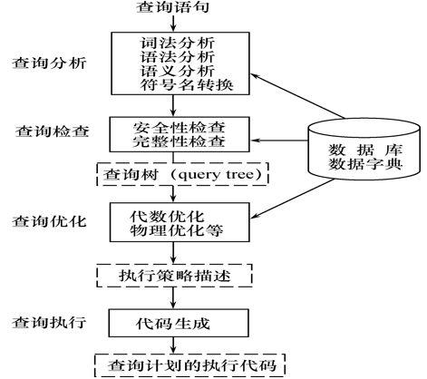
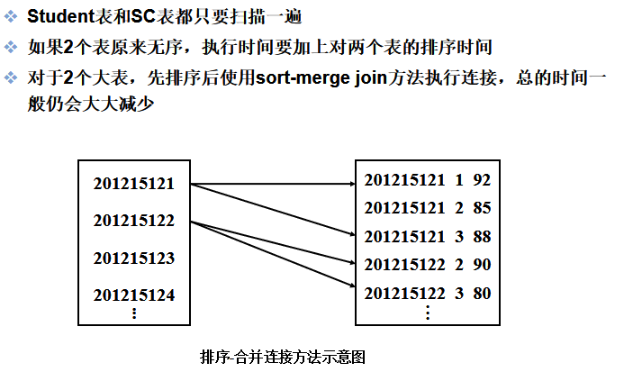

[toc]

# 1.关系数据库系统的查询处理 

RDBMS查询处理阶段 ： 
    1、查询分析
    2、查询检查
    3、查询优化 
    4、查询执行

> 数据字典到底是个什么玩意儿？
>
> ​		数据字典是指对数据的数据项、数据结构、数据流、数据存储、处理逻辑等进行定义和描述，其目的是对[数据流程图](https://baike.baidu.com/item/数据流程图/3073245)中的各个元素做出详细的说明，使用数据字典为简单的建模项目。
>
> ​		简而言之，**数据字典是描述数据的信息集合，是对系统中使用的所有数据元素的定义的集合。**

## 1.1  查询处理步骤 [^1]

### (1)查询分析

- 对查询语句进行扫描、词法分析和语法分析 
- 从查询语句中识别出语言符号，如SQL关键字、属性名和关系名等； 
- 进行语法检查和语法分析 ，判断查询语句是否符合SQL语法规则

### (2)查询检查 

- **根据数据字典对合法的查询语句进行语义检查** ，即检查语句中的数据库对象，如属性名、关系名是否存在和有效；
- 根据数据字典中的用户权限和完整性约束定义对用户的**存取权限**进行检查 ，若用户没有相应的访问权限或者违反了完整性约束条件，则拒绝执行；
- 检查通过后，把SQL查询语句转换成等价的关系代数表达式 ，RDBMS一般都用**查询树**[^5]\(语法分析树)来表示扩展的关系代数表达式 
- 这个过程要把数据库对象的外部名称**转换为内部表示** 

### (3)查询优化

- 查询优化：**选择一个高效执行的查询处理策略** 
- 查询优化分类 ：
  - 代数优化：指**关系代数表达式的优化**
  - 物理优化：指**存取路径和底层操作算法的选择**
- 查询优化方法选择的依据：
  - 基于规则(rule based)
  - 基于代价(cost based)
  - 基于语义(semantic based)

## 1.2  实现查询操作的算法示例 

这部分可以见软件学院数据库PPT，第七讲-关系查询处理与查询优化
或者见第三版书P159，第五版书P277

### （1）选择操作的实现 

#### 简单的全表扫描方法 

- 对查询的基本表顺序扫描，逐一检查每个元组是否满足选择条件，把满足条件的元组作为结果输出 
- **适合小表，不适合大表**

#### 索引(或散列)扫描方法 

- 适合选择条件中的属性上有索引(例如B+树索引或Hash索引) 
- 通过索引先找到满足条件的**元组主码或元组指针**，再通过元组指针直接在查询的基本表中找到元组

### （2）连接操作的实现

#### 嵌套循环方法(nested loop)

==最简单可行的算法==

- 对外层循环(Student)的每一个元组(s)，检索内层循环(SC)中的每一个元组(sc)
- 检查这两个元组在连接属性(sno)上是否相等
- 如果满足连接条件，则串接后作为结果输出，直到外层循环表中的元组处理完为止

#### 排序-合并方法(sort-merge join) 

==常用的算法==

- 适合连接的诸表**已经排好序**的情况 
- 排序－合并连接方法的步骤：
  - 如果连接的表没有排好序，先对Student表和SC表按连接属性Sno排序 
  - 取Student表中第一个Sno，依次扫描SC表中具有相同Sno的元组 
  - 当扫描到Sno不相同的第一个SC元组时，返回Student表扫描它的下一个元组，再扫描SC表中具有相同Sno的元组，把它们连接起来 
  - 重复上述步骤直到Student 表扫描完

#### 索引连接(index join)方法

① 如果原来没有该索引，在SC表上建立属性Sno的索引
② 对Student中每一个元组，由Sno值通过SC的索引查找相应的SC元组 
③ 把这些SC元组和Student元组连接起来，循环执行② ③，直到Student表中的元组处理完为止 

#### hash join算法

把连接的属性作为hash的码，用同一个函数把student,sc表中的元组散列到hash表中。

1. 划分阶段——又称创建阶段，创建hash表，对包含较少元组的表（如student表）进行一遍处理，把它的元组按hash函数分散到hash表的桶中。
2. 试探阶段——又称连接阶段，对另一个表（SC表）进行一遍处理，把SC表的元组按同一个hash函数散列，找到适当的桶，并把SC元组与来自Student元组表与之相匹配的元组连接起来。

# 2.关系数据库系统的查询优化

可分为代数优化和物理优化。

**关系查询优化是影响关系数据库管理系统性能的关键因素**

## 2.1  查询优化概述 

> 它减轻了用户选择存取路径的负担，用户只需要提出“干什么”，而不必指出“怎么干”

查询优化的优点不仅在于**用户不必考虑如何最好表达查询以获得较高的效率**，而且在于**系统可以比用户程序“优化”做的更好**，原因：

1. 优化器可以从数据字典中获得许多统计信息，从而选择高效的执行计划，用户程序难以获得这些信息
2. 若数据库的物理统计信息改变，系统可以自动对查询进行重新优化以选择相适应的执行计划
3. 优化器可以考虑几百种不同的执行方案，程序员不行
4. 优化器中集成了许多复杂的优化技术。

---

- 在集中式数据库中，查询执行开销包括：
  总代价=I/O代价+CPU代价+内存代价
- 在分布式数据库中
  总代价=I/O代价+CPU代价+内存代价+通信代价

查询优化的**总目标**：

- 选择有效的策略。
- 求得给定关系表达式的值。
- 使得查询代价最小(实际上是==较小==) 

## 2.2 查询优化的一个实例[^2]

第五版书P280 ,就是对同一个查询给了三种不同的代数查询方式，对比优劣。

## 2.3 查询优化的==四个步骤==[^3]

1. 将查询优化转换成某种内部表示，通常是<u>语法树</u>
2. 根据一定的**等价变换规则**，把语法树转换成标志（优化）形式
3. 选择低层的操作算法
4. 生成查询计划

步骤3,4有时是作为一个步骤处理的。

## 2.4 查询优化的一般准则

又叫==查询树的启发式优化==，可见第五版书P284

1. ==选择运算应尽可能先做==，可使执行时间降低几个数量级。
2. 执行连接前对关系做适当的预处理
   - 索引连接法
   - 排序合并连接法
3. 把**投影运算和选择运算同时进行**
   避免重复扫描
4. 把**投影同其前或其后的双目运算结合起来**
   没有必要为了去掉某些列又扫描一遍。
5. 把某些选择同它前面要执行的笛卡尔积结合起来成为一个连接运算[^4]
   <u>连接，尤其是等值连接，比笛卡尔积省很多时间</u>
6. 找出**公共子表达式**，可以先计算一次公共子表达式，并把结果写入中间文件。 

# 3.代数优化

> 详细的变换规则，见PPT或书P163

## 3.1 关系代数表达式等价变换规则

代数优化策略：通过对关系代数表达式的等价变换来提高查询效率 

关系代数表达式的等价：指用相同的关系代替两个表达式中相应的关系所得到的结果是相同的

两个关系表达式E1和E2是等价的，可记为E1≡E2  

## 3.2  查询树的启发式优化

1. ==选择运算应尽可能先做==，可使执行时间降低几个数量级。
2. 执行连接前对关系做适当的预处理
   - 索引连接法
   - 排序合并连接法
3. 把**投影运算和选择运算同时进行**
   避免重复扫描
4. 把**投影同其前或其后的双目运算结合起来**
   没有必要为了去掉某些列又扫描一遍。
5. 把某些选择同它前面要执行的笛卡尔积结合起来成为一个连接运算[^4]
   连接，尤其是等值连接，比笛卡尔积省很多时间。
6. 找出**公共子表达式**，可以先计算一次公共子表达式，并把结果写入中间文件。 

---

遵循这些启发式规则，应用等价变换公式来优化关系表达式的算法。

​	【算法】关系表达式的优化
​	【输入】一个关系表达式的查询树
​	【输出】优化的查询树
​	【方法】
1）利用等价变换规则4把形如σF1∧F2∧…∧Fn(E)变换为 
​                        σF1(σF2(…(σFn( E ) )…) )。
2）对每一个选择，利用等价变换规则4～9尽可能把它移到树的叶端。

3 ）对每一个投影利用等价变换规则3，5，10，11中的一般形式尽可能把它移向树的叶端。

> 注意： 
> 等价变换规则3使一些投影消失
> 规则5把一个投影分裂为两个，其中一个有可能被移向树的叶端 

4 ）利用等价变换规则3 ～ 5 把选择和投影的串接合并成单个选择、单个投影或一 个选择后跟一个投影。使多个选择或投影能同时执行，或在一次扫描中全部完成  

# 4.物理优化

第三版书上没有，第五版P286

- 代数优化改变查询语句中操作的次序和组合，**不涉及底层的存取路径**
- 对于一个查询语句有许多存取方案，它们的执行效率不同， 仅仅进行代数优化是不够的 
- 物理优化就是要选择高效合理的操作算法或存取路径，求得优化的查询计划 

## 选择的方法： 

- 基于规则的启发式优化

  启发式规则是指：<u>大多数情况下都适用，但不一定最好的规则</u>。

- 基于代价估算的优化

  用**优化器估算**，算出最小代价

- 两者结合的优化方法

  查询优化器通常上述两个方法一起用。因为策略非常多，所以先用启发式优化，选较优的候选方案，再分别计算代价，选出最优的方案

## 4.1基于启发式规则的存取路径选择优化

###  选择操作的启发式规则 

1. 对于小关系，使用全表顺序扫描，即使选择列上有索引 。

2. 对于选择条件是 "主码＝值" 的查询

   - **查询结果最多是一个元组，可以选择主码索引**
   -  一般的DBMS会自动建立主码索引。

3. 对于选择条件是 "非主属性＝值" 的查询，并且选择列上有索引
   要估算查询结果的元组数目

   - 如果**比例较小**(<10%)可以使用索引扫描方法
   - 否则还是使用全表顺序扫描

4. 对于选择条件是属性上的非等值查询或者范围查询，并且选择列上有索引
    要估算查询结果的元组数目

   - 如果**比例较小**(<10%)可以使用索引扫描方法
   - 否则还是使用全表顺序扫描 

5. 对于用AND连接的合取选择条件

   - 如果有涉及这些属性的**组合索引**
     - 优先采用**组合索引扫描方法**
   - 如果某些属性上有**一般的索引**
     - 则可以用**索引扫描方法**
   - 都没有，用全表顺序扫描。

6. 对于用OR连接的析取选择条件，一般使用**全表顺序扫描**

   > 总的来说，数据量小就用索引，数据量大就全表扫描。

###  连接操作的启发式规则 

1. 如果两个表都已经按照连接属性排序
    选用**排序-合并**方法
2. 如果一个表在连接属性上有索引
    选用**索引连接**方法
3. 如果上面两个规则都不适用，**其中一个表较小**
    选用**Hash join**方法
4. 最后可以选用嵌套循环方法，并选择其中较小的表，确切地讲是占用的块数(b)较少的表，作为外表(外循环的表) 。

> 怎么看我都觉得第四个方法用不到吧。。

## 4.2  基于代价的优化

1. 启发式规则优化是定性的选择，比较粗糙，适合==解释执行的系统==
   解释执行的系统，**优化开销包含在查询总开销之中** 
2. ==编译执行的系统==中查询优化和查询执行是分开的，**一次编译优化，多次执行**。
   可以采用精细复杂一些的**基于代价**的优化方法  

### 一、 统计信息

基于代价的优化方法要计算各种操作算法的执行代价，与数据库的状态密切相关 
数据字典中存储的优化器需要的统计信息： 

1. 对每个基本表
   - 该表的元组总数(N)
   - 元组长度(l)
   - 占用的块数(B)
   - 占用的溢出块数(BO)
2. 对基表的每个列
   - 该列不同值的个数(m)
   - 选择率(f)
     - 如果不同值的分布是均匀的，f＝1/m
     - 如果不同值的分布不均匀，则每个值的选择率＝具有该值的元组数/N
   - 该列最大值
   - 该列最小值
   - 该列上是否已经建立了索引
   - 索引类型(B+树索引、Hash索引、聚集索引)
3. 对索引(如B+树索引)
   - 索引的层数(L)
   - 不同索引值的个数
   - 索引的选择基数S(有S个元组具有某个索引值)
   - 索引的叶结点数(Y) 

### 二、 代价估算示例 

#### 1）全表扫描算法的代价估算公式

如果基本表大小为B块，全表扫描算法的代价 cost＝B

如果选择条件是码＝值，那么平均搜索代价 cost＝B/2

#### 2）索引扫描算法的代价估算公式

- 如果选择条件是码＝值
  - 如［例1-C2: Sno=‘201215121’］，则采用该表的主索引
  - 若为B+树，层数为L，需要存取B+树中从根结点到叶结点L块，再加上基本表中该元组所在的那一块，所以cost=L+1
- 如果选择条件涉及**非码属性**
  - 如［例1-C3: Sage>20］，若为B+树索引，选择条件是相等比较，S是索引的选择基数(有S个元组满足条件)
  - 最坏的情况下，满足条件的元组可能会保存在不同的块上，此时，cost=L+S 
- 如果比较条件是＞，＞＝，＜，＜＝操作
  - 假设有一半的元组满足条件就要存取一半的叶结点
  - 通过索引访问一半的表存储块cost=L+Y/2+B/2
  - 如果可以获得更准确的选择基数，可以进一步修正Y/2与B/2

#### 3）嵌套循环连接算法的代价估算公式

已经讨论过了嵌套循环连接算法的代价 `cost＝Br+Bs/(K-1) Br` 

如果需要把连接结果写回磁盘，
   `cost＝Br+Bs/(K-1) Br +(Frs*Nr*Ns)/Mrs`

- 其中Frs为连接选择性(join selectivity)，表示连接结果元组数的比例
- Mrs是存放连接结果的块因子，表示每块中可以存放的结果元组数目。

#### 4）排序-合并连接算法的代价估算公式

- 如果连接表已经按照连接属性排好序，则`cost＝Br+Bs+(Frs*Nr*Ns)/Mrs`
- 如果必须对文件排序
  - 需要在代价函数中加上排序的代价
  - 对于包含B个块的文件排序的代价大约是  ` (2*B)+(2*B*log2B)`

---

# 小结

1. 查询处理是RDBMS的核心，查询优化技术是查询处理的关键技术 
2. 本章讲解的优化方法 
   - **启发式代数优化**（代数优化）
   - 基于启发式规则规则的**存取路径优化**（物理优化）
   - **基于代价的优化**（物理优化）
3. 本章的目的：希望读者掌握查询优化方法的概念和技术 
4. 比较复杂的查询，尤其是涉及连接和嵌套的查询
   - 不要把优化的任务全部放在RDBMS上
   - 应该找出RDBMS的优化规律，以写出适合RDBMS自动优化的SQL语句 （比如？）
5. 对于RDBMS不能优化的查询需要重写查询语句，进行手工调整以优化性能 

---

[^1]: 这一节第三版的书上都没有，直接就是查询优化。第五版的书上才有，了解一下即可。
[^2]: 见书的P159，这里就不说明了
[^3]: 这部分在第三版书的P158。第五版书P280 。了解一下
[^4]: 这部分见书P159 ，4.2.2中的实例

[^5]: 查询树及其优化可能会考。