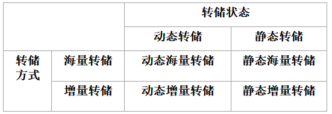
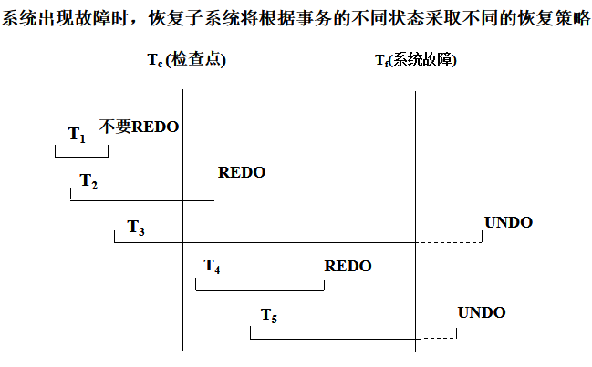
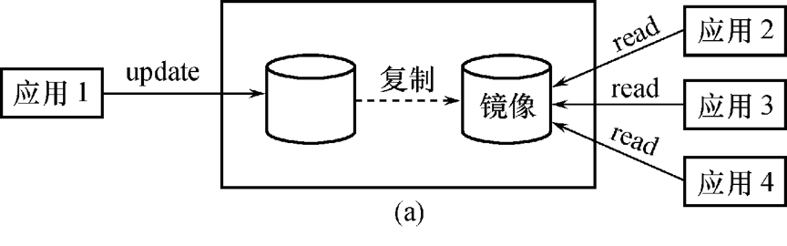
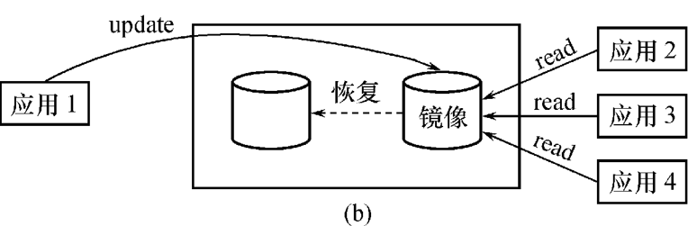

[toc]

# 1、事务的基本概念(Transaction事务)

## 1.1定义

- 一个数据库操作序列
- 一个**不可分割的工作单位**
- 恢复和并发控制的基本单位
- ==要么全做，要么全不做==

事务和程序比较：

- 在关系数据库中，一个事务可以是一条或多条SQL语句,也可以包含一个或多个程序。
- **一个程序通常包含多个事务**

定义事务的语句有3条：

```sql
BEGIN TRANSACTION 开始
COMMIT		提交并结束
ROLLBACK	回滚并结束，将数据库的所有已完成的操作全部撤销，滚回到事务开始时的状态。
```

## 1.2特性

1. 原子性

   要么都做，要么都不做

2. 一致性

   是指当事务完成时，必须使所有数据都具有一致的状态。

3. 隔离性

   当多个事务并发执行时，<u>一个事务的执行不能被其他事务干扰</u>。

4. 持续性

   一个事务一旦提交，它<u>对数据库中数据的改变应该是永久性的</u>，即使系统可能出现故障。

# 2、数据库恢复概述

- 故障是不可避免的
  - 系统故障：计算机软、硬件故障
  - 人为故障：操作员的失误、恶意的破坏等。
- 数据库的恢复
  把数据库从错误状态恢复到某一已知的正确状态(亦称为一致状态或完整状态)

# 3、故障的种类

## 3.1 事务内部的故障

- 有的是可以通过事务程序本身发现的
- 有的是非预期的

事务内部更多的故障是非预期的，是不能由应用程序处理的

- 运算溢出
- 并发事务发生死锁而被选中撤销该事务
- 违反了某些完整性限制等

 以后，事务故障==仅指这类非预期的故障==

<u>事务故障的恢复操作</u>被称为：撤消事务（UNDO）

## 3.2 系统故障（软故障）

称为软故障，是指造成系统停止运转的任何事件，使得系统要重新启动。 

影响正在运行的所有事务，但不破坏数据库

主存的内容，尤其是数据库缓存区中的内容，都将丢失。

- 发生系统故障时，**事务未提交**，事务没有达到预期的终点。回滚改事务，撤销修改，使其看起来完全没有发生过。
  - 恢复策略：==强行撤消（UNDO）==所有未完成事务
- 发生系统故障时，**事务已提交**，但是有些已完成的事务**可能一部分或者全部留在缓冲区**，**尚未完全写回到磁盘上**。
  所以故障的发生会使这些事务对数据库的修改部分或全部丢失。会使数据库处于不一致的状态。
  - 恢复策略：==重做（REDO）==所有已提交的事务

## 3.3 介质故障（硬故障）

硬故障，指外存故障。

例如：磁盘损坏、磁头碰撞、操作系统的某种潜在错误、瞬时强磁场干扰

用备份和日志恢复。

## 3.4 计算机病毒

数据库可能被破坏，可能被更改。

# 4、恢复的实现技术

恢复操作的基本原理：==冗余==
	利用存储在系统<u>其它地方的冗余数据</u>来**重建数据库中已被破坏或不正确的那部分数据**

恢复机制涉及的关键问题

1. 如何建立冗余数据
   - 数据转储（backup）
   - 登记日志文件（logging）
2. 如何利用这些冗余数据实施数据库恢复（也就是5.恢复策略的内容了）

## 一、数据转储

- 转储是指DBA**将整个数据库复制**到磁带或另一个磁盘上保存起来的过程，备用的数据称为后备副本或后援副本
- 如何使用
  - 数据库遭到破坏后可以将后备副本重新装入
  - 重装后备副本只能将数据库恢复到转储时的状态

### 1）静态转储与动态转储

#### 静态转储

- 在系统中**无运行事务时**进行的转储操作
- 转储开始时数据库处于一致性状态
- <u>**转储期间不允许对数据库的任何存取、修改活动**</u>
- 得到的**一定是一个数据一致性的副本** 
- 优点：实现简单
- 缺点：降低了数据库的可用性
  - 转储必须等待正运行的用户事务结束 
  - 新的事务必须等转储结束

> 适合小数据库

#### 动态转储

- 转储操作与用户事务并发进行
- **转储期间允许对数据库进行存取或修改**
- 优点：
  - 不用等待正在运行的用户事务结束
  - 不会影响新事务的运行
- 缺点
  - **不能保证副本中的数据正确有效**
    
    > 【例】在转储期间的某个时刻Tc，系统把数据A=100转储到磁带上，而在下一时刻Td，某一事务将A改为200。转储结束后，后备副本上的A已是过时的数据了

> 适合大数据库，或者说不能暂停事务运行的数据库。

### 2）海量转储与增量转储

- 海量转储: 每次转储全部数据库

- 增量转储: 只转储上次转储后更新过的数据

- 海量转储与增量转储比较：
  - 从恢复角度看，使用**海量转储**得到的后备副本**进行恢复往往<u>更方便</u>**
  - 但如果**数据库很大**，事务处理又十分频繁，则**增量转储方式更实用更有效**



## 二、日志文件

### 1）日志文件的格式和内容

什么是日志文件？

> 日志文件(log)是用来记录事务对数据库的更新操作的文件
>

日志文件的格式

- 以**记录**为单位的日志文件（记录的详细一点）
- 以**数据块**为单位的日志文件（记录的简单一点）

#### 以记录为单位的日志文件内容

- 各个事务的开始标记(BEGIN TRANSACTION)
- 各个事务的结束标记(COMMIT或ROLLBACK)
- 各个事务的所有更新操作
  - 事务标识（标明是哪个事务） 
  - 操作类型（插入、删除或修改）
  - 操作对象（记录内部标识）
  - <u>更新前数据的旧值</u>（对插入操作而言，此项为空值）
  - <u>更新后数据的新值</u>（对删除操作而言, 此项为空值）
  
  > 一般都是以记录为单位，才有对旧值和新值的记录，才好undo和redo

#### 以数据块为单位的日志文件内容

- 事务标识（标明是那个事务）
- 被更新的数据块

### 2）日志文件的作用

- 进行事务故障恢复
- 进行系统故障恢复 ——软故障
- 协助后备副本进行介质故障恢复 ——硬故障

具体来说

1. <u>事务故障恢复和系统故障恢复必须用日志文件</u>
2. 介质故障可能直接从备份还原了，不一定用到日志文件
3. 动态转储必须要日志文件
4. 静态转储也可以建立日志文件。

### 3）登记日志文件

#### 基本原则

- 登记的次序严格按事务执行的时间次序
- ==必须先写日志文件，后写数据库==
  - 写日志文件操作：把表示这个修改的日志记录写到日志文件
  - 写数据库操作：把对数据的修改写到数据库中

#### 为什么要先写日志文件?

- 写数据库和写日志文件是两个不同的操作在这两个操作之间可能发生故障
- 如果先写了数据库修改，而在日志文件中没有登记下这个修改，**则以后就无法恢复这个修改了**
- 如果先写日志，但没有修改数据库，按<u>日志文件恢复时只不过是多执行一次不必要的UNDO操作</u>，并不会影响数据库的正确性 

# 5、恢复策略

## 5.1 事务故障的恢复

- 事务故障：事务在**运行至正常终止点前被终止**

  > 显然还没有提交（commit)

- 恢复方法
  
  - 由恢复子系统应利用日志文件撤消==（UNDO）==此事务已对数据库进行的修改
  
- 事务故障的恢复<u>由系统自动完成，对用户是透明的，不需要用户干预</u>

###  事务故障的恢复步骤

1.  **反向扫描**文件日志（即从最后向前扫描日志文件），查找该事务的更新操作。
2.  对该事务的更新操作执行**逆操作**。即将日志记录中“更新前的值” 写入数据库。
    - 插入操作: “更新前的值”为空，则相当于做删除操作
    - 删除操作:“更新后的值”为空，则相当于做插入操作
    - 若是修改操作，则相当于用修改前值代替修改后值 
3.  继续反向扫描日志文件，查找该事务的其他更新操作，并做同样处理。
4.  如此处理下去，**<u>直至读到此事务的开始标记</u>**，事务故障恢复就完成了。
    

## 5.2 系统故障的恢复

系统故障造成数据库不一致状态的原因

- ==未完成事务对数据库的更新已写入数据库==
- ==已提交事务对数据库的更新还**留在缓冲区**没来得及写入数据库==

恢复方法

1. ==Undo==故障发生时未完成的事务（未完成，可能完成了一半，那一半已经写入了，所以要把他撤销）
2. ==Redo==已完成的事务（已完成的可能有一部分甚至全部留在缓冲区，**丢失会使数据库不一致**，所以从做一遍）

系统故障的恢复由系统在重新启动时自动完成，**不需要用户干预**


### 系统故障的恢复步骤:arrow_up_small:

1.	正向扫描日志文件（即从头扫描日志文件），将相应事务放入队列
   - 重做(REDO) 队列: 在故障发生前**已经提交**的事务
     这些事务既有BEGIN TRANSACTION记录，<u>也有COMMIT记录</u>
   - 撤销 (Undo)队列:故障发生时尚**未完成**的事务
      这些事务只有BEGIN TRANSACTION记录，**无相应的COMMIT记录**
2.	对撤销(Undo)队列事务进行撤销(UNDO)处理
   - **反向**扫描日志文件，对每个UNDO事务的更新操作执行**逆操作**
   - 即将日志记录中“**更新前的值**”写入数据库 
3.	对重做(Redo)队列事务进行重做(REDO)处理
   - **正向**扫描日志文件，对每个REDO事务重新执行登记的操作
   - 即将日志记录中“**更新后的值”**写入数据库 

## 5.3 介质故障的恢复

因为是直接从备份点开始，所以只需要重做就行，不用撤销

### 1.重装数据库

装入最新的后备数据库副本（离故障发生时刻最近的转储副本），使数据库恢复到最近一次转储时的一致性状态。

- 对于静态转储的数据库副本，装入后数据库即处于一致性状态
- 对于动态转储的数据库副本，还须同时装入<u>转储时刻的**日志文件副本**</u>，利用与恢复系统故障的方法（即**REDO+UNDO**），才能将数据库恢复到一致性状态。

> 动态转储要通过日志恢复。
>
> 因为动态转储可能是前面的备份了，但当前的还没备份，只是日志同步了。所以恢复还要用日志。

### 2.重做已完成的事务

装入有关的**日志文件副本 (转储结束时刻的日志文件副本)**

- 首先扫描日志文件，找出<u>故障发生时已提交</u>的事务的标识，将其记入重做队列。
- 然后正向扫描日志文件，对重做队列中的所有事务进行重做处理。即将日志记录中“更新后的值”写入数据库。

### 介质故障的恢复需要DBA介入

- DBA的工作
  - 重装最近转储的数据库副本和有关的各日志文件副本
  - 执行系统提供的恢复命令
- 具体的恢复操作仍由DBMS完成

> 当然，用后面的镜像技术更好，不用DBA介入

# 6、具有检查点的恢复技术

## 一、问题的提出

两个问题，恢复子系统需要搜索日志，确定哪些redo，哪些undo。

1. 搜索整个日志将耗费大量的时间
2. 很多REDO的命令实际上已经把他们的更新操作写进数据库了，不再缓存里，不会丢失，**重新执行REDO，浪费了大量时间**

## 二、检查点技术

- 在日志文件中增加**检查点记录**（checkpoint）

- 增加**重新开始文件**

- 恢复子系统在登录日志文件期间**动态地维护日志**

  ---

- 检查点记录的内容:
  1. 建立检查点时刻所有正在执行的事务清单
  2. 这些事务最近一个日志记录的地址
  
- 重新开始文件的内容:      记录各个检查点记录在日志文件中的地址


---

### 动态维护日志文件的方法：:arrow_down_small:

周期性地执行如下操作：**建立检查点，保存数据库状态**。
具体步骤是：

1. 将当前**日志缓冲区**中的所有**日志记录**写入磁盘的日志文件上

2. 在日志文件中写入一个**检查点记录**

3. 将当前**数据缓冲区**的所有**数据记录**写入磁盘的数据库中

4. .把检查点记录在日志文件中的地址写入一个**重新开始文件**

   .jpg)

> 注意，缓冲区的所有数据记录都写入后，显然以后恢复就不需要REDO了。

---

恢复子系统可以<u>定期或不定期</u>地建立检查点,保存数据库状态 

定期：按照预定的一个时间间隔，如每隔一小时建立一个检查点 

不定期：按照某种规则，如日志文件已写满一半建立一个检查点

---

### 优点

1. 使用检查点方法可以==改善恢复效率==
2. **当事务 T 在一个检查点之前提交**，T 对数据库所做的修改==一定都已写入数据库==，写入时间是在这个检查点建立之前或在这个检查点建立之时 。在进行恢复处理时，没有必要对事务T执行REDO操作[^1]

## 三、利用检查点的恢复策略[^2]



==关键是看提交的时间==

> 在检查点前 ，无需操作
>
> 在检查点后，故障点前，需REDO
>
> 在故障点后，需UNDO

T1在**检查点前提交**，显然不用操作
T2在检查点前开始执行，**故障点前提交**缓冲区，还没提交，所以要REDO
T3在检查点前执行，但在**故障后提交**，操作未提交，所以要UNDO
T4在检查点后执行，**故障点前提交**。可能提交的修改在缓冲区，所以要REDO
T5在**故障后才提交**，操作未提交，故UNDO

# 7、数据库镜像

- **介质故障**是对系统影响最为严重的一种故障，严重影响数据库的可用性
  - 介质故障恢复比较费时
  - 为预防介质故障，DBA必须**周期性地转储数据库**
- 提高数据库可用性的解决方案
  - 数据库镜像（Mirror）

> 如果用转储实现
> 一是费时，发生了故障要从备份去恢复，这个恢复耗时长。**恢复的时候还不能访问**，影响工作
> 二是要周期性的做，加重了DBA的负担。
>
> 反正现在磁盘越来越便宜，用镜像也不贵。
> 镜像好处多
>
> 1. 本体故障可以访问镜像。
> 2. 一致性由DBMS自动完成，不用DBA来做。
> 3. 恢复也是DBMS去自动恢复
> 4. 没有故障时可以用于并发操作

---

### 数据库镜像的用途

- DBMS**自动**把整个数据库或其中的关键数据复制到另一个磁盘上
- DBMS**自动**保证镜像数据与主数据库的一致性 , 每当主数据库更新时，DBMS自动把更新后的数据复制过去（如下图所示）



### 出现介质故障时:smiling_imp:

- **可由镜像磁盘继续提供使用** （和转储不同，镜像数据库可以使用的）
- 同时DBMS自动利用镜像磁盘数据进行数据库的恢复
- 不需要关闭系统和重装数据库副本(如下图所示)




### 没有出现故障时

- 可用于**并发操作**

- 一个用户对数据加**排他锁**修改数据，其他用户可以**读镜像数据库上的数据，而不必等待该用户释放锁** 

  > 但这样容易读到脏数据吧？

### 缺点

- 频繁地复制数据自然会**降低系统运行效率**(这个是肯定的)
- 在实际应用中用户往往只选择对**关键数据**和**日志文件镜像**，而<u>不是对整个数据库进行镜像</u>

# 8. 小结

- 如果<u>数据库只包含成功事务提交的结果，就说数据库处于一致性状态</u>。保证数据一致性是对数据库的最基本的要求。

- 事务是数据库的逻辑工作单位
  DBMS保证系统中一切事务的原子性、一致性、隔离性和持续性
  
- DBMS必须对事务故障、系统故障和介质故障进行恢复

- 恢复中最经常使用的技术：数据库转储和登记日志文件

- 恢复的基本原理：利用存储在后备副本、日志文件和数据库镜像中的==冗余==数据来重建数据库（镜像里面也是冗余）

- 常用恢复技术
  - 事务故障的恢复
    UNDO
  - 系统故障的恢复（软故障）
    UNDO + REDO
  - 介质故障的恢复（硬故障）
    重装备份并恢复到一致性状态 + REDO
    或直接用镜像来恢复，也需要REDO吧，因为镜像有时候不是对整个数据库镜像镜像，只是对日志，关键数据镜像。
  
  ---
  
- 提高恢复效率的技术

- 检查点技术
  - 可以提高系统故障的**恢复效率**
  - 可以在一定程度上提高利用**<u>动态转储备份</u>**进行介质故障恢复的效率
  
- 镜像技术
  
  - 镜像技术可以**<u>改善介质故障的恢复效率</u>**

---

[^1]: 从而节省了大量时间
[^2]: 可以见书P258

