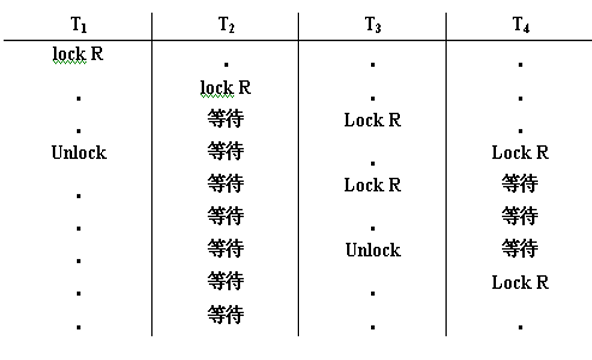

[TOC]

# 1. 并发控制概述

## 问题的产生

1. 允许多个用户同时使用的数据库系统
2. 不同的多事务执行方式 
   1.  事务**串行执行**
      - **每个时刻只有一个事务运行，其他事务必须等到这个事务结束以后方能运行**
      - 不能充分利用系统资源，发挥数据库共享资源的特点
   2. 交叉并发方式（Interleaved Concurrency）
      - 在单处理机系统中，事务的并行执行是这些并行事务的并行操作轮流交叉运行
      
      - 单处理机系统中的并行事务**并没有真正地并行运行**，但能够减少处理机的空闲时间，提高系统的效率
      
        > 不会出现同时存取同一数据这种情况。是分时间片的。
   3. **同时并发方式（simultaneous  concurrency）**
      
      - 会产生多个事务**同时存取同一数据**的情况 
      - **可能会存取和存储不正确的数据，破坏事务一致性和数据库的一致性**
      - 这是对应多处理机的时候，这时候就需要封锁机制，避免破坏一致性，隔离性。同时又实现并发执行。

## 并发控制机制的任务

- 对并发操作进行正确调度
- **保证事务的隔离性**
- 保证数据库的一致性

## 并发操作带来的数据不一致性

### 1. 丢失修改（Lost Update）

两个事务T1和T2读入同一数据并修改，T2的提交结果破坏了T1提交的结果，导致T1的修改被丢失。

### 2. 不可重复读（Non-repeatable Read）

- 不可重复读是指事务T1读取数据后，事务T2执行更新操作，使T1无法再现前一次读取结果。

- 不可重复读包括三种情况：

  1. 事务T1读取某一数据后，事务T2对其做了修改，当事务T1再次读该数据时，==得到与前一次不同的值==

      

  2. 事务T1按一定条件从数据库中读取了某些数据记录后，事务T2删除了其中部分记录，当T1再次按相同条件读取数据时，发现**某些记录消失了** ;

  3. 事务T1按一定条件从数据库中读取某些数据记录后，事务T2插入了一些记录，当T1再次按相同条件读取数据时，发现**多了一些记录**。

  > 后两种不可重复读有时也称为==幻影现象==（Phantom Row）

### 3. 读“脏”数据（Dirty Read）

- 事务T1修改某一数据，并将其写回磁盘
- 事务T2读取同一数据后，T1由于某种原因被撤销
- 这时T1已修改过的数据恢复原值，**T2读到的数据就与数据库中的数据不一致**
- T2读到的数据就为“脏”数据，即==不正确的数据==

## 数据不一致性的主要原因

>  由于并发操作**破坏了事务的隔离性**，从而导致了一致性被破坏。

并发控制就是要用正确的方式调度并发操作，使一个用户事务的执行不受其他事务的干扰，从而避免造成数据的不一致性 

# 2. 封锁

## 2.1 什么是封锁

- 封锁就是事务T在对某个数据对象（例如表、记录等）操作之前，先向系统发出请求，对其加锁
- 加锁后事务T就对该数据对象有了一定的控制，在事务T释放它的锁之前，其它的事务不能更新此数据对象。

## 2.2 基本封锁类型

- 排它锁（Exclusive Locks，简记为X锁）
  - 又称为写锁
  - 若事务T对数据对象A加上X锁，则==只允许T读取和修改A==，其它任何事务都不能再对A加任何类型的锁，直到T释放A上的锁
  - 保证其他事务在T释放A上的锁之前**不能再读取和修改A** 
- 共享锁（Share Locks，简记为S锁）
  - 若事务T对数据对象A加上S锁，则其它事务==只能再对A加S锁，而不能加X锁==，直到T释放A上的S锁
  - 保证其他事务可以读A，但在T释放A上的S锁之前**不能对A做任何修改** 

## 2.3 锁的相容矩阵

> 其中横线表示没有加锁。

## 2.4 封锁协议[^1]

### 一级封锁协议

功能：防止丢失修改

- 事务T1在读A进行修改之前先对A加==X锁==
- 当T2再请求对A加X锁时被拒绝
- T2只能等待T1释放A上的锁后T2获得对A的X锁
- 这时T2读到的A已经是T1更新过的值15
- T2按此新的A值进行运算，并将结果值A=14送回到磁盘。避免了丢失T1的更新。

### 二级封锁协议

功能：不读“脏”数据

- 事务T1在对C进行修改之前，先对C加X锁，修改其值后写回磁盘；
- T2请求在C上加S锁，因T1已在C上加了X锁，T2只能等待
- T1因某种原因被撤销，C恢复为原值100；
- T1释放C上的X锁后T2获得C上的S锁，读C=100。避免了T2读“脏”数据。

### 三级封锁协议

功能：可重复读

- 事务T1在读A，B之前，先对A，B加S锁
- 其他事务只能再对A，B加S锁，而不能加X锁，<u>**即其他事务只能读A，B，而不能修改**</u>
- 当T2为修改B而<u>申请对B的X锁时被拒绝</u>只能等待T1释放B上的锁
- T1为验算再读A，B，这时读出的B仍是100，求和结果仍为150，即可重复读
- T1结束才释放A，B上的S锁。T2才获得对B的X锁 

#  3. 活锁和死锁

## 3.1 活锁

- 事务T1封锁了数据R
- 事务T2又请求封锁R，于是T2等待。
- T3也请求封锁R，当T1释放了R上的封锁之后系统首先批准了T3的请求，T2仍然等待。
- T4又请求封锁R，当T3释放了R上的封锁之后系统又批准了T4的请求……
- ==T2有可能永远等待==，这就是活锁的情形 

> 不是，它为啥不设置一个队列，先来先批准呢。或者设置优先级，为啥后来先批准。

避免活锁：采用==先来先服务==的策略

## 3.2 死锁

- 事务T1封锁了数据R1
- T2封锁了数据R2
- T1又请求封锁R2，因T2已封锁了R2，于是T1等待T2释放R2上的锁
- 接着T2又申请封锁R1，因T1已封锁了R1，T2也只能等待T1释放R1上的锁
- 这样==T1在等待T2，而T2又在等待T1==，T1和T2两个事务永远不能结束，形成 死锁 

这种由于两个以上的事务**争夺资源而造成的互相等待现象**，称为  “ 死锁 ”

## 3.3 解决死锁的方法

### 1. 预防死锁

#### (1) 一次封锁法

- 要求每个事务必须**一次将所有要使用的数据全部加锁**，否则就不能继续执行
- 存在的问题
  - **降低系统并发度**
  - 难于事先精确确定封锁对象

#### (2) 顺序封锁法

- 顺序封锁法 是**预先对数据对象规定一个封锁顺序**，所有事务都按这个顺序实行封锁。

- 顺序封锁法存在的问题

  - 维护成本高
  数据库系统中封锁的数据对象极多，并且在不断地变化。
  
   - 难以实现
       很难事先确定每一个事务要封锁哪些对象

#### (3) 结论

- 在操作系统中广为采用的预防死锁的策略并==不很适合数据库==的特点

- DBMS在解决死锁的问题上更普遍采用的是==诊断并解除死锁==的方法

  > 因为不好预防,所以不如在死锁产生时解除.

### 2. 死锁的诊断与解除

#### (1) 超时法

- 如果一个事务的等待时间超过了规定的时限，就认为发生了死锁
- 优点：实现简单
- 缺点:
  - 有可能误判死锁
  - 时限若设置得太长，死锁发生后不能及时发现

#### (2) 事务等待图法 

- 并发控制**子系统周期性地（比如每隔数秒）生成事务等待图**，检测事务。如果发现图中==存在回路==，则表示系统中出现了死锁。
- 解除死锁
  - 选择一个处理死锁**代价最小**的事务，将其**撤消**
  - **释放此事务持有的所有的锁**，使其它事务能继续运行下去

> 有没有可能一解除，又死锁？需不需要错时恢复？

# 4. 并发调度的可串行性

- ==可串行化(Serializable)调度==
  
  - 多个事务的并发执行是正确的，当且仅当其结果<u>与按==**某一次序串行地**==执行这些事务时的结果相同</u>
  
    > 就是事务之间按顺序执行，顺序可变，但不能在事务内部插入事务。
- 可串行性(Serializability)
  - 是**并发事务正确调度的准则**
  - 一个给定的并发调度，**当且仅当它是可串行化的，才认为是正确调度** 

> 事务T1:  A=B+1
>
> 事务T2: B=A+1

> ==串行调度——按某一次序串行（顺序）的执行事务==
>
> 多个事务的调度策略不同<u>可能导致结果不同，但都是正确的调度</u>。见第三版P273，第五版P317

---

## 冲突可串行化

- **冲突操作是指不同的事务对同一个数据的读写操作和写写操作**
- 其他操作是不冲突操作。（当然，读同一个数据是不会冲突的）

冲突可串行化是指:
	一个调度SC在==保证冲突操作的次序不变==的情况下，通过交换两个事务的不冲突操作的次序，得到另一个调度SC\`,如果SC`是==串行的==，则称SC为冲突可串行化的调度

- 一个调度是**冲突可串行化**，一定是可串行化的调度

  > 再有冲突的情况下可串行化调度，那么，本身当然是可串行化调度的。
  >
  > 冲突操作是
  >
  > Ri(X)   Wj(x)  事务i对x读，事务j对x写这种。
  
- 冲突可串行化调度是可串行化调度的==充分条件==，**不是必要条件**。还有不满足冲突可串行化条件的可串行化调度。

> SC2最后变成串行的了，先是对事务T1的操作,然后是对事务T2的操作，事务按顺序完成，中间不插入其他事务的部分，这就是串行的。

# 5. 两段锁协议（2PL)

## 两段锁的含义

是==保证并发调度可串行化==的封锁协议。
也就是说，==遵循两段锁协议就一定是一个可串行化的调度==。

事务分为两个阶段对数据项的加锁和解锁

- 第一阶段是获得封锁，也称为**扩展阶段**
  	事务**可以申请**获得任何数据项上的任何类型的锁，但是**不能释放**任何锁 
- 第二阶段是释放封锁，也称为**收缩阶段**
  	事务**可以释放**任何数据项上的任何类型的锁，但是**不能再申请**任何锁 

---

- 事务遵守两段锁协议是可串行化调度的**充分条件**，而不是必要条件。

  若并发事务的一个调度是<u>可串行化的，不一定所有事务都符合两段锁协议</u> 

- 若并发事务都遵守两段锁协议，则对这些事务的任何并发调度策略都是**可串行化的**

## 两段锁协议与防止死锁的一次封锁法

- 一次封锁法要求==每个事务==必须一次将所有要使用的数据全部加锁，否则就不能继续执行，因此==一次封锁法遵守两段锁协议==
- 但是<u>两段锁协议并不要求事务必须一次将所有要使用的数据全部加锁</u>，因此==遵守两段锁协议的事务可能发生死锁==

>  一次封锁法更严格。但也cost more。
>
> 两段锁协议发生封锁可见P275

## 严格两段锁协议与强两段锁协议

严格两段锁协议：除要求满足两段锁协议规定外，还要求事务的**<u>排它锁（x）</u>必须在事务提交之后释放** 

> 避免**脏读**问题
>
> 2PL能随时释放锁，S2PL只能在事务结束后释放锁。这样你在释放锁之前都读不了，**肯定没有脏读**。

强两段锁协议：两段锁协议的另一个变化，除要求满足两段锁协议规定外，还要求事务的**<u>所有锁</u>都必须在事务提交之后释放。**

> 和严格两段锁协议相比，变成了全部锁。S锁也要在提交后释放了。
>
> 事务可按其提交的**顺序串行化**

- 从两段锁协议到严格两段锁协议，再到强两段锁协议，事务==持锁的时间不断增长==

- ==保证事务的并发调度是<u>冲突可串行化</u>的==

  > 这是否说明，服从两段锁协议的调度一定是冲突可串行化调度？

- 增强了数据库的<u>一致性保证</u>

- **并发度降低**

- 死锁出现可能性增加 

- 目前，大多数的DBMS都采用严格两段锁协议或强两段锁协议

# 6. 封锁的粒度

- **封锁对象的大小**称为**封锁粒度**(Granularity) 

- 封锁的对象：逻辑单元，物理单元 

  【例】在关系数据库中，封锁对象：

  - 逻辑单元: 属性值、属性值集合、元组、关系、索引项、整个索引、整个数据库等
  - 物理单元：页（数据页或索引页）、物理记录等

## 选择封锁粒度原则

- 封锁粒度与系统的并发度和并发控制的开销密切相关:
  - 封锁的粒度越大，数据库所能够封锁的数据单元就越少，**并发度就越小**，系统**开销也越小**
  - 封锁的粒度越小，**并发度较高**，但系统**开销也就越大**

> 【例】:
> 	若封锁粒度是数据页，事务T1需要修改元组L1，则T1必须对包含L1的整个数据页A加锁。如果T1对A加锁后事务T2要修改A中元组L2，则T2被迫等待，直到T1释放A。
> 	如果封锁粒度是元组，则T1和T2可以同时对L1和L2加锁，不需要互相等待，提高了系统的并行度。
> 	又如，事务T需要读取整个表，若封锁粒度是元组，T必须对表中的每一个元组加锁，**开销极大**。 

- 多粒度封锁(Multiple Granularity Locking)
  - 在一个系统中**同时支持**多种封锁粒度供不同的事务选择
  - 这个算是一个较优方案。
- 选择封锁粒度
       同时考虑封锁开销和并发度两个因素，适当选择封锁粒度
  - 需要处理<u>多个关系的大量元组</u>的用户事务：以数据库为封锁单位
  - 需要处理<u>大量元组</u>的用户事务：以关系为封锁单元（就是表）
  - 只处理<u>少量元组</u>的用户事务：以元组为封锁单位

## 多粒度树

- 以树形结构来表示多级封锁粒度
- 根结点是整个数据库，表示最大的数据粒度
- 叶结点表示最小的数据粒度多粒度树

- 允许多粒度树中的每个结点被**独立地**加锁
- 对一个结点加锁意味着这个结点的**所有后裔结点**也被加以同样类型的锁
- 在多粒度封锁中一个数据对象可能以两种方式封锁：显式封锁和隐式封锁

## 显式封锁和隐式封锁

- 显式封锁: 直接加到数据对象上的封锁

- 隐式封锁: 该数据对象没有独立加锁，是由于**其上级结点加锁而使该数据对象加上了锁**，（我个人觉得下级节点加锁也会导致它被锁）

- 显式封锁和隐式封锁的效果是一样的

  

- 系统检查封锁冲突时

  - 要检查显式封锁
  - 还要检查隐式封锁

- 例如事务T要对关系R1加X锁

  - 系统必须<u>搜索其上级结点</u>数据库、关系R1
  - 还要搜索R1的<u>下级结点</u>，即R1中的每一个元组
  - 如果其中某一个数据对象已经加了==不相容锁==，则**T必须等待** 

对某个数据对象加锁，系统要检查

- 该数据对象
  有无显式封锁与之冲突
- 所有上级结点
  检查本事务的显式封锁是否与该数据对象上的**隐式封锁冲突**：(由上级结点已加的封锁造成的）
- 所有下级结点
  看下级节点的的显式封锁是否与本事务的**隐式封锁**（由上级节点加到下级结点的封锁）冲突

> 意思就是，上面节点的锁会不会和本节点冲突，以及
> 下面的锁会不会和本节点冲突

==<u>这样做效率很低，所以人们引入了一种新型锁，意向锁。</u>==

## 意向锁

引进意向锁（intention lock）目的

- **提高对某个数据对象加锁时系统的检查效率**
- 如果对一个结点加意向锁，则说明该结点的**下层结点正在被加锁**
- 对任一结点加基本锁，**必须先对它的上层结点加意向锁**
- 例如，对任一元组加锁时，必须先对它所在的数据库和关系加意向锁

> 这样的优点就是，以后加锁不用往下找了，本节点无锁就是无锁，有意向锁代表下面节点要被加锁。

分为：

- 意向共享锁(Intent Share Lock，简称IS锁)
- 意向排它锁(Intent Exclusive Lock，简称IX锁)
- 共享意向排它锁(Share Intent Exclusive Lock，简称SIX锁)

### IS锁

如果对一个数据对象加IS锁，表示它的后裔结点拟（意向）加S锁。
  例如：事务T1要对R1中某个元组加S锁，则要首先对关系R1和数据库加IS锁 

### IX锁

如果对一个数据对象加IX锁，表示它的后裔结点拟（意向）加X锁。

### SIX锁

如果对一个数据对象加SIX锁，表示对它加S锁，再加IX锁，即SIX = S + IX。

> 对某个表加SIX锁，则表示该事务要读整个表（所以要对该表加S锁），同时会更新个别元组（所以要对该表加IX锁，表的后裔——元组会被更改）

### 锁的强度

- 锁的强度是**指它对其他锁的排斥程度**

- 一个事务在申请封锁时以强锁代替弱锁是安全的，反之则不然

  

### 具有意向锁的多粒度封锁方法

- 申请封锁时应该按自上而下的次序进行（先加意向锁，再实际加锁）
- 释放封锁时则应该按自下而上的次序进行

例如：事务T1要对关系R1加S锁

- 要首先对数据库加IS锁

- 检查数据库和R1是否已加了不相容的锁

  > 数据库上不能有X锁，R1上要加S锁的，不能有IX锁

- **不再需要搜索和检查R1中的元组是否加了不相容的锁(X锁)** 

> 因为上级已经检查过了，下级是必定不会和上级的锁不相容的

### 具有意向锁的多粒度封锁方法的优点

- 提高了系统的并发度
- 减少了加锁和解锁的开销
- 在实际的数据库管理系统产品中得到广泛应用 

# 7. 小结

1. 数据共享与数据一致性是一对矛盾
   共享就容易导致数据不一致，强调数据一致就难共享。

2. 数据库的价值在很大程度上取决于它所能提供的数据共享度

3. 数据共享在很大程度上取决于系统允许对数据**并发操作**的程度

4. 数据并发程度又取决于数据库中的并发控制机制

5. 数据的一致性也取决于并发控制的程度。施加的并发控制愈多，数据的一致性往往愈好

6. 数据库的并发控制以事务为单位

7. 数据库的并发控制通常使用封锁机制
   两类最常用的封锁，X锁，S锁

8. 并发控制机制调度并发事务操作是否正确的判别准则是可串行性

   并发操作的正确性则通常由两段锁协议来保证。

   两段锁协议是**可串行化调度**的**充分条件，但不是必要条件**

- 对数据对象施加封锁，带来问题
- 活锁： 先来先服务

- 死锁：
  - 预防方法
    - 一次封锁法
    - 顺序封锁法

  - 死锁的诊断与解除
    - 超时法
    - 等待图法

---

[^1]: P269