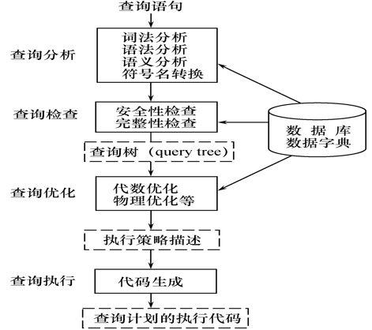
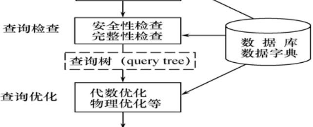

[TOC]

总的来看问B+树索引，hash，聚簇这三个物理结构基本上是年年都问

# 细节

1. 关系数据库就是表的集合
2. **sum()，min(),avg()这种聚集函数不能出现在where里**，只能在select或having里
3. HAVING短语**必须与GROUP BY短语**同时使用，不能单独出现
4. RDBMS执行CREATE VIEW语句时**只是把视图定义存入<u>数据字典</u>**，并==不执行==其中的SELECT语句。
5. 在对视图查询时，按视图的定义从**基本表**中将数据查出。
6. ==对视图的更新最终都会变成对基本表的更新==，因为视图是个虚表，不存东西的。
7. ==一些视图是不可更新的，因为对这些视图的更新不能唯一地有意义地转换成对相应基本表的更新==

# 猜测可能的题

### 什么是关系？简述关系的性质

关系就是二维表，是实体之间的多个属性的联系。

基本关系的性质。

1. 列是同质的，每一列中的分量是同一类型的数据，来自同一个域
2. 不同的列可出自同一个域（姓名，曾用名）
3. 列的顺序无所谓,列的次序可以任意交换
4. 任意两个元组的**候选码不能相同**
5. 行的顺序无所谓，行的次序可以任意交换
6. 分量必须取原子值，每一个分量都要是不可再分的数据项。满足1NF

### 简述关系模型中的三类完整性约束

实体完整性约束：主码的定义，主码唯一且不能为空

参照完整性约束：外码，要么全空，要么对应

用户自定义完整性约束，check()，not null ,unique

### 简述数据库系统的体系结构特点

三级结构，二级映像。

然后分别展开说就是


### 数据库设计步骤

### 简述数据库概论设计的主要步骤

- 需求分析阶段
  综合各个用户的应用需求

- 概念设计阶段
  形成独立于机器特点，独立于各个DBMS产品的概念模式(E-R图)

  > 上述两个阶段可独立于任何DBMS

- 逻辑设计阶段

  - 首先<u>将E-R图转换成具体的数据库产品支持的数据模型</u>，如关系模型，形成数据库逻辑**模式**
  - 然后根据用户处理的要求、安全性的考虑，在基本表的基础上再建立必要的视图(View)，形成数据的**外模式**

- 物理设计阶段
  根据DBMS特点和处理的需要，进行物理存储安排，建立索引，形成数据库**内模式**


### 什么是封锁，基本的封锁类型有几种？简述他们的含义

- 封锁就是事务T在对某个数据对象（例如表、记录等）操作之前，先向系统发出请求，对其加锁
- 加锁后事务T就对该数据对象有了一定的控制，在事务T释放它的锁之前，其它的事务不能更新此数据对象。


X,R锁

- 排它锁（Exclusive Locks，简记为X锁）
  - 又称为写锁
  - 若事务T对数据对象A加上X锁，则==只允许T读取和修改A==，其它任何事务都不能再对A加任何类型的锁，直到T释放A上的锁
  - 保证其他事务在T释放A上的锁之前**不能再读取和修改A** 
- 共享锁（Share Locks，简记为S锁）
  - 若事务T对数据对象A加上S锁，则其它事务==只能再对A加S锁，而不能加X锁==，直到T释放A上的S锁
  - 保证其他事务可以读A，但在T释放A上的S锁之前**不能对A做任何修改** 

意向锁

IS锁

如果对一个数据对象加IS锁，表示它的后裔结点拟（意向）加S锁。
  例如：事务T1要对R1中某个元组加S锁，则要首先对关系R1和数据库加IS锁 

IX锁

如果对一个数据对象加IX锁，表示它的后裔结点拟（意向）加X锁。

SIX锁

如果对一个数据对象加SIX锁，表示对它加S锁，再加IX锁，即SIX = S + IX。

### 简述关系数据模型的优缺点

优点

​		关系模型把**存取路径向用户隐蔽起来**（即**存储路径对用户透明**），用户只需指出“干什么”，“找什么”，不需告知“怎么干”，“怎么找”。从而<u>大大提高了数据的独立性</u>，提高了用户的生产率。

​		**概念单一，建立在严格的数学基础上**。

缺点

​	存取路径对用户透明，导致**查询效率**不如非关系数据模型，因此为了提高性能，**需对用户的查询请求优化。增加了开发DBMS的难度**

### 层次模型和网状模型的优缺点

#### 层次模型：

​	用树型结构表示，现实世界中的许多实体之间的联系本来就呈现一种自然的层次关系

优点：

1. 结构清晰
2. 查询效率高，因为联系用有向边表示，在DBMS中用指针实现，性能优于关系数据库
3. 良好的完整性支持

缺点：

1. 现实中很多联系是非层次的
2. 特定状态下很笨拙，比如一个节点有多个双亲，需要引入冗余数据，或者非自然数据结构来模拟
3. 查询子女节点必须经过双亲，浪费时间
4. 结构严密，层次命令趋于程序化

#### 网状模型

优点：

1. 能直接更直接描述现实世界，一个节点可有多个双亲，节点之间可有多种联系
2. 性能良好，存取效率高

缺点：

1. 结构复杂，不利于用户掌握
2. DDL,DML复杂，不利于使用
3. 记录之间的联系通过存取路径实现，**应用程序在访问数据时必须选择适当的存取路径**，因此用户必须了解系统结构的细节。加重了编写应用程序的负担

### 简述数据库系统的三级结构，这种结构的优点是什么？

内模式，模式，外模式

是对数据的三个抽象级别，它把数据的具体组织留给DBMS管理，使用户能逻辑地、抽象地处理数据，而不必关心数据在计算机中的具体表示方式与存储方式。

### HASH树和B+树索引都用在什么场合

b+树通用

### 关系代数的基本运算有哪些 ? 如何用这些基本运算来表示其他运算? 

答：**并、差、笛卡尔积、投影和选择**5种运算为基本的运算。

其他3种运算，即**交、连接和除**，均可以用这5种基本运算来表达。


### SQL的特点

1. 综合统一

   - ==集数据定义语言（DDL），数据操纵语言（DML），数据控制语言（DCL）==功能于一体。
   - 可以独立完成数据库生命周期中的全部活动
   - 用户数据库投入运行后，可根据需要随时逐步修改模式，不影响数据的运行。
   - 数据操作符统一
2. 高度**非过程化**

   - SQL只要提出“做什么”，无须了解存取路径。
   - 存取路径的选择以及SQL的操作过程由系统自动完成
3. **面向集合**的操作方式

   - 非关系数据模型采用面向记录的操作方式，操作对象是一条记录
   - SQL采用集合操作方式
     - 可以是**元组的集合**
     - 一次插入、删除、更新操作的对象可以是**元组的集合**
4. 以同一种语法结构提供多种使用方式

   - SQL是<u>独立的语言</u>，能够独立地用于联机交互的使用方式
   - SQL又是<u>嵌入式语言</u>，能够嵌入到高级语言（例如C，C++，  Java）程序中，供程序员设计程序时使用
5. 语言简洁，易学易用

### 聚簇索引

- CLUSTER 表明要建立的索引是**聚簇索引**。聚簇索引是指索引项的顺序**与表中记录的物理顺序一致的索引组织。**

  > 为了提高某个属性的查询速度，把这个属性上**具有相同值的元组集中存放在连续的物理块中**称聚簇

- <u>在==最经常查询的列上==建立聚簇索引以提高查询效率</u> 

- 一个基本表上最多**只能建立一个聚簇索引** 

- <u>经常更新的列不宜建立聚簇索引</u> 

- 减少i/o操作

### 视图的作用

- 视图能够**简化用户的操作**
- 视图使用户能以**多种角度看待同一数据** 
- 视图对**重构数据库**提供了一定程度的**逻辑独立性** 
- 视图能够对机密数据提供**安全保**护
- 适当的利用视图可以更清晰的表达查询

### 自主存取控制缺点

可能存在数据的“**无意泄露**”
原因：这种机制仅仅通过对数据的存取权限来进行安全控制，而**数据本身并无安全性标记**
解决：对系统控制下的**所有主客体**实施**强制存取控制策略**

### 强制存取控制（MAC)  的特点

- 保证更高程度的安全性

- 用户不能直接感知或进行控制

- 适用于对数据有严格而固定密级分类的部门

  

  ==先进行DAC检查==，通过DAC检查的数据对象==再由系统进行MAC检查==，只有通过MAC检查的数据对象方可存取。

### 什么是审计  

- 系统自动建立审计日志，将用户对数据库的**所有操作记录在上面**
- DBA利用审计日志找出非法存取数据的人、时间和内容
- **C2以上**安全级别的DBMS必须具有

### 审计分类

- 用户级审计
  - 针对<u>自己创建的数据库的表或视图</u>进行审计 
  - 记录所有用户对这些表或视图的一切成功和（或）不成功的访问要求以及各种类型的SQL操作 
- 系统级审计 
  - DBA设置 
  - 监测成功或失败的登录要求 
  - <u>监测GRANT和REVOKE操作</u>以及其他数据库级权限下的操作

### 为维护数据库的完整性，DBMS必须：

- 提供**定义**完整性约束条件的机制
- 提供完整性**检查的方法**
- **违约处理**

### 函数依赖集的闭包，属性集的闭包

略

### 数据字典是个什么

​		数据字典是指对数据的数据项、数据结构、数据流、数据存储、处理逻辑等进行定义和描述，其目的是对[数据流程图](https://baike.baidu.com/item/数据流程图/3073245)中的各个元素做出详细的说明，使用数据字典为简单的建模项目。

​		简而言之，**数据字典是描述数据的信息集合，是对系统中使用的所有数据元素的定义的集合。**

### RDBMS查询处理阶段



- 查询优化分类 ：
  - 代数优化：指**关系代数表达式的优化**
  - 物理优化：指**存取路径和底层操作算法的选择**
- 查询优化方法选择的依据：
  - 基于规则(rule based)
  - 基于代价(cost based)
  - 基于语义(semantic based)

### 连接操作的实现

1. 嵌套循环

2. 排序合并

3. 索引连接

4. hash join

   > 见第7章

### 查询树的启发式优化——代数优化里面的

1. ==选择运算应尽可能先做==，可使执行时间降低几个数量级。
2. 执行连接前对关系做适当的预处理
   - 索引连接法
   - 排序合并连接法
3. 把**投影运算和选择运算同时进行**
   避免重复扫描
4. 把**投影同其前或其后的双目运算结合起来**
   没有必要为了去掉某些列又扫描一遍。
5. 把某些选择同它前面要执行的笛卡尔积结合起来成为一个连接运算[^4]
   连接，尤其是等值连接，比笛卡尔积省很多时间。
6. 找出**公共子表达式**，可以先计算一次公共子表达式，并把结果写入中间文件。 

### 基于代价的优化

1. **启发式规则优化**是定性的选择，比较粗糙，适合==解释执行的系统==
   解释执行的系统，**优化开销包含在查询总开销之中** 
2. ==编译执行的系统==中查询优化和查询执行是分开的，**一次编译优化，多次执行**。
   可以采用精细复杂一些的**基于代价**的优化方法  

### 事务的基本概念

- 一个数据库操作序列
- 一个**不可分割的工作单位**
- 恢复和并发控制的基本单位
- ==要么全做，要么全不做==

#### 特性

1. 原子性

   要么都做，要么都不做

2. 一致性

   是指当事务完成时，必须使<u>所有数据都具有一致的状态</u>。

3. 隔离性

   当多个事务并发执行时，<u>一个事务的执行不能被其他事务干扰</u>。

4. 持续性

   一个事务**一旦提交**，它<u>对数据库中数据的改变应该是永久性的</u>，即使系统可能出现故障。

### 具有意向锁的多粒度封锁方法的优点

- **提高了系统的并发度**
- 减少了加锁和解锁的开销
- 在实际的数据库管理系统产品中得到广泛应用 

### 索引存取方法的选择

- 对哪些属性列建立索引
- 对哪些属性列建立组合索引
- 对哪些索引要设计为唯一索引

#### 1.选择B+树索引存取方法的一般规则

- 如果一个(或一组)属性<u>经常在**查询条件**中出现</u>，则考虑在这个(或这组)属性上建立索引(或组合索引)
- 如果一个属性经常作为最大值和最小值等聚集函数的参数，则考虑在这个属性上建立索引
- 如果一个(或一组)属性<u>经常在连接操作的**连接条件**中出现</u>，则考虑在这个(或这组)属性上建立索引

关系上定义的索引数过多会带来较多的额外开销 

#### 2.Hash索引存取方法的选择

当一个关系满足下列两个条件时，可以选择HASH存取方法

1. 一个关系<u>**大小可预知，而且不变**</u>
2. 关系的大小动态改变，但DBMS提供了动态hash存取方法

#### 3.聚簇存取方法的选择

##### 什么是聚簇

​	为了提高**某个属性（或属性组）的查询速度**，把这个或这些属性（称为聚簇码）上<u>具有==相同值的元组==**集中存放**在连续的**物理块**称为聚簇</u>

##### 为何需要索引

聚簇索引可以大大提高按聚簇码进行查询的效率。例如要查信息系的所有学生名单，假设信息系有500人，在极端情况下，这500人对应的数据元组分布在500个不同的物理块上，尽管有索引，避免全表扫描，但还是要进行500次I/O操作。如果击中存放，则显著减少访问磁盘次数。

##### 聚簇索引

- 建立聚簇索引后，基表中数据也需要按指定的聚簇属性值的升序或降序存放。也即聚簇索引的
- ==索引项顺序与表中元组的物理顺序一致。==
- 在<u>一个基本表上最多只能建立一个聚簇索引</u>
- 聚簇索引的用途：对于某些类型的查询，可以提高查询效率

##### 选取原则

1. **经常一起进行连接操作**的关系可以建立聚簇
2. 一个关系的一个（或一组）属性上的**值重复率很高**。
3. 一个关系的一组属性经常出现在相等的比较条件中

总之，每个聚簇码值的平均元组数不能太少，太少了聚簇的效果不明显。

# 2016年

### 一、选择题（10题、每题1分，我并没有全部记得）

#### 1、代数运算中的除运算可以分解成哪几种基本运算

投影，笛卡尔积，差

#### 2、由F出发根据Armstrong原理推导出来的函数依赖一定在F+中是指Armstrong原理的

 是指  有效性：由F出发，根据Armstrong公理推导出来的每一个函数依赖一定在F+中。

>   完备性：==F+中的每一个函数依赖， 必定可以由F出发，根据Armstrong公理推导出来==


#### 3、一个数据库在试运行前，管理员正在考虑分区问题，问此时处在数据库设计的（）阶段。

试运行是数据库的实施阶段，在试运行前考虑分区问题，应该是在**物理设计**阶段。

#### 4、哪个优化需要用到数据字典（）

四个选项为查询优化、代数优化、物理优化三选二或全选



这么看这三个都需要

#### 5、以下封锁中并行性最强的是（）

A、一次申请全部封锁；B、二段锁；C、按次序申请封锁；D意向锁；

 个人认为   D：并行性最强

一次封锁法和顺序封锁法是预防死锁里的，代价比较大。二段锁代价比一次封锁法小，有可能发生死锁。意向锁是比较灵活的。应该是并行性最强

---

### 二、有一个关系模式含有两个表

PI(会员号，课程号，课时，教练号)，PI_FIN（会员号，课程号，时间，学习时间）;(15分，每问5分)

#### （1）、该关系模式最多满足第几范式，还要求说明关系模式PI存在的问题，也就是低级范式的缺点，总之要求会判断，也要会说明相应第x范式的优缺点；

P1的码是（会员号，课程号），但显然课时部分依赖于码，它只需要依赖课程号，所以PI不满足2NF，属于1NF

PI_FIN的码也是（会员号，课程号），但具体依赖关系题目没说明白，我也不好猜。

反正缺点就是插入异常，删除异常，数据冗余，修改复杂。

例如这里删除异常，教练号难道没学员就没教练么

插入异常，新入职一个教练，没有带学员就插不进去。

#### （2）、用SQL求至少选修了两门课时为30小时的课程会员；

```SQL
Select 会员号
from pi_fin ，pi
where pi.会员号=pi_fin.会员号 and 课时=30
group by 会员号
having count(*)>=2
```


 

### 三、某学术期刊中包含如下关系：

一个学术主题包含多篇文章，每个文章只能投给一个主题；每篇文章有多个作者，作者中只有一个投稿者；每个学术主题有多个审稿人，每篇文章有多个审稿人对其进行审稿，每个人都给出审稿意见。学术主题包含主题名和主题编号，作者包含作者名和作者编号，文章包含文章名和文章编号，审稿人包含审稿人编号和名字。对以上关系画出E-R图并设计关系模式，注意标明主码和外码。（10分)

 


### 四、B+树索引和hash索引在存取时有什么区别？应用背景上有什么区别？(5分)

 数据库设计，物理设计部分。

存取时区别

1.选择B+树索引存取方法的一般规则

- 如果一个(或一组)属性<u>经常在查询条件中出现</u>，则考虑在这个(或这组)属性上建立索引(或组合索引)
- 如果一个属性经常作为最大值和最小值等聚集函数的参数，则考虑在这个属性上建立索引
- 如果一个(或一组)属性<u>经常在连接操作的连接条件中出现</u>，则考虑在这个(或这组)属性上建立索引

关系上定义的索引数过多会带来较多的额外开销 

2.Hashi索引存取方法的选择

当一个关系满足下列两个条件时，可以选择HASH存取方法

1. 一个关系**大小可预知，而且不变**
2. 关系的大小动态改变，但DBMS提供了动态hash存取方法

---

应用时区别

- **如果是等值查询，那么哈希索引明显有绝对优势**，因为只需要经过一次算法即可找到相应的键值；当然了，这个前提是，键值都是唯一的。如果键值不是唯一的，就需要先找到该键所在位置，然后再根据链表往后扫描，直到找到相应的数据；
- **如果是范围查询检索，这时候哈希索引就毫无用武之地了**，因为原先是有序的键值，经过哈希算法后，有可能变成不连续的了，就没办法再利用索引完成范围查询检索；
- 同理，**哈希索引也没办法利用索引完成排序**，以及like ‘xxx%’ 这样的部分模糊查询（这种部分模糊查询，其实本质上也是范围查询）；
- B+树索引的关键字检索效率比较平均，不像B树那样波动幅度大，**在有大量重复键值情况下，哈希索引的效率也是极低的，因为存在所谓的哈希碰撞问题**。
- ==B+树索引结构适用于绝大多数场景==

### 五、二段锁协议与冲突可串行化调度有什么关系；(5分)

 二段锁

事务分为两个阶段对数据项的加锁和解锁

- 第一阶段是获得封锁，也称为**扩展阶段**
  事务**可以申请**获得任何数据项上的任何类型的锁，但是**不能释放**任何锁 
- 第二阶段是释放封锁，也称为**收缩阶段**
  事务**可以释放**任何数据项上的任何类型的锁，但是**不能再申请**任何锁 

- 事务遵守两段锁协议是可串行化调度的**充分条件**，而不是必要条件。
- 若并发事务都遵守两段锁协议，则对这些事务的<u>任何并发调度策略都是**可串行化的**</u>
- 若并发事务的一个调度是<u>可串行化的，不一定所有事务都符合两段锁协议</u> 

---

冲突可串行化是指:
	一个调度SC在==保证冲突操作的次序不变==的情况下，通过交换两个事务的不冲突操作的次序，得到另一个调度SC\`,如果SC`是==串行的==，则称SC为冲突可串行化的调度

- 一个调度是**冲突可串行化**，一定是可串行化的调度
- 冲突可串行化调度是可串行化调度的==充分条件==，**不是必要条件**。还有不满足冲突可串行化条件的可串行化调度。

---

所以总结来看，两者都是可串行化调度的充分条件，不是必要条件。二段锁协议是可能会发生死锁的。


### 六、一个学校的数据库每周日12点进行一次全盘备份，每日12点进行一次差异备份，每小时进行一次日志备份。机器在2015年3月11日凌晨3:31出了系统故障，请问怎么恢复能使损失最小。(5分)

1.重装数据库，2.重做已完成事务

这周是周日就从全盘备份装入数据库，不然就从差异备份中装入数据库。装入有关的日志文件副本，3点的

- 首先扫描日志文件，找出<u>故障发生时已提交</u>的事务的标识，将其记入重做队列。
- 然后正向扫描日志文件，对重做队列中的所有事务进行重做处理。即将日志记录中“更新后的值”写入数据库。

未提交的不用UNDO。


# 2015年


### （1）为什么聚簇索引能加快关系代数表达式的运算速度？

#### 什么是聚簇

​	为了提高**某个属性（或属性组）的查询速度**，把这个或这些属性（称为聚簇码）上具有相同值的元组**集中存放**在连续的**物理块**称为聚簇

#### 为何需要索引

聚簇索引可以大大提高按聚簇码进行查询的效率。例如要查信息系的所有学生名单，假设信息系有500人，在极端情况下，这500人对应的数据元组分布在500个不同的物理块上，尽管有索引，避免全表扫描，但还是要进行500次I/O操作。如果击中存放，则显著减少访问磁盘次数。

#### 聚簇索引

- 建立聚簇索引后，基表中数据也需要按指定的聚簇属性值的升序或降序存放。也即聚簇索引的
- ==索引项顺序与表中元组的物理顺序一致。==
- 在<u>一个基本表上最多只能建立一个聚簇索引</u>
- 聚簇索引的用途：对于某些类型的查询，可以提高查询效率

#### 缺点

必须强调的是，聚簇只能提高某些应用的性能，**而且建立与维护聚簇的开销是相当大的**。对已有关系建立聚簇，将导致关系中[元组](https://baike.baidu.com/item/元组)移动其物理存储位置并使此关系上原有的索引无效，必须重建。当一个[元组](https://baike.baidu.com/item/元组)的聚簇码值改变时，该元组的存储位置也要做相应移动，**聚簇码值要相对稳定，以减少修改聚簇码值所引起的维护开销。**

因此，当通过聚簇码进行访问或连接是该关系的主要应用，与聚簇码无关的其他访问很少或者是次要的，这时可以使用聚簇。尤其当SQL语句中包含有与聚簇码有关的ORDER BY，GROUP BY，UNION，DISTINCT等子句或短语时，使用聚簇特别有利，可以省去对[结果集](https://baike.baidu.com/item/结果集)的排序操作；否则很可能会适得其反。

### （2）为什么检查点操作能够减少故障恢复的开销？

1. 搜索整个日志将耗费大量的时间
2. 很多REDO的命令实际上已经把他们的更新操作写进数据库了，不再缓存里，不会丢失，**重新执行REDO，浪费了大量时间**

#### 检查点技术

- 在日志文件中增加**检查点记录**（checkpoint）

- 增加**重新开始文件**

- 恢复子系统在登录日志文件期间**动态地维护日志**

  ---

- 检查点记录的内容:

  1. 建立检查点时刻所有正在执行的事务清单
  2. 这些事务最近一个日志记录的地址

- 重新开始文件的内容:      记录各个检查点记录在日志文件中的地址


### 镜像的优缺点

出现介质故障时

- **可由镜像磁盘继续提供使用** （和转储不同，镜像数据库可以使用的）
- 同时DBMS自动利用镜像磁盘数据进行数据库的恢复
- 不需要关闭系统和重装数据库副本(如下图所示)

没有出现故障时

- 可用于**并发操作**
- 一个用户对数据加**排他锁**修改数据，其他用户可以**读镜像数据库上的数据，而不必等待该用户释放锁** 

缺点

- 频繁地复制数据自然会**降低系统运行效率**(这个是肯定的)
- 在实际应用中用户往往只选择对**关键数据**和**日志文件镜像**，而<u>不是对整个数据库进行镜像</u>


#### 六：从单表查询和多表连接查询两方面描述为什么B+索引树能够减小存取开销。并说明B+索引的弊端。


# 2013年

第一道大题是简答题，分四个小题，每题4分，共16分。

###  1.解释数据库的三层结构和两级映像.


###  2.如何保证一个关系数据库在任何情况下都符合实际需要


###  3.事务的概念以及四个特性


###  4.问并发控制会导致哪些数据不一致。

 插入错误，幻影现象，数据不一致，数据难复现，读脏数据


---


# 2012年

一、概念题（每题4分，共12分）

### 1、数据库完整性和安全性有什么不同。

完整性：（强调数据正确）

是指的 实体完整性，参照完整性，用户自定义完整性三种。

- 数据的==正确性和相容性==
- 防止数据库中存在**不符合语义**的数据，也就是防止数据库中存在**不正确的**数据

安全性：（强调保护数据）

为计算机系统建立和采取的各种安全保护措施，以保护计算机系统中的硬件、软件及数据，防止其因偶然或恶意的原因使系统遭到破坏，数据遭到更改或泄露等。

- 数据库的一大特点是数据可以共享
- 数据共享必然带来数据库的安全性问题
- 数据库系统中的数据共享不能是无条件的共享

### 2、文件系统和数据库系统的主要区别。

1. ==整体数据的结构化是数据库的主要特征之一==，同时也是与文件系统的根本区别

整体结构化的含义

- 不再仅仅针对某一个应用，而是**面向全组织**
- 不仅数据内部结构化，整体是结构化的，**数据之间具有联系**

数据库中实现的是数据的真正结构化

- 数据的结构**用数据模型描述**，无需程序定义和解释
- 数据可以变长
- 数据的最小存取单位是数据项

2. 数据的共享性高，冗余低，易扩充

   数据共享可以大大减少冗余，节约存储空间，还能避免数据之间的不相容性与不一致性

   由于数据库面向整个系统，可以被多个应用共享使用，同时还可以扩充，增加新的应用。

3. 数据独立性高

   - 物理独立性：用户的应用程序与数据库中数据的物理存储是相独立的。
   - 逻辑独立性：用户的应用程序与数据库中数据的逻辑结构是相独立的

4. 数据库由DBMS统一管理

   提供，安全性，完整性检查，并发控制，数据恢复功能。

