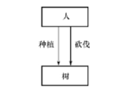

第1章 绪论

[TOC]

#### 1 ．试述数据、数据库、数据库系统、数据库管理系统的概念。

答： 

( l ）数据（ Data ) ：

​	**描述事物的符号记录称为数据**。数据的种类有数字、文字、图形、图像、声音、正文等。数据与其语义是不可分的。解析在现代计算机系统中数据的概念是广义的。早期的计算机系统主要用于科学计算，处理的数据是整数、实数、浮点数等传统数学中的数据。现代计算机能存储和处理的对象十分广泛，表示这些对象的数据也越来越复杂。**数据与其语义是不可分的**。 500 这个数字可以表示一件物品的价格是 500 元，也可以表示一个学术会议参加的人数有 500 人，还可以表示一袋奶粉重 500 克。 

( 2 ）数据库（DB ) ：数据库是长期储存在计算 机内的、有组织的、可共享的**数据集合**。
数据库中的数据按一定的数据模型组织、描述和储存，具有较小的冗余度、较高的数据独立性和易扩展性，并可为各种用户共享。

( 3 ）数据库系统（ DBS ) ：数据库系统是指在计算机系统中引入数据库后的**系统构成**，一般由**数据库、数据库管理系统（及其开发工具）、应用系统、数据库管理员构成**。解析数据库系统和数据库是两个概念。数据库系统是一个人一机系统，数据库是数据库系统的一个组成部分。但是在日常工作中人们常常把数据库系统简称为数据库。希望读者能够从人们讲话或文章的上下文中区分“数据库系统”和“数据库”，不要引起混淆。 

( 4 ）数据库管理系统（DBMS ) ：数据库管理系统是<u>位于用户与操作系统之间</u>的一层**数据管理软件**，用于科学地组织和存储数据、高效地获取和维护数据。 
DBMS 的主要功能包括数据定义功能、数据操纵功能、数据库的运行管理功能、数据库的建立和维护功能。解析 DBMS 是一个大型的复杂的软件系统，是计算机中的基础软件。

#### 2 ．使用数据库系统有什么好处？

答：

使用数据库系统的好处是由数据库管理系统的特点或优点决定的。使用数据库系统的好处很多

例如，可以大大提高应用<u>开发的效率</u>，<u>方便用户的使用</u>，<u>减轻数据库系统管理人员维护的负担</u>，等等。

- 使用数据库系统**可以大大提高应用开发的效率**。
  因为在数据库系统中应用程序不必考虑数据的定义、存储和数据存取的**具体路径**，这些工作都由 DBMS 来完成。用一个通俗的比喻，使用了 DBMS 就如有了一个好参谋、好助手，许多具体的技术工作都由这个助手来完成。开发人员就可以专注于应用逻辑的设计，而不必为数据管理的许许多多复杂的细节操心。
- **当应用逻辑改变，数据的逻辑结构也需要改变时**
  由于数据库系统提供了数据与程序之间的独立性，数据逻辑结构的改变**是 DBA 的责任，开发人员不必修改应用程序**，**或者只需要修改很少的应用程序**，从而既简化了应用程序的编制，又**大大减少了应用程序的维护和修改**。
- 使用数据库系统可以**减轻数据库系统管理人员维护系统的负担**。
  因为 DBMS 在数据库建立、运用和维护时对数据库进行统一的管理和控制，包括数据的完整性、安全性、多用户并发控制、故障恢复等，都由 DBMS 执行。

总之，使用数据库系统的优点是很多的，既便于数据的集中管理，控制数据冗余，提高数据的利用率和一致性，又有利于应用程序的开发和维护。

####  3 ．试述文件系统与数据库系统的区别和联系。

答：

##### 文件系统与数据库系统的区别是：

**文件系统面向某一应用程序**，共享性差，冗余度大，数据独立性差，记录内有结构，<u>整体无结构</u>，由应用程序自己控制。

**数据库系统面向现实世界**，共享性高，冗余度小，具有较高的物理独立性和一定的逻辑独立性，<u>整体结构化</u>，用数据模型描述，由数据库管理系统提供数据的安全性、完整性、并发控制和恢复能力。

##### 文件系统与数据库系统的联系是：

- 文件系统与数据库系统都是计算机系统中<u>管理数据的软件</u>。**文件系统是操作系统的重要组成部分**；
-  **DBMS 是独立于操作系统的软件**。但是 DBMS 是在操作系统的基础上实现的；
- <u>数据库中数据的组织和存储是通过操作系统中的文件系统来实现的。</u>

#### 4 ．举出适合用文件系统而不是数据库系统的例子；再举出适合用数据库系统的应用例子。

答 ：

( l ）适用于文件系统而不是数据库系统的例子：

**数据的备份**、软件或应用程序使用过程中的**临时数据存储**一般使用文件比较合适。

早期功能比较简单、比较固定的应用系统也适合用文件系统。

 ( 2 ）适用于数据库系统而非文件系统的例子：

目前，几乎所有企业或部门的**信息系统**都以数据库系统为基础，都使用数据库。例如，一个工厂的管理信息系统（其中会包括许多子系统，如库存管理系统、物资采购系统、作业调度系统、设备管理系统、人事管理系统等），学校的学生管理系统，人事管理系统，图书馆的图书管理系统，等等，都适合用数据库系统。希望读者能举出自己了解的应用例子。

#### 5 ．试述数据库系统的特点。

答：

数据库系统的主要特点有：

 ( l ）数据结构化数据库系统实现**<u>整体数据的结构化</u>**，这是数据库的主要特征之一，也是**数据库系统与文件系统的本质区别**。

注意这里的“整体’两个字。在数据库系统中，<u>数据不再针对某一个应用，而是面向全组织，具有整体的结构化</u>。不仅数据是结构化的，而且数据的存取单位即一次可以存取数据的大小也很灵活，可以小到某一个数据项（如一个学生的姓名），大到一组记录（成千上万个学生记录）。而在文件系统中，数据的存取单位只有一个：记录，如一个学生的完整记录。

 ( 2 ）数据的**共享性高，冗余度低，易扩充**。

数据库的数据不再面向某个应用而是面向整个系统，因此可以被多个用户、多个应用以多种不同的语言共享使用。由于数据面向整个系统，是有结构的数据，不仅可以被多个应用共享使用，而且容易增加新的应用，这就使得数据库系统弹性大，易于扩充。

解析数据共享可以大大减少数据冗余，节约存储空间，同时还能够避免数据之间的不相容性与不一致性。所谓“数据面向某个应用”是指数据结构是针对某个应用设计的，只被这个应用程序或应用系统使用，可以说数据是某个应用的“私有资源”。所谓“弹性大”是指系统容易扩充也容易收缩，即应用增加或减少时不必修改整个数据库的结构，只需做很少的改动。可以取整体数据的各种子集用于不同的应用系统，当应用需求改变或增加时，只要重新选取不同的子集或加上一部分数据，便可以满足新的需求。

 ( 3 ）数据**独立性高**

数据独立性包括**数据的物理独立性**和**数据的逻辑独立性**。数据库管理系统的模式结构和二级映像功能保证了数据库中的数据具有很高的物理独立性和逻辑独立性。

( 4 ）数据由 DBMS **统一管理和控制**

数据库的共享是**并发的共享**，即多个用户可以同时存取数据库中的数据甚至可以同时存取数据库中同一个数据。

为此， DBMS 必须提供统一的数据控制功能，包括数据的**安全性保护**、数据的**完整性检查**、**并发控制**和**数据库恢复**。

> 这刚好就是7-10章的内容

 

#### 6 ．数据库管理系统的主要功能有哪些？

答：

( l ）数据库定义功能； 

( 2 ）数据存取功能； 

( 3 ）数据库运行管理； 

( 4 ）数据库的建立和维护功能。

 

#### 7 ．试述数据模型的概念、数据模型的作用 和 数据模型的三个要素。

答：

##### 概念：

数据模型是数据库中用来对现实世界**进行抽象的工具**，是数据库中用于提供信息表示和操作手段的形式构架。一般地讲，数据模型是严格定义的概念的集合。

##### 作用：

数据模型**是数据库系统的基础**，任何一个DBMS都以某一个数据模型为基础。

##### 三个要素：

**数据模型通常由数据结构、数据操作和完整性约束三部分组成。**

 (1）数据结构：是所研究的对象类型的集合，是对系统静态特性的描述。（网状结构，层次结构等）

 (2）数据操作：是指对数据库中各种对象（型）的实例（值）允许进行的操作的集合，包括操作及有关的操作规则，是对系统动态特性的描述。

 (3）数据的约束条件：是一组完整性规则的集合。完整性规则是给定的数据模型中数据及其联系所具有的制约和依存规则，用以限定符合数据模型的数据库状态以及状态的变化，以保证数据的正确、有效、相容。

---

根据模型应用的不同目的，可以将模型分成两类或者说两个层次：

一类是概念模型，是按**用户的观点**来对数据和信息建模，用于信息世界的建模，强调语义表达能力，概念简单清晰；

> E-R图

另一类是数据模型，是按**计算机系统的观点**对数据建模，用于机器世界，人们可以用它定义、操纵数据库中的数据，一般需要有严格的形式化定义和一组严格定义了语法和语义的语言，并有一些规定和限制，便于在机器上实现。

> 关系模型，层次模型等

#### 8 ．试述概念模型的作用。

答：

概念模型实际上是现实世界到机器世界的一个中间层次。概念模型用于信息世界的建模，**是现实世界到信息世界的第一层抽象**，是数据库设计人员进行数据库设计的有力工具，也是数据库设计人员和用户之间进行交流的语言。

 

#### 9 ．定义并解释概念模型中以下术语：实体，实体型，实体集，属性，码，实体联系图（ E 一 R 图）

答：

- 实体(Entity)   客观存在并可相互区别的事物，可以是具体的人、物或抽象的概念。

- 属性(Attribute)    实体所具有的某一特性称为属性。实体可以由若干个属性来刻画。 

- 域(Domain)      属性的<u>取值范围</u>称为该属性的域。

- 实体型(Entity Type)  用实体名及其属性名集合来抽象和刻画<u>同类实体</u>，例如**学生**（学号，姓名....）就是一个实体型，（也可以说是关系）

- 实体集(Entity Set)  同一类型实体的集合称为实体集，例如**全体学生**。

- 码（key)      <u>唯一标识实体</u>的**最小属性集**称为码。

- 联系 （Relationship)  现实世界中事物内部以及事物之间的联系。例如1:1，1:n这样的。

  **实体内部**的联系指组成实体的**各属性之间**的联系 
  **实体之间**的联系通常是指**不同实体集之间**的联系

 

#### 10 ．试给出 3 个实际部门的 E 一 R 图，要求实体型之间具有一对一、一对多、多对多各种不同的联系。

#### 11 ．试给出一个实际部门的 E 一 R 图，要求有三个实体型，而且 3 个实体型之间有多对多联系。 3 个实体型之间的多对多联系和三个实体型两两之间的三个多对多联系等价吗？为什么？

答：

 

3 个实体型之间的多对多联系和 3 个实体型两两之间的 3 个多对多联系是**不等价**的，因为他们**有不同的语义**。 3 个实体型两两之间的三个多对多联系如下图所示。

 

 

#### 12 ．画E-R图

每个系有若干班级和教研室，每个教研室有若干教员，其中有的教授和副教授每人各带若干研究生；每个班有若干学生，每个学生选修若干课程，每门课可由若干  学生选修。请用 E 一 R 图画出此学校的概念模型。

答：

 

 

#### 13 ．某工厂生产若干产品

每种产品由不同的零件组成，有的零件可用在不同的产品上。这些零件由不同的原材料制成，不同零件所用的材料可以相同。这些**零件按所属的不同产品分别放在仓库中**（*说明可能有相同的零件，由于组成不同的产品而放在不同的仓库中，是m:n的关系*)，原材料按照类别放在若干仓库中。请用 E 一 R 图画出此工厂产品、零件、材料、仓库的概念模型。

答：

 

 

#### 14 ．试述层次模型的概念，举出三个层次模型的实例。

答：

层次模型缺点：现实中许多联系是非层次的，例如多对多联系。

 ( l ）教员学生层次数据库模型

 

( 2 ）行政机构层次数据库模型

 

( 3 ）行政区域层次数据库模型

 

 

#### 15．今有一个层次数据库实例，试用子女一兄弟链接法和层次序列链接法画出它的存储结构示意图。

#### 

答：

子女兄弟链接法：（还是老套的左子女，右兄弟）

 

层次序列链接法：（注意不是层次遍历啊）

 

 

#### 16 ．试述网状模型的概念，举出三个网状模型的实例。

答：

缺点：网状模型结构比较复杂，用户不易掌握，其DDL,DML也复杂，不易使用

满足下面两个条件的基本层次联系集合为网状模型。

 ( l ）允许**一个以上的结点无双亲**； ( 2 ）**一个结点可以有多于一个的双亲**。

实例 1 : 

 

实例 2 : 

 

实例 3 : 

 

 

#### 17 ．试述网状、层次数据库的优缺点。:arrow_up_small:

答：

##### 层次模型的优点主要有： 

1. **模型简单**，对具有一对多层次关系的部门描述非常自然、直观，容易理解，这是层次数据库的突出优点；
2. 用层次模型的应用系统**性能好**，特别是对于那些实体间联系是固定的且预先定义好的应用，采用层次模型来实现，其性能优于关系模型； 
3. 层次数据模型提供了良好的完整性支持。

##### 层次模型的缺点主要有：

1. 现实世界中**很多联系是非层次性的，如多对多联系**、**一个结点具有多个双亲**等，层次模型不能自然地表示这类联系，只能通过引入冗余数据或引入虚拟结点来解决；
2. 对插入和删除操作的限制比较多；
3. 查询子女结点必须通过双亲结点。

##### 网状数据模型的优点主要有：

1. 能够更为直接地描述现实世界，如一个结点可以有多个双亲；
2. 具有良好的性能，存取效率较高。

##### 网状数据模型的缺点主要有：

1. 结构比较**复杂**，而且随着应用环境的扩大，数据库的结构就变得越来越复杂，不利于最终用户掌握；
2. 其 **DDL 、 DML 语言复杂**，用户不容易使用。由于记录之间联系是通过存取路径实现的，应用程序在访问数据时必须选择适当的存取路径。因此，用户必须了解系统结构的细节，**加重了编写应用程序的负担**。

 

#### 18 ．试述关系模型的概念，定义并解释以下术语：

 ( l ）关系（ 2 ）属性（ 3 ）域（ 4 ）元组 ( 5 ）主码（ 6 ）分量（ 7 ）关系模式

答：

关系模型由关系数据结构、关系操作集合和关系完整性约束三部分组成。在用户观点下，关系模型中数据的逻辑结构是一张二维表，它由行和列组成。 

1. 关系：一个关系对应通常说的一张**表**；
2. 属性：表中的一列即为一个属性；
3. 域：属性的**取值范围**；
4. 元组：表中的一行即为一个元组；
5. 主码：表中的某个属性组，它可以惟一确定一个元组；
6. 分量：**元组中的一个属性值**；
7. 关系模式：对关系的描述，一般表示为**关系名（属性 1 ，属性 2 ， … ，属性 n )** 

 

#### 19 ．试述关系数据库的特点。

答：

##### 关系数据模型具有下列优点：

1. 关系模型与非关系模型不同，它是**建立在严格的数学概念的基础上**的。
2. 关系模型的概念单一，无论实体还是实体之间的联系都用关系表示，操作的对象和操作的结果都是关系，所以其<u>数据结构简单、清晰，用户易懂易用</u>。
3. 关系模型的**存取路径对用户透明**，从而具有**更高的数据独立性、更好的安全保密性**，也**简化了程序员的工作和数据库开发建立的工作**。

##### 缺点：

​	由于存取路径对用户透明，**查询效率往往不如非关系数据模型**。因此为了提高性能，**必须对用户的查询请求进行优化**，增加了开发数据库管理系统的难度。 

 

#### 20 ．试述数据库系统三级模式结构，这种结构的优点是什么？:arrow_up_small:

答：

数据库系统的三级模式结构由外模式、模式和内模式组成。（参见书上图 1 . 29 ) 

- **外模式**：亦称<u>子模式</u>或<u>用户模式</u>，是数据库用户（包括应用程序员和最终用户）能够看见和使用的局部数据的逻辑结构和特征的描述，是数据库用户的数据视图，是与某一应用有关的数据的逻辑表示。
- **模式**，亦称**逻辑模式**，是数据库中**全体数据的逻辑结构和特征的描述**，是所有用户的<u>公共数据视图</u>。模式描述的是数据的全局逻辑结构。外模式涉及的是数据的局部逻辑结构，通常是模式的子集。
- **内模式**，亦称**存储模式**，是数据在数据库系统内部的表示，即对数据的<u>物理结构和存储方式的描述</u>。

数据库系统的三级模式是对数据的三个抽象级别，它把数据的具体组织留给 DBMs 管理，使用户能逻辑抽象地处理数据，而不必关心数据在计算机中的表示和存储。

为了能够在内部实现这三个抽象层次的联系和转换，数据库系统在这三级模式之间提供了**两层映像**：外模式／模式映像和模式／内模式映像。正是这**两层映像保证了**数据库系统中的数据能够具有较高的**逻辑独立性**和**物理独立性**。

 

#### 21 ．定义并解释以下术语：模式、外模式、内模式、 DDL 、 DML 模式、

模式描述的是**数据的全局逻辑结构**。

外模式涉及的是数据的**局部逻辑结构**，通常是模式的子集。

内模式，亦称存储模式，是数据在数据库系统内部的表示，即对数据的**物理结构和存储方式**的描述。

 DDL ：**数据定义语言**，`data define langeuage`用来**定义数据库模式、外模式、内模式**的语言。

 DML ：**数据操纵语言**，`data manage langeuage`用来对数据库中的数据进行**查询、插入、删除和修改**的语句。 

 

#### 22 ．什么叫数据与程序的物理独立性？什么叫数据与程序的逻辑独立性？为什么数据库系统具有数据与程序的独立性？

答：

数据与程序的逻辑独立性：当**模式改变时**（例如增加新的关系、新的属性、改变属性的数据类型等），由数据库管理员对各个**外模式／模式的映像**做相应改变，可以**使外模式保持不变**。应用程序是依据数据的外模式编写的，从而应**用程序不必修改**，保证了数据与程序的逻辑独立性，简称数据的逻辑独立性。

数据与程序的物理独立性：当数据库的**存储结构改变了**，由数据库管理员对**模式／内模式映像**做相应改变，可以使**模式保持不变**，从而**应用程序也不必改变**，保证了数据与程序的物理独立性，简称数据的物理独立性。

> 总结一下
>
> 模式变，外模式/模式映像变，外模式不变，<u>逻辑独立性</u>，应用不变
>
> 内模式变，模式/内模式映像变，模式不变，<u>物理独立性</u>，应用不变
>
> 可以画个流程图，外模式变应用就得跟着变了？

数据库管理系统在三级模式之间提供的**两层映像**保证了数据库系统中的数据能够具有较高的逻辑独立性和物理独立性。 

 

#### 23 ．试述数据库系统的组成。

答：

数据库系统一般由数据库（DB）、数据库管理系统(DBMS)及其开发工具、应用系统、数据库管理员（DBA）和**用户**构成。

 

#### 24 . DBA 的职责是什么？

答：

负责全面地管理和控制数据库系统。具体职责包括：

1. 决定数据库的信息内容和结构；
2. 决定数据库的存储结构和存取策略；
3. 定义数据的安全性要求和完整性约束条件；
4. 监督和控制数据库的使用和运行；
5. 改进和重组数据库系统。 

#### 25 ．系统分析员、数据库设计人员、应用程序员的职责是什么？

答：

系统分析员负责应用系统的需求分析和规范说明，系统分析员要和用户及 DBA 相结合，确定系统的硬件、软件配置，并参与数据库系统的概要设计。

数据库设计人员负责数据库中数据的确定、数据库各级模式的设计。数据库设计人员必须参加用户需求调查和系统分析，然后进行数据库设计。在很多情况下，数据库设计人员就由数据库管理员担任。

应用程序员负责设计和编写应用系统的程序模块，并进行调试和安装。

