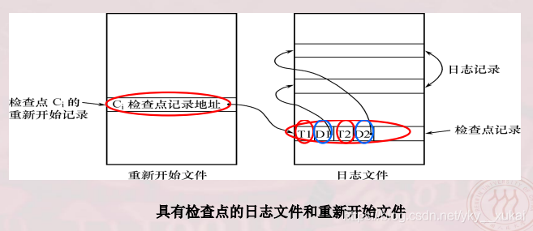

第10章 数据库恢复技术

[toc]

### 1．试述事务的概念及事务的4 个特性。

答：

事务是用户定义的一个数据库操作序列，这些操作==要么全做要么全不做==，是一个不可分割的工作单位。
事务具有4 个特性：原子性（Atomicity ）、一致性（consistency ）、隔离性( Isolation ）和持续性（Durability ）。这4 个特性也简称为ACID 特性。

- 原子性：事务是数据库的逻辑工作单位，事务中包括的诸操作要么都做，要么都不做。
- 一致性：事务执行的结果必须是使数据库从一个一致性状态变到另一个一致性状态。
- 隔离性：一个事务的执行**不能被其他事务干扰**。即一个事务内部的操作及使用的数据对其他并发事务是隔离的，并发执行的各个事务之间不能互相干扰。
- 持续性：持续性也称**永久性**，指一个事务一旦提交，它**对数据库中数据的改变就应该是永久性的**。接下来的其他操作或故障不应该对其执行结果有任何影响。

  

### 2 ．为什么事务非正常结束时会影响数据库数据的正确性，请列举一例说明之。

答：

​	事务执行的结果必须是使数据库从一个一致性状态变到另一个一致性状态。如果数据库系统运行中发生故障，有些事务尚未完成就被迫中断，这些未完成事务对数据库所做的修改有一部分已写入物理数据库，这时数据库就处于一种不正确的状态，或者说是**不一致的状态**。
​	例如某工厂的库存管理系统中，要把数量为Q 的某种零件从仓库1 移到仓库2 存放。
则可以定义一个事务T , T 包括两个操作；Q1= Q1 一Q , Q2= Q2 + Q。 如果T 非正常终止时只做了第一个操作，则数据库就处于不一致性状态，库存量无缘无故少了Q 。

 

### 3 ．数据库中为什么要有恢复子系统？它的功能是什么？

答：

因为计算机系统中硬件的故障、软件的错误、操作员的失误以及恶意的破坏是==不可避免的==，这些故障轻则造成运行事务非正常中断，影响数据库中数据的正确性，重则破坏数据库，使数据库中全部或部分数据丢失，因此必须要有恢复子系统。
恢复子系统的功能是：把数据库从错误状态恢复到某一已知的正确状态（亦称为一致状态或完整状态）。

 

### 4 ．数据库运行中可能产生的故障有哪几类？哪些故障影响事务的正常执行？哪些故障破坏数据库数据？

答：

数据库系统中可能发生各种各样的故障，大致可以分以下几类：

（1）事务内部的故障；
（2）系统故障；
（3）介质故障；
（4）计算机病毒。
事务故障、系统故障和介质故障影响事务的正常执行；介质故障和计算机病毒破坏数据库数据。

 

### 5 ．数据库恢复的基本技术有哪些？

答：

**数据转储**和**登录日志文件**是数据库恢复的基本技术。
当系统运行过程中发生故障，利用转储的数据库后备副本和日志文件就可以将数据库恢复到故障前的某个一致性状态。

 

### 6 ．数据库转储的意义是什么？试比较各种数据转储方法。

答：

数据转储是数据库恢复中采用的基本技术。所谓转储即DBA 定期地将数据库复制到磁带或另一个磁盘上保存起来的过程。当数据库遭到破坏后可以将后备副本重新装入，将数据库恢复到转储时的状态。

- 静态转储：在系统中无运行事务时进行的转储操作，静态转储简单，但必须等待正运行的用户事务结束才能进行。同样，新的事务必须等待转储结束才能执行。显然，这会降低数据库的可用性。
- 动态转储：指转储期间允许对数据库进行存取或修改。动态转储可克服静态转储的缺点，它不用等待正在运行的用户事务结束，也不会影响新事务的运行。但是，转储结束时后援副本上的数据并不能保证正确有效。因为转储期间运行的事务可能修改了某些数据，使得后援副本上的数据不是数据库的一致版本。为此，必须把转储期间各事务对数据库的修改活动登记下来，建立日志文件.这样，后援副本加上日志文件就能得到数据库某一时刻的正确状态。转储还可以分为海量转储和增量转储两种方式。
- 海量转储是指每次转储全部数据库。
- 增量转储则指每次只转储上一次转储后更新过的数据。从恢复角度看，使用海量转储得到的后备副本进行恢复一般说来更简单些。但如果数据库很大，事务处理又十分频繁，则增量转储方式更实用更有效。

> 转储和镜像的区别？
>
> 我觉得镜像可以再原数据库损坏或恢复的时候访问，而转储不可以。
> 其他区别就是实现上的区别了吧，但我觉得他们都是在转储啊。。。0809

### 7 ．什么是日志文件？为什么要设立日志文件？

答：

（1）日志文件是用来记录事务对数据库的更新操作的文件。
（2）设立日志文件的目的是：进行事务故障恢复；进行系统故障恢复；**协助**后备副本进行介质故障恢复。

 

### 8 ．登记日志文件时为什么必须先写日志文件，后写数据库？

答：

把对数据的修改写到数据库中和把表示这个修改的日志记录写到日志文件中是两个不同的操作。有可能在这两个操作之间发生故障，即这两个写操作只完成了一个。
如果先写了数据库修改，而在运行记录中没有登记这个修改，则以后就无法恢复这个修改了。如果先写日志，但没有修改数据库，在恢复时**只不过是多执行一次UNDO 操作**，并不会影响数据库的正确性。所以一定要先写日志文件，即首先把日志记录写到日志文件中，然后写数据库的修改。

 

### 9 ．针对不同的故障，试给出恢复的策略和方法。（即如何进行事务故障的恢复？系统故障的恢复？介质故障恢复？) 

答：

#### 事务故障的恢复：

==只需要反向操作即可==，因为事务故障了显然是未完成的，需要undo。

事务故障的恢复是由DBMS执行恢复，步骤是自动完成的，对用户是透明的。

（1）反向扫描文件日志（即从最后向前扫描日志文件），查找该事务的更新操作；
（2）对该事务的更新操作执行逆操作，即将日志记录中“更新前的值”写入数据库；
（3）继续反向扫描日志文件，做同样处理；
（4）如此处理下去，直至读到此事务的开始标记，该事务故障的恢复就完成了。

#### 系统故障的恢复：

系统故障可能会造成数据库处于不一致状态：
一是未完成事务对数据库的更新可能已写入数据库（需要undo)
二是已提交事务对数据库的更新可能还留在缓冲区，没来得及写入数据库（需要redo）
因此恢复操作就是要撤销（UNDO ）故障发生时未完成的事务，重做（REDO ）已完成的事务。

系统的恢复步骤是：

1. 正向扫描日志文件，找出在故障发生前已经提交的事务队列（REDO 队列）和未完成的事务队列（uNDO 队列）。
2. 对撤销队列中的各个事务进行UNDO 处理。
   进行UNDO 处理的方法是，反向扫描日志文件，对每个UNDO 事务的更新操作执行逆操作，即将日志记录中“**更新前的值**”写入数据库。
3. 对重做队列中的各个事务进行REDO 处理。
   进行REDO 处理的方法是：正向扫描日志文件，对每个REDO 事务重新执行日志文件登记的操作。即将日志记录中“**更新后的值**”写入数据库。

#### 介质故障的恢复：

介质故障是最严重的一种故障。
恢复方法是**重装数据库**，然后重做已完成的事务。具体过程是：

( 1 ) DBA 装入最新的数据库后备副本（离故障发生时刻最近的转储副本）, 使数据库恢复到转储时的一致性状态；
( 2 ) DBA 装入转储结束时刻的日志文件副本；
( 3 ) DBA 启动系统恢复命令，由DBMS 完成恢复功能，即重做已完成的事务。

 

### 10 ．什么是检查点记录？检查点记录包括哪些内容？

答：
检查点记录是一类**新的日志记录**。它的内容包括：

① 建立检查点时刻**所有正在执行的事务清单**

② 这些事务的**最近一个日志记录的地址**。

> 检查点之前提交的就不用REDO。恢复只需要恢复检查点之后的。

### 11 ．具有检查点的恢复技术有什么优点？试举一个具体的例子加以说明。答

答：

利用日志技术进行数据库恢复时，恢复子系统必须搜索日志，确定哪些事务需要REDO ，哪些事务需要UNDO 。一般来说，需要检查所有日志记录。这样做有**两个问题**：一是搜索整个日志将耗费大量的时间；二是很多需要REDO 处理的事务实际上已经将它们的更新操作结果写到数据库中了，恢复子系统又重新执行了这些操作，浪费了大量时间。

检查点技术就是为了解决这些问题。

在采用检查点技术之前，恢复时需要从头扫描日志文件，而利用检查点技术只需要从上个检查点开始扫描日志，这就==**缩短了扫描日志的时间**==
事务Tl 的更新操作实际上已经写到数据库中了，进行恢复时没有必要再REDO 处理，采用检查点技术做到了这一点。

 

### 12 ．试述使用检查点方法进行恢复的步骤。:smiling_imp:

答：

1. 从**重新开始文件**（见上图）中找到最后一个检查点记录在日志文件中的地址，由该地址在日志文件中找到最后一个检查点记录。
2. 由该检查点记录**得到检查点建立时刻所有正在执行的事务清单ACTIVE 一LIST** 。
   这里建立两个事务队列：
   1. UNDO 一LIST ：需要执行undo 操作的事务集合；
   2. REDO 一LIST ：需要执行redo 操作的事务集合。
      把<u>ACTIVE 一LIST 暂时放入UNDO 一LIST 队列</u>，**REDO 队列暂为空**。
3. 从检查点开始正向扫描日志文件：
   1. 如有新开始的事务T ，把T 暂时放入UNDO 一LlST 队列；
   2. 如有提交的事务K，把K从UNDO 一LIST 队列移到REDO 一LIST 队列，直到日志文件结束；
      显然事务K在==检查点之后并且在错误发生之前==提交，所以需要UNDO。
4. 对UNDO 一LIST 中的每个事务执行UNDO 操作，对REDO 一LIST 中的每个事务执行REDO 操作。

 

### 13 ．什么是数据库镜像？它有什么用途？

答：

数据库镜像即根据DBA 的要求，自动把整个数据库或者其中的部分关键数据复制到另一个磁盘上。每当主数据库更新时，DBMS 自动把更新后的数据复制过去，即DBMS 自动保证镜像数据与主数据的一致性。

数据库镜像的用途有：
一是用于数据库恢复。当出现介质故障时，可由**镜像磁盘继续提供使用**，同时DBMS 自动利用镜像磁盘数据进行数据库的恢复，**不需要关闭系统和重装数据库副本**。

二是提高数据库的可用性。在没有出现故障时，当一个用户对某个数据加排它锁进行修改时，其他用户可以读镜像数据库上的数据，而**不必等待该用户释放锁**。（也可以说是并发使用）

