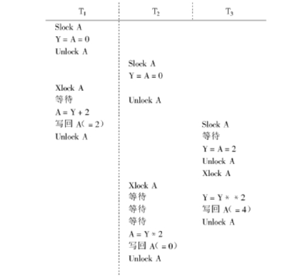

第11章 并发控制

[toc]

### 1． 在数据库中为什么要并发控制？

答：数据库是共享资源，通常有许多个事务同时在运行。当多个事务并发地存取数据库时就会产生同时读取和／或修改同一数据的情况。若对并发操作不加控制就可能会存取和存储不正确的数据，**破坏数据库的一致性**。所以数据库管理系统必须提供并发控制机制。

 

### 2 ．并发操作可能会产生哪几类数据不一致？用什么方法能避免各种不一致的情况？

答：并发操作带来的数据不一致性包括三类：丢失修改、不可重复读和读“脏’数据。

 ( l ）丢失修改（lost update ) 两个事务 Tl 和T2读入同一数据并修改，T2提交的结果破坏了（覆盖了） Tl 提交的结果，导致 Tl 的修改被丢失。

 ( 2 ）不可重复读（ Non 一 Repeatable Read ) 不可重复读是指事务 T1 读取数据后，事务T2更新了该数据，使 T1无法再现前一次读取结果。

( 3 ）读“脏”数据（ Dirty Read ) 读“脏”数据是指事务 T1修改某一数据，并将其写回磁盘，事务T2读取同一数据后， T1由于某种原因被==撤销==，这时 T1已修改过的数据恢复原值，T2读到的数据就与数据库中的数据不一致，则T2读到的数据就为“脏”数据，即不正确的数据。

避免不一致性的方法和技术就是并发控制。最常用的技术是**封锁技术**。也可以用其他技术，例如在分布式数据库系统中可以采用**时间戳方法**来进行并发控制。 

 

### 3 ．什么是封锁？基本的封锁类型有几种？试述它们的含义。

答：封锁就是事务 T 在对某个数据对象例如表、记录等操作之前，先向系统发出请求，对其加锁。加锁后事务 T 就对该数据对象有了一定的控制，在事务 T 释放它的锁之前，其他的事务不能更新此数据对象。封锁是实现并发控制的一个非常重要的技术。  

基本的封锁类型有两种：
排它锁（ Exclusive Locks ，简称 x 锁）和共享锁 ( Share Locks，简称 S 锁）。

排它锁又称为写锁。若事务 T 对数据对象 A 加上 X 锁，则只允许 T 读取和修改 A ，其他任何事务都不能再对 A 加任何类型的锁，直到 T 释放 A 上的锁。这就保证了其他事务在 T 释放 A 上的锁之前不能再读取和修改 A 。

共享锁又称为读锁。若事务 T 对数据对象 A 加上 S 锁，则事务 T 可以读 A但不能修改 A ，其他事务只能再对 A 加 S 锁，而不能加 X 锁，直到 T 释放 A 上的 S 锁。这就保证了其他事务可以读 A ，但在 T 释放 A 上的 S 锁之前不能对 A 做任何修改。

 

### 4 ．如何用封锁机制保证数据的一致性？

答： DBMS 在对数据进行读、写操作之前首先对该数据执行封锁操作，例如下图中事务 Tl 在对 A 进行修改之前先对 A 执行 Xlock ( A ) ，即对 A 加 x 锁。这样，当几请求对 A 加 x 锁时就被拒绝，几只能等待 Tl 释放 A 上的锁后才能获得对 A 的 x 锁，这时它读到的 A 是 Tl 更新后的值，再按此新的 A 值进行运算。这样就不会丢失 Tl 的更新。

 

DBMS 按照一定的封锁协议，对并发操作进行控制，使得多个并发操作有序地执行，就可以避免丢失修改、不可重复读和读脏数据等数据不一致性。

 

### 5 .  什么是封锁协议？不同级别的封锁协议的主要区别是什么？

对数据对象加锁时，约定一些规则，例如何时申请X锁或S锁、持续时间、何时释放等，称这些规则为封锁协议。

一级封锁协议：事务T在修改数据R之前必须先对其加X锁,直到事务结束才释放。
二级封锁协议：一级封锁协议加上事务T在读取数据R之前必须先对其加S锁,**读完后即可释放**S锁。
三级封锁协议：一级封锁协议加上事务T在读取数据R之前必须先对其加S锁,直到**事务结束才释放**。

#### 一级封锁协议

功能：防止丢失修改

- 事务T1在读A进行修改之前先对A加==X锁==
- 当T2再请求对A加X锁时被拒绝
- T2只能等待T1释放A上的锁后T2获得对A的X锁
- 这时T2读到的A已经是T1更新过的值15
- T2按此新的A值进行运算，并将结果值A=14送回到磁盘。避免了丢失T1的更新。

#### 二级封锁协议

功能：不读“脏”数据

- 事务T1在对C进行修改之前，先对C**加X锁**，修改其值后写回磁盘；
- T2请求在C上加S锁，因T1已在C上加了X锁，T2只能等待
- T1因某种原因被撤销，C恢复为原值100；
- T1释放C上的X锁后T2获得C上的S锁，读C=100。避免了T2读“脏”数据。

#### 三级封锁协议

功能：可重复读

- 事务T1在读A，B之前，先对A，B==加S锁==
- 其他事务只能再对A，B加S锁，而不能加X锁，<u>**即其他事务只能读A，B，而不能修改**</u>
- 当T2为修改B而<u>申请对B的X锁时被拒绝</u>只能等待T1释放B上的锁
- T1为验算再读A，B，这时读出的B仍是100，求和结果仍为150，即可重复读
- T1结束才释放A，B上的S锁。T2才获得对B的X锁 

### 6 .  不同的封锁协议与系统一致性级别的关系是什么？

不同的封锁协议==对应不同的一致性级别==

一级封锁协议可防止丢失修改,并保证事务T是可恢复的。在一级封锁协议中,**对读数据是不加S锁的**,所以它不能保证可重复读和不读"脏"数据。

二级封锁协议除防止了丢失修改,还可进一步防止读"脏"数据。在二级封锁协议中,由于**读完数据后立即释放S锁,**所以它不能保证可重复读。

在三级封锁协议中,无论是读数据还是写数据都加长锁，即**都要到事务结束才释放封锁**。所以三级封锁协议除防止了丢失修改和不读"脏"数据外,还进一步防止了不可重复读。

### 7 ．什么是活锁？什么是死锁？

答：

 

​	 如果事务 T1封锁了数据 R ，事务T2又请求封锁 R ，于是T2等待。T3也请求封锁 R ，当 T1 释放了 R 上的封锁之后系统首先批准了T3的请求，T2仍然等待。然后T4又请求封锁 R ，当T3释放了 R 上的封锁之后系统又批准了T4的请求 … …
​	 T2有可能永远等待，这就是活锁的情形。活锁的含义是该等待事务等待时间太长，似乎被锁住了，实际上可能被激活。

如果事务 T1封锁了数据 R1，T2封锁了数据R2，然后 T1又请求封锁R2，因T2已封锁了T2，于是 T1等待T2释放R2上的锁。接着T2又申请封锁 R1 ，因 T1已封锁了 R1 ，T2也只能等待 T1释放 R1 上的锁。这样就出现了 T1 在等待R2，而T2又在等待 R1的局面， 两个事务永远不能结束，形成死锁。

 

 

### 8 ．试述活锁的产生原因和解决方法。

答：活锁产生的原因：当一系列封锁不能按照其先后顺序执行时，就可能导致一些事务无限期等待某个封锁，从而导致活锁。避免活锁的简单方法是采用==先来先服务的策略==。当多个事务请求封锁同一数据对象时，封锁子系统按请求封锁的先后次序对事务排队，数据对象上的锁一旦释放就批准申请队列中第一个事务获得锁。

 

### 9 .   请给出预防死锁的若干方法

在数据库中,产生死锁的原因是两个或多个事务都已封锁了一些数据对象,然后又都请求已被其他事务封锁的数据加锁,从而出现死等待。

防止死锁的发生其实就是要破坏产生死锁的条件。预防死锁通常有两种方法： 
(1)一次封锁法：要求每个事务必须一次将所有要使用的数据全部加锁,否则就不能继续执行； 
(2)顺序封锁法：预先对数据对象规定一个封锁顺序,所有事务都按这个顺序实行封锁。

不过,预防死锁的策略不大适合数据库系统的特点,具体原因可参见《概论》8.4。

### 10 ．请给出检测死锁发生的一种方法，当发生死锁后如何解除死锁？

答：数据库系统一般采用允许死锁发生， DBMS 检测到死锁后加以解除的方法。 DBMS 中诊断死锁的方法与操作系统类似，一般使用**超时法**或**事务等待图法**。

- 超时法是：如果一个事务的等待时间超过了规定的时限，就认为发生了死锁。
  超时法实现简单，但有可能误判死锁，事务因其他原因长时间等待超过时限时，系统会误认为发生了死锁。若时限设置得太长，又不能及时发现死锁发生。 

- 并发控制**子系统周期性地（比如每隔数秒）生成事务等待图**，检测事务。如果发现图中==存在回路==，则表示系统中出现了死锁。

  DBMS 并发控制子系统检测到死锁后，就要设法解除。通常采用的方法是选择一个处理死锁代价最小的事务，将其撤消，释放此事务持有的所有锁，使其他事务得以继续运行下去。当然，对撤销的事务所执行的数据修改操作必须加以恢复。

 

### 11 ．什么样的并发调度是正确的调度？

答：可串行化（ Serializable ）的调度是正确的调度。可串行化的调度的定义：多个事务的并发执行是正确的，当且仅当其结果与按某一次序串行执行它们时的结果相同，称这种调度策略为可串行化的调度。 

 

### 12 ．设 T1，T2，T3是如下的 3 个事务： 

Tl ：A : = A + 2 ; 

T2：A : = A * 2 ; 

T3：A : = A **2 ; ( 就是A的平方）

设 A 的初值为 0 。 

#### ( 1 ）若这 3 个事务**允许并行执行**，则有多少可能的正确结果，请一一列举出来。

答 ：A 的最终结果可能有 2 、 4 、 8 、 16 。因为串行执行次序有 T1T2T3、 T1T3T2、T2T1T3、T2T3T1、T3T1T2、T3T2T1。对应的执行结果是 16 、 8 、 4 、 2 、 4 、2 。 

#### ( 2 ）请给出一个可串行化的调度，并给出执行结果

答：

​     

最后结果 A 为 16 ，是可串行化的调度。 

#### ( 3 ）请给出一个非串行化的调度，并给出执行结果。

答：

​     

   最后结果 A 为 0 ，为非串行化的调度。 

0不在任意一次串行执行的结果当中。

#### ( 4 ）若这 3 个事务都**遵守两段锁协议**，请给出一个不产生死锁的可串行化调度。

扩展阶段和收缩阶段。

答：

​     

####    ( 5 ）若这 3 个事务都遵守两段锁协议，请给出一个产生死锁的调度。

答：

​     

 这个死锁还挺有趣的诶。

### 13 .  试述两段锁协议的概念

事务分为两个阶段对数据项的加锁和解锁

- 第一阶段是获得封锁，也称为**扩展阶段**
  事务**可以申请**获得任何数据项上的任何类型的锁，但是**不能释放**任何锁 
- 第二阶段是释放封锁，也称为**收缩阶段**
  事务**可以释放**任何数据项上的任何类型的锁，但是**不能再申请**任何锁 

### 14．试证明，若并发事务遵守两段锁协议，则对这些事务的并发调度是可串行化的。

证明：首先以两个并发事务 T1 和T2为例，存在多个并发事务的情形可以类推。根据可串行化定义可知，事务不可串行化只可能发生在下列两种情况：

1. 事务 T1 写某个数据对象 A ，T2读或写 A ;
2. 事务 T1 读或写某个数据对象 A ，T2写 A 
3.  两个事务都读A，加S锁，不会有冲突。

下面称 A 为潜在冲突对象。

设 T1 和T2访问的潜在冲突的公共对象为{A1，A2 … ， An ｝。不失一般性，假设这组潜在冲突对象中 X ＝(A 1 , A2 ， … ， Ai ｝均符合情况 1 。 Y ＝{A i + 1 ， … ， An ｝符合所情况（ 2 ）。 

VX ∈ x , Tl 需要 XlockX ① 

T2 需要 Slockx 或 Xlockx ②

 1 ）如果操作 ① 先执行，则 T1获得锁，T2等待

由于遵守两段锁协议， Tl 在成功获得 X 和 Y 中全部对象及非潜在冲突对象的锁后，才会释放锁。

这时如果存在 w ∈ x 或 Y ，T2已获得 w 的锁，则出现死锁；否则， Tl 在对 x 、 Y 中对象全部处理完毕后，T2才能执行。这相当于按 Tl 、T2的顺序串行执行，根据可串行化定义， Tl 和几的调度是可串行化的。 

2 ）操作 ② 先执行的情况与（ l ）对称因此，若并发事务遵守两段锁协议，在不发生死锁的情况下，对这些事务的并发调度一定是可串行化的。证毕。 

 

### 15 ．举例说明，对并发事务的一个调度是可串行化的，而这些并发事务不一定遵守两段锁协议。

答：

只需在T2后面加一个额外的上锁，释放的过程。可以看到T2不遵守两段锁协议。

 

 

### 16 ．为什么要引进意向锁？意向锁的含义是什么？

答：引进意向锁是为了**提高封锁子系统的效率**。该封锁子系统**支持多种封锁粒度**。

原因是：在多粒度封锁方法中一个数据对象可能以两种方式加锁 ― 显式封锁和隐式封锁。因此系统在对某一数据对象加锁时不仅要检查该数据对象上有无（显式和隐式）封锁与之冲突，还要检查其所有上级结点和所有下级结点，看申请的封锁是否与这些结点上的（显式和隐式）封锁冲突。

显然，这样的检查方法效率很低。为此引进了意向锁。

意向锁的含义是：对任一结点加锁时，必须先对它的上层结点加意向锁。例如事务 T 要对某个元组加 X 锁，则首先要对关系和数据库加 ix 锁。换言之，对关系和数据库加 ix 锁，表示它的后裔结点 ― 某个元组拟（意向）加 X 锁。==引进意向锁后，系统对某一数据对象加锁时不必逐个检查与下一级结点的封锁冲突了==。例如，事务 T 要对关系 R 加 X 锁时，系统只要检查根结点数据库和 R 本身是否已加了不相容的锁（如发现已经加了 ix ，则与 X 冲突），而不再需要搜索和检查 R 中的每一个元组是否加了 X 锁或 S 锁。 

 

### 17 ．试述常用的意向锁： IS 锁、 ix 锁、 SIX 锁，给出这些锁的相容矩阵。

答： IS锁：如果对一个数据对象加 IS 锁，表示它的后裔结点拟（意向加 S 锁），例如，要对某个元组加 S 锁，则要首先对关系和数据库加 IS 锁 

IX 锁：如果对一个数据对象加 ix 锁，表示它的后裔结点拟（意向加 X 锁），例如，要对某个元组加 X 锁，则要首先对关系和数据库加 ix 锁。 

SIX 锁：如果对一个数据对象加 SIX 锁，表示对它加 S 锁，再加 IX 锁，即 SIX = S + IX 。

> 意味着对该对象加S锁，对其下级对象会加X锁。
>
> 例如：对某个表加SIX锁，则表示该事务要读整个表（所以要对该表加S锁），同时会更新个别元组（所以要对该表加IX锁，表的后裔——元组会被更改）

相容矩阵：

 

 

### 18 ．理解并解释下列术语的含义：

封锁、活锁、死锁、排它锁、共享锁、并发事务的调度、可串行化的调度、两段锁协议。

答：（略，已经在上面有关习题中解答）

 

### 19 ．试述你了解的某一个实际的 DBMS 产品的并发控制机制。

答：（略，参见简单介绍了有关 Oracle 的并发控制机制。）

 