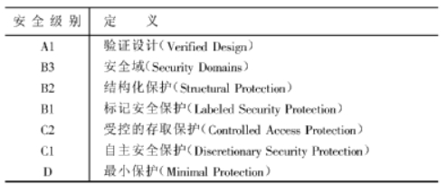

 第4章 数据库安全性

[TOC]

### 1 ．什么是数据库的安全性？

答：数据库的安全性是指保护数据库<u>以防止不合法的使用所造成的数据泄露、更改或破坏</u>。

### 2 ．数据库安全性和计算机系统的安全性有什么关系？

答：

- <u>安全性问题不是数据库系统所独有的，所有计算机系统都有这个问题</u>。只是在数据库系统中大量数据集中存放，而且为许多最终用户直接共享，从而使安全性问题更为突出。
- 系统安全保护措施是否有效是数据库系统的主要指标之一。
- 数据库的安全性和计算机系统的安全性，包括操作系统、网络系统的安全性是<u>紧密联系、相互支持的</u>，

### *3 ．试述可信计算机系统评测标准的情况，试述TDI / TCSEC 标准的基本内容。

答：各个国家在计算机安全技术方面都建立了一套可信标准。目前各国引用或制定的一系列安全标准中，最重要的是美国国防部（DoD ）正式颁布的《 DoD 可信计算机系统评估标准》 。（TDI / TCSEC 标准是将TcsEc 扩展到数据库管理系统，即《 可信计算机系统评估标准关于可信数据库系统的解释》 （Tmsted Database Interpretation 简称TDI , 又称紫皮书）。在TDI 中定义了数据库管理系统的设计与实现中需满足和用以进行安全性级别评估的标准。
TDI 与TcsEc 一样，从安全策略、责任、保证和文档四个方面来描述安全性级别划分的指标。每个方面又细分为若干项。

 

### *4 ．试述TcsEC ( TDI ）将系统安全级别划分为4 组7 个等级的基本内容。

答：根据计算机系统对安全性各项指标的支持情况，TCSEC ( TDI ）将系统划分为**四组（division ) 7 个等级**，依次是D 、C ( CI , CZ ）、B ( BI , BZ , B3 ）、A ( AI ) ，按系统可靠或可信程度逐渐增高。


这些安全级别之间具有一种偏序向下兼容的关系，即较高安全性级别提供的安全保护包含较低级别的所有保护要求，同时提供更多或更完善的保护能力。各个等级的基本内容为：
**D 级 是最低级别**。一切不符合更高标准的系统，统统归于D 组。

Cl 级只提供了非常初级的自主安全保护。能够实现对用户和数据的分离，进行自主存取控制（DAC ) ，保护或限制用户权限的传播。
**C2 级实际是安全产品的最低档次**，提供受控的存取保护，即将Cl 级的DAC 进一步细化，以个人身份注册负责，并实施审计和资源隔离。
B1 级标记安全保护。对系统的数据加以标记，并对标记的主体和客体实施强制存取控制（MAC ）以及审计等安全机制。
B2 级结构化保护。建立形式化的安全策略模型并对系统内的所有主体和客体实施DAC 和MACo 
B3 级安全域。该级的TCB 必须满足访问监控器的要求，审计跟踪能力更强，并提供系统恢复过程。
A1 级验证设计，即提供B3 级保护的同时给出系统的形式化设计说明和验证以确信各安全保护真正实现。

 

### 5 ．试述实现数据库安全性控制的常用方法和技术。

答：实现数据库安全性控制的常用方法和技术有：
( l ）**用户标识和鉴别**：该方法由系统提供一定的方式让用户标识自己的名字或身份。每次用户要求进入系统时，由系统进行核对，通过鉴定后才提供系统的使用权。
( 2 ）**存取控制**：通过用户权限定义和合法权检查确保只有合法权限的用户访问数据库，所有未被授权的人员无法存取数据。例如**C2 级中的自主存取控制( DAC )** , **B1级中的强制存取控制（MAC ）**。
( 3 ）**视图机制**：为不同的用户定义视图，通过视图机制把<u>要保密的数据对无权存取的用户隐藏起来</u>，从而自动地对数据提供一定程度的安全保护。

( 4 ）**审计**：建立审计日志，把用户对数据库的<u>所有操作自动记录</u>下来放入审计日志中，DBA 可以利用审计跟踪的信息，重现导致数据库现有状况的一系列事件，找出非法存取数据的人、时间和内容等。
( 5 ）**数据加密**：对存储和传输的数据进行加密处理，从而使得不知道解密算法的人无法获知数据的内容。

 

### 6 ．什么是数据库中的自主存取控制方法和强制存取控制方法？ 

答：

1. 自主存取控制方法：

**定义各个用户对不同数据对象的存取权限**。当用户对数据库访问时首先检查用户的存取权限。防止不合法用户对数据库的存取。

2. 强制存取控制方法：

每一个数据对象被**（强制地）标以一定的密级**，每一个**用户也被（强制地）授予某一个级别的许可证**。系统规定**只有具有某一许可证级别的用户才能存取某一个密级的数据对象**。

 

### 7 .SQL 语言中提供了哪些数据控制（自主存取控制）的语句？请试举几例说明它们的使用方法。

答：

```sql
GRANT 语句的一般格式：
         GRANT <权限>[,<权限>]... 
         [ON <对象类型> <对象名>]
         TO <用户>[,<用户>]...
         [WITH GRANT OPTION];
语义：将对指定操作对象的指定操作权限授予指定的用户 

REVOKE语句的一般格式为：
          REVOKE <权限>[,<权限>]... 
          [ON <对象类型> <对象名>]
          FROM <用户>[,<用户>]...;
语义：回收给出的权限
```


SQL 中的自主存取控制是通过GRANT语句和REVOKE语句来实现的。如：

```sql
GRANT SELECT , INSERT 
ON Student  
TO 王平
WITH GRANT  OPTION ; 
```


就将Student 表的SELECT 和INSERT 权限授予了用户王平，后面的“WITH GRANT OPTION ”子句表示用户王平同时也获得了“授权”的权限，即可以把得到的权限继续授予其他用户。

```sql
REVOKE INSERT 
ON Student 
FROM 王平 CASCADE ; 
```

就将Student 表的INSERT 权限从用户王平处收回，**选项CASCADE 表示，如果用户王平将Student 的INSERT 权限又转授给了其他用户，那么这些权限也将从其他用户处收回。**

就将Student 表的INSERT 权限从用户王平处收回，选项CASCADE 表示，如果用户王平将Student 的INSERT 权限又转授给了其他用户，那么这些权限也将从其他用户处收回。

 

 

### 8．请用SQL的GRANT 和REVOKE语句(加上视图机制)完成以下授权定义或存取控制功能（图见书上）:

( a ）用户王明对两个表有SELECT 权力。

```sql
GRANT SELECT 
ON 职工,部门
TO 王明
```

( b ）用户李勇对两个表有INSERT 和DELETE 权力。

```sql
GRANT INSERT,DELETE 
ON 职工,部门
TO 李勇
```

*( c ) 每个职工只对自己的记录有SELECT 权力。

```sql
GRANT SELECT ON 职工
WHEN USER()=NAME   //这部分书上没有解释，了解一下。
TO ALL;
```

( d ）用户刘星对职工表有SELECT 权力，对工资字段具有更新权力。

```
GRANT SELECT,UPDATE(工资) 
ON 职工
TO 刘星
```

 ( e ）用户张新具有修改这两个表的结构的权力。

```sql
GRANT ALTER TABLE  //修改是用alter table
ON 职工,部门
TO 张新;
```

 ( f ）用户周平具有对两个表所有权力（读，插，改，删数据），并具有给其他用户授权的权力。

```sql
GRANT ALL PRIVILIGES 
ON 职工,部门
TO 周平
WITH GRANT OPTION;
```

( g ）用户杨兰具有从每个部门职工中SELECT 最高工资、最低工资、平均工资的权力，他不能查看每个人的工资。

```sql
CREATE VIEW 部门工资 AS //下面嵌套一个查询
    SELECT 部门.名称,MAX(工资),MIN(工资),AVG(工资)
    FROM 职工,部门
    WHERE 职工.部门号=部门.部门号
    GROUP BY 职工.部门号  //一定注意要按部门分组，这样先分组，再算AVG,MAX,MIN。
GRANT SELECT ON 部门工资
TO 杨兰;
```

 

### 9 ．把习题8 中（1）---（7）的每一种情况，撤销各用户所授予的权力

(1) 

```mssql
REVOKE SELECT 
ON 职工，部门 
FROM 王明；
```

(2) 

```sql
REVOKE INSERT , DELETE 
ON 职工，部门 
FROM 李勇；
```

(3) 

```sql
REOVKE SELECT ON 职工
WHEN USER ( ) =NAME
FROM ALL ;
```

(4) 

```sql
REVOKE SELECT , UPDATE 
ON 职工
FROM 刘星；
```

(5) 

```sql
REVOKE ALTER TABLE 
ON 职工，部门
FROM 张新；
```

(6) 

```sql
REVOKE ALL PRIVILIGES 
ON 职工，部门
FROM 周平；
```

(7) 

```sql
REVOKE SELECT ON 部门工资
FROM 杨兰；
DROP VIEW 部门工资； //还要丢弃表哦
```

 

### 10. 为什么强制存取控制提供了更高级别的数据库安全性？

答：强制存取控制（MAC ）是对数据本身进行密级标记，**无论数据如何复制，标记与数据是一个不可分的整体**，只有符合密级标记要求的用户才可以操纵数据，从而提供了更高级别的安全性。

 

### 11 ．理解并解释MAC 机制中主体、客体、敏感度标记的含义。

答：

- 主体是系统中的活动实体，既包括DBMS 所管理的**实际用户**，也包括**代表用户的各进程**。

- 客体是系统中的被动实体，是受主体操纵的，包括文件、基表、索引、视图等。对于主体和 客体，DBMS 为它们每个实例（值）指派一个敏感度标记（Label ）。

- 敏感度标记被分成若干级别

  例如绝密（Top Secret ）、机密（Secret ）、可信( Confidential ）、公开（Public ）等。

  主体的敏感度标记称为**许可证级别**（Clearance Level ) ，客体的敏感度标记称为**密级**（Classification Level ）

 

### 13 ．什么是数据库的审计功能，为什么要提供审计功能？

答：

审计功能是指DBMS 的审计模块在用户对数据库执行操作的同时**把所有操作自动记录到系统的审计日志中**。
因为任何系统的安全保护措施都不是完美无缺的，蓄意盗窃破坏数据的人总可能存在。利用数据库的审计功能，DBA 可以根据审计跟踪的信息，重现导致数据库现有状况的一系列事件，找出非法存取数据的人、时间和内容等。

 

### 14 ．统计数据库中存在何种特殊的安全性问题？

答：统计数据库允许用户查询聚集类型的信息，如合计、平均值、最大值、最小值等，**不允许查询单个记录信息**。但是，**人们可以从合法的查询中推导出不合法的信息**，即可能存在**隐蔽的信息通道**，这是统计数据库要研究和解决的特殊的安全性问题。

