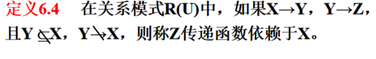
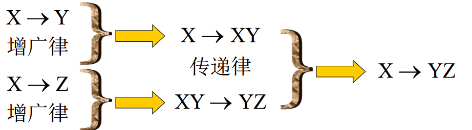
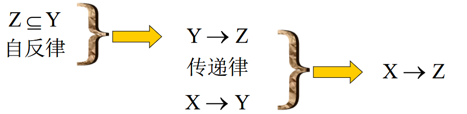
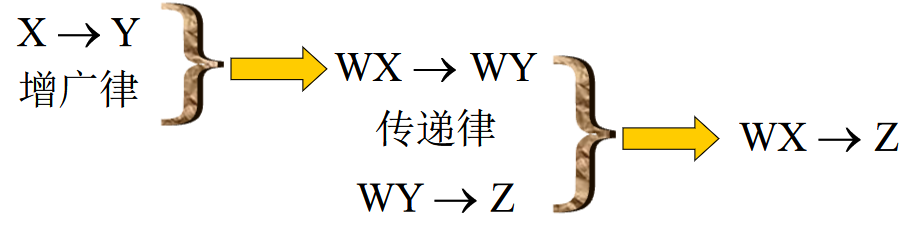

第6章 关系数据库理论

[toc]

### 1 ．理解并给出下列术语的定义：

1. 函数依赖
   函数依赖是指一个关系表中属性（列）之间的联系。
   设R(U)是一个属性集U上的关系模式，X , Y $\subseteq$U， r是R(U) 上的任意一个关系，如果成立
   		**对$\forall$t , s $\in$r，若t[X] = s[X]，则t[Y] = s[Y]**
   则称 “X函数确定Y” 或  “Y函数依赖于X”，记作X→Y。

   > 左部x称为决定因子
   > 右部y称为依赖因子

2. 部分函数依赖
   只需要X中部分的属性就能决定Y

3. 完全函数依赖

   即刚好要X中的==所有属性==才能决定Y，称**Y完全函数依赖于x** 

4. 传递依赖

   

5. 候选码

   若U完全依赖于K，则K称为R的一个侯选码（Candidate Key）。
   即每个K**完全决定**一个U，==每个K都是独一无二的==。
   若关系模式R有多个候选码，则选定其中的一个做为主码（Primary key）。

   > 上面的例子中
   > 学号唯一，而且没有多余属性，所以是一个候选键
   > 姓名唯一，而且没有多余属性，所以是一个候选键

   包含在任何一个==候选码中的属性称为主属性==

6. 主码
    主码就是候选码里面的一个，是人为规定的

7. 外码
   该属性在另一个关系中是主码。

8. 全码（All 一key ）

   即所以的属性构成一个码

9. 1NF 

   每个列不能再分割，==所有属性都是不可分的基本数据项==

10. 2NF 
    每一个**非主属性**==完全函数依赖==于码，消除部分依赖

11. 3NF 
    ==消除传递函数依赖==

12. BCNF 

    在一个关系模式中==每一个决定属性因素==都包含==**码**==。

    > X→Y，每一个X都要是码 

13. 多值依赖

    关系模式R(U)中多值依赖X→→Y成立，当且仅当对R(U)的任一关系r，**给定的一对(x, z )值，有一组Y的值，这组值仅仅决定于x值，而与z值无关。**（实际上不需要Z来决定，Z是多余的）

14. 4NF 

    关系模式R<U ，F>$\in$1NF，如果对于R的每个**非平凡多值依赖**X→ →Y，（Y不是X的子集），**X都含有码**，则R$\in$4NF


### 2．建立一个关于系、学生、班级、学会等诸信息的关系数据库。

学生：<u>学号</u>、姓名、出生年月、系名、班号、宿舍区。

班级：<u>班号</u>、专业名、系名、人数、入校年份。

系：<u>系名</u>、系号、系办公地点、人数。

学会：<u>学会名</u>、成立年份、办公地点、人数。


  语义如下：一个系有若干专业，每个专业每年只招一个班，每个班有若干学生。**一个系的学生住在同一宿舍区**。每个学生可参加若干学会，每个学会有若干学生。学生参加某学会有一个入会年份。

  请给出**关系模式**，写出每个关系模式的**极小函数依赖集**，指出是否存在**传递函数依赖**，对于函数依赖左部是多属性的情况讨论函数依赖是完全函数依赖，还是部分函数依赖。指出各关系模式的候选码、外部码，有没有全码存在?

解：

#### (1)关系模式如下：

```sql
 学生：S(Sno，Sname，Sbirth，Dept，Class，Rno)

 班级：C(Class，Pname，Dept，Cnum，Cyear)

 系：D(Dept，Dno，Office，Dnum)

 学会：M(Mname，Myear，Maddr，Mnum)
```

####  (2)每个关系模式的**最小函数依赖集**如下： 

#####  A、学生S (Sno，Sname，Sbirth，Dept，Class，Rno) 的

**最小函数依赖集**如下:

Sno$\rightarrow$Sname，Sno$\rightarrow$Sbirth，Sno$\rightarrow$Class，Class$\rightarrow$Dept，DEPT$\rightarrow$Rno

> 这玩意儿也不是闭包啊。

> 就是所有的可以推出来的依赖的集合？
>
> 如果函数依赖集F满足下列条件，则称F为最小函数依赖集或最小覆盖。
>
> ① F中的任何一个函数依赖的右部仅含有一个属性；
>
> ② F中不存在这样一个函数依赖X→A，使得F与F-{X→A}等价；
>
> ③ F中不存在这样一个函数依赖X→A，X有真子集Z使得F-{X→A}∪{Z→A}与F等价。

  **传递依赖**如下：

由于Sno$\rightarrow$Dept，而Dept$\rightarrow$Sno ，Dept$\rightarrow$Rno（宿舍区）

 

所以Sno与Rno之间存在着传递函数依赖。

  由于Class$\rightarrow$Dept，Dept $\rightarrow$ Class，Dept$\rightarrow$Rno

​     所以Class与Rno之间存在着传递函数依赖。


  由于Sno$\rightarrow$Class，Class$\rightarrow$Sno，Class$\rightarrow$Dept

​     所以Sno与Dept之间存在着传递函数依赖。


#####  B、班级C(Class，Pname，Dept，Cnum，Cyear)的

**最小函数依赖集**如下:

  Class$\rightarrow$Pname，Class$\rightarrow$Cnum，Class→Cyear，Pname→Dept.

  由于Class→Pname，Pname→Class，Pname→Dept

​    所以Class与Dept之间存在着传递函数依赖。

#####  C、系D(Dept，Dno，Office，Dnum)的

最小函数依赖集如下：

  Dept→Dno，Dno→Dept，Dno→Office，Dno→Dnum

  根据上述函数依赖可知，Dept与Office，Dept与Dnum之间不存在传递依赖。

#####  D、学会M(Mname，Myear，Maddr，Mnum)的

最小函数依赖集如下：

  Mname→Myear，Mname→Maddr，Mname→Mnum

   该模式不存在传递依赖。

####  (3)各关系模式的候选码、外部码，全码如下：

 A、学生S候选码：Sno；外部码：Dept、Class；无全码

 B、班级C候选码：Class；外部码：Dept；无全码

 C、系D候选码：Dept或Dno；无外部码；无全码

 D、学会M候选码：Mname；无外部码；无全码

 

### 3 ．试由amstrong 公理系统推导出下面三条推理规则：

- 合并律
  若X → Y，X → Z，则X → YZ

  

- 分解律
  若X → Y ，Z →Y，则X → Z
  特别地，若X → YZ ，则X → Y，X → Z

  

- 伪传递律
  若X → Y，WY → Z，则WX → Z

  


 

### 5 ．试举出3 个多值依赖的实例。

答：

（1）关系模式MSC ( M , S , C ）中，M 表示专业，S 表示学生，C 表示该专业的必修课。假设每个专业有多个学生，有一组必修课。设同专业内所有学生选修的必修课相同，实例关系如下。按照语义对于M 的每一个值M i , s 有一个完整的集合与之对应而不问C 取何值，所以M 一一S 。由于C 与S 的完全对称性，必然有M 一一C 成立。

（2）关系模式ISA ( I , S , A ）中，I 表示学生兴趣小组，S 表示学生，A 表示某兴趣小组的活动项目。假设每个兴趣小组有多个学生，有若干活动项目。每个学生必须参加所在兴趣小组的所有活动项目，每个活动项目要求该兴趣小组的所有学生参加。
按照语义有I 一一S , I 一一A 成立。
（3）关系模式RDP ( R , D , P ）中，R 表示医院的病房，D 表示责任医务人员，P 表示病人。假设每个病房住有多个病人，有多个责任医务人员负责医治和护理该病房的所有病人。

 

### 12．下面的结论哪些是正确的? 哪些是错误的? 对于错误的请给一个反例说明之。

#### （1）任何一个二目关系是属于3NF。

答：正确。因为关系模式中只有两个属性，所以无传递。

#### （2）任何一个二目关系是属于BCNF.

答: 正确。按BCNF的定义，若X→ Y,且Y不是X的子集时，每个决定因素都包含码，对于二目关系决定因素**必然包含码**。详细证明如下：（任何二元关系模式必定是BCNF）。

证明：设R为一个二目关系R(A1，A2)，则属性A1和A2之间可能存在以下几种依赖关系：

A、A1→ A2，但A2→ A1，则关系R的码为A1，决定因素都包含码，所以，R是BCNF。

B、A1→ A2，A2→ A1，则关系R的码为A2，所以决定因素都包含码，R是BCNF。

包含码。R是BCNF。C、R的码为(A1，A2)（即A1→ A2，A2 → A1），决定因素都

#### （3）任何一个二目关系是属于4NF.

答:正确。因为**只有两个属性，所以无非平凡的多值依赖**。

>  若X → →Y 有，且**Z=Ø**，则称X → →Y为**平凡的多值依赖**
> 否则（即Z不为空集），称X → →Y为**非平凡的多值依赖** 
>
> 二目关系，只有X,Y必然没有Z，必然没有非平凡的多值依赖。