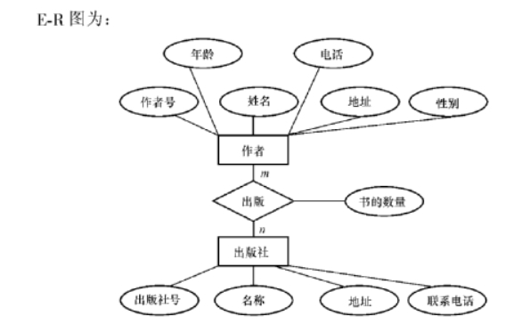
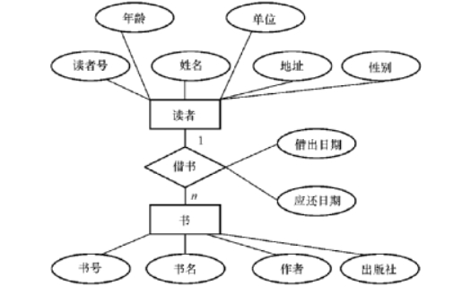

第7章 数据库设计

[toc]

### 1．试述数据库设计过程。

答：这里只概要列出数据库设计过程的六个阶段：

1. 需求分析；
2. 概念结构设计；
3. 逻辑结构设计；
4. 数据库物理设计；
5. 数据库实施； 
6. 数据库运行和维护。

这是一个完整的实际数据库及其应用系统的设计过程。不仅包括设计数据库本身，还包括数据库的实施、运行和维护。设计一个完善的数据库应用系统往往是上述六个阶段的**不断反复**。

 

### 2 ．试述数据库设计过程各个阶段上的设计描述。

答：各阶段的设计要点如下：

1. 需求分析：准确了解与分析用户需求（包括数据与处理）。
2. 概念结构设计：通过对用户需求进行综合、归纳与抽象，形成一个独立于具体 DBMS 的**概念模型。** E-R图
3. 逻辑结构设计：将概念结构转换为某个 DBMS 所支持的**数据模型**，并对其进行优化。
4. 数据库物理设计：为逻辑数据模型选取一个最适合应用环境的物理结构（包括存储结构和存取方法）。
5. 数据库实施：设计人员运用 DBMS 提供的数据语言、工具及宿主语言，根据逻辑设计和物理设计的结果建立数据库，编制与调试应用程序，组织数据入库，并进行试运行。
6. 数据库运行和维护：在数据库系统运行过程中对其进行评价、调整与修改。

 

### 3 ．试述数据库设计过程中， 结构设计部分形成的数据库模式。

答：数据库结构设计的不同阶段形成数据库的各级模式，即：

1. 在概念设计阶段形成独立于机器特点，独立于各个 DBMS 产品的概念模式，在本篇中就是 E-R 图
2. 在逻辑设计阶段将 E 一 R 图转换成具体的数据库产品支持的**数据模型**，如关系模型，形成数据库逻辑模式，然后在基本表的基础上再建立必要的视图 ( Vi 娜），形成数据的外模式；
3. 在物理设计阶段，根据 DBMS 特点和处理的需要，进行物理存储安排，建立索引，形成数据库内模式。

 

### 4 ．试述数据库设计的特点。

答：数据库设计既是一项涉及多学科的综合性技术又是一项庞大的工程项目。其主要特点有：

 ( l ）数据库建设是硬件、软件和干件（技术与管理的界面）的结合。

 ( 2 ）从软件设计的技术角度看，数据库设计应该和应用系统设计相结合，也就是说，整个设计过程中要把结构（数据）设计和行为（处理）设计密切结合起来。

 

### 5 ．需求分析阶段的设计目标是什么？调查的内容是什么？

答：需求分析阶段的设计目标是通过详细调查现实世界要处理的对象（组织、部门、企业等），充分了解原系统（手工系统或计算机系统）工作概况，明确用户的各种需求，然后在此基础上确定新系统的功能。调查的内容是“数据’夕和“处理”，即获得用户对数据库的如下要求：

 ( l ）信息要求，指用户需要从数据库中获得信息的内容与性质，由信息要求可以导出数据要求，即在数据库中需要存储哪些数据；

 ( 2 ）处理要求，指用户要完成什么处理功能，对处理的响应时间有什么要求，处理方式是批处理还是联机处理；

 ( 3 ）安全性与完整性要求。

 

### 6 ．数据字典的内容和作用是什么？

答：数据字典是系统中各类数据描述的集合。数据字典的内容通常包括：

 ( l ）数据项；

 ( 2 ）数据结构；

 ( 3 ）数据流； 

( 4 ）数据存储；

 ( 5 ）处理过程五个部分。

其中数据项是数据的最小组成单位，若干个数据项可以组成一个数据结构。数据字典通过对数据项和数据结构的定义来描述数据流和数据存储的逻辑内容。数据字典的作用：数据字典是关于数据库中数据的描述，在需求分析阶段建立，是下一步进行概念设计的基础，并在数据库设计过程中不断修改、充实、完盖。

 

### 7 ．什么是数据库的概念结构？试述其特点和设计策略。

答：概念结构是信息世界的结构，即概念模型，其主要特点是：

1. 能真实、充分地反映现实世界，包括事物和事物之间的联系，能满足用户对数据的处理要求，是对现实世界的一个真实模型； 
2. 易于理解，从而可以用它和不熟悉计算机的用户交换意见，用户的积极参与是数据库设计成功的关键； 
3. 易于更改，当应用环境和应用要求改变时，容易对概念模型修改和扩充；
4. 易于向关系、网状、层次等各种数据模型转换。概念结构的设计策略通常有四种：
   1. 自顶向下，即首先定义全局概念结构的框架，然后逐步细化；
   2. 自底向上，即首先定义各局部应用的概念结构，然后将它们集成起来，得到全局概念结构； 
   3. 逐步扩张，首先定义最重要的核心概念结构，然后向外扩充，以滚雪球的方式逐步生成其他概念结构，直至总体概念结构；
   4. 混合策略，即将自顶向下和自底向上相结合，用自顶向下策略设计一个全局概念结构的框架，以它为骨架集成由自底向上策略中设计的各局部概念结构。

 

### 8 ．什么叫数据抽象？试举例说明。

答：数据抽象是对实际的人、物、事和概念进行人为处理，抽取所关心的共同特性，忽略非本质的细节，并把这些特性用各种概念精确地加以描述，这些概念组成了某种模型。如“分类’夕这种抽象是：定义某一类概念作为现实世界中一组对象的类型。这些对象具有某些共同的特性和行为。它抽象了对象值和型之间的， ' i 5 member of ”的语义。在 E 一 R 模型中，实体型就是这种抽象。例如在学校环境中，李英是老师，表示李英是教师类型中的一员，则教师是实体型，李英是教师实体型中的一个实体值，具有教师共同的特性和行为：在某个系某个专业教学，讲授某些课程，从事某个方向的科研。

 

###  9 ．试述数据库概念结构设计的重要性和设计步骤。

答：

重要性：数据库概念设计是整个数据库设计的关键，将在需求分析阶段所得到的应用需求首先抽象为概念结构，以此作为各种数据模型的共同基础，从而能更好地、更准确地用某一 DBMS 实现这些需求。

设计步骤：概念结构的设计方法有多种，其中最经常采用的策略是自底向上方法，该方法的设计步骤通常分为两步：第 1 步是抽象数据并设计局部视图，第 2 步是集成局部视图，得到全局的概念结构。 

 

 

### 10 ．为什么要视图集成？视图集成的方法是什么？

答：在对数据库系统进行概念结构设计时一般采用自底向上的设计方法，把繁杂的大系统分解子系统。首先设计各个子系统的局部视图，然后通过视图集成的方式将各子系统有机地融合起来，综合成一个系统的总视图。这样，设计清晰，由简到繁。由于数据库系统是从整体角度看待和描述数据的，因此数据不再面向某个应用而是整个系统。因此必须进行视图集成，使得数据库能被全系统的多个用户、多个应用共享使用。一般说来，视图集成可以有两种方式： 

( l ）多个分 E 一 R 图一次集成; 

( 2 ）逐步集成，用累加的方式一次集成两个分 E 一 R 图。

无论采用哪种方式，每次集成局部 E 一 R 图时都需要分两步走：

 ( l ）合并，解决各分 E 一 R 图之间的冲突，将各分 E 一 R 图合并起来生成初步 E 一 R 图；

 ( 2 ）修改和重构，消除不必要的冗余，生成基本 E 一 R 图。 

 

### 11 ．什么是数据库的逻辑结构设计？试述其设计步骤。

答：数据库的逻辑结构设计就是把概念结构设计阶段设计好的基本 E 一 R 图转换为与选用的 DBMS 产品所支持的数据模型相符合的逻辑结构。设计步骤为 :

1. 将概念结构转换为一般的关系、网状、层次模型； 
2. 将转换来的关系、网状、层次模型向特定 DBMS 支持下的数据模型转换；
3. 对数据模型进行优化。

 

### 14 ．规范化理论对数据库设计有什么指导意义？

答：规范化理论为数据库设计人员判断关系模式的优劣提供了理论标准，可用以指导关系数据模型的优化，用来预测模式可能出现的问题，为设计人员提供了自动产生各种模式的算法工具，使数据库设计工作有了严格的理论基础。 

 

### 15 ．试述数据库物理设计的内容和步骤。

答：数据库在物理设备上的存储结构与存取方法称为数据库的物理结构，它依赖于给定的 DBMS 。为一个给定的逻辑数据模型选取一个最适合应用要求的物理结构，就是数据库的物理设计的主要内容。数据库的物理设计步骤通常分为两步：

 ( l ）确定数据库的物理结构，在关系数据库中主要指存取方法和存储结构；

 ( 2 ）对物理结构进行评价，评价的重点是时间效率和空间效率。

 

### 16 ．数据输入在实施阶段的重要性是什么？如何保证输入数据的正确性？

答：数据库是用来对数据进行存储、管理与应用的，因此在实施阶段必须将原有系统中的历史数据输入到数据库。数据量一般都很大，而且数据来源于部门中的各个不同的单位。数据的组织方式、结构和格式都与新设计的数据库系统有相当的差距，组织数据录入就要将各类源数据从各个局部应用中抽取出来，分类转换，最后综合成符合新设计的数据库结构的形式，输入数据库。因此这样的数据转换、组织入库的工作是相当费力费时的工作。特别是原系统是手工数据处理系统时，各类数据分散在各种不同的原始表格、凭证、单据之中，数据输入工作量更大。保证输入数据正确性的方法：为提高数据输入工作的效率和质量，应该针对具体的应用环境设计一个数据录入子系统，由计算机来完成数据入库的任务。在源数据入库之前要采用多种方法对它们进行检验，以防止不正确的数据入库。

 

###  17 ．什么是数据库的再组织和重构造？为什么要进行数据库的再组织和重构造？

答：数据库的再组织是指：按原设计要求重新安排存储位置、回收垃圾、减少指针链等，以提高系统性能。数据库的重构造则是指部分修改数据库的模式和内模式，即修改原设计的逻辑和物理结构。数据库的再组织是不修改数据库的模式和内模式的。进行数据库的再组织和重构造的原因：数据库运行一段时间后，由于记录不断增、删、改，会使数据库的物理存储情况变坏，降低了数据的存取效率，数据库性能下降，这时 DBA 就要对数据库进行重组织。 DBMS 一般都提供用于数据重组织的实用程序。数据库应用环境常常发生变化，如增加新的应用或新的实体，取消了某些应用，有的实体与实体间的联系也发生了变化等，使原有的数据库设计不能满足新的需求，需要调整数据库的模式和内模式。这就要进行数据库重构造。 

 

### 18 ．现有一局部应用，包括两个实体：“出版社”和“作者”

这两个实体是多对多的联系，请读者自己设计适当的属性，画出 E 一 R 图，再将其转换为关系模型（包括关系名、属性名、码和完整性约束条件）。

答：

 

关系模型为：

作者（作者号，姓名，年龄，性别，电话，地址）

出版社（出版社号，名称，地址，联系电话）

出版（作者号，出版社号，书的数量）

出版关系的主码作者号，出版社号分别参照作者关系的主码作者号和出版社关系的主码出版社号。

 

### 19 ．请设计一个图书馆数据库

此数据库中对每个借阅者保存读者记录，包括：读者号，姓名，地址，性别，年龄，单位。对每本书存有：书号，书名，作者，出版社。对每本被借出的书存有读者号、借出日期和应还日期。要求：给出 E 一 R 图，再将其转换为关系模型。

答 ：E 一 R 图为：

 

关系模型为：

读者（读者号，姓名，地址，性别）

书（书号，书名，作者，出版社）

借书（读者号，书号，借出日期，年龄，单位，应还日期）