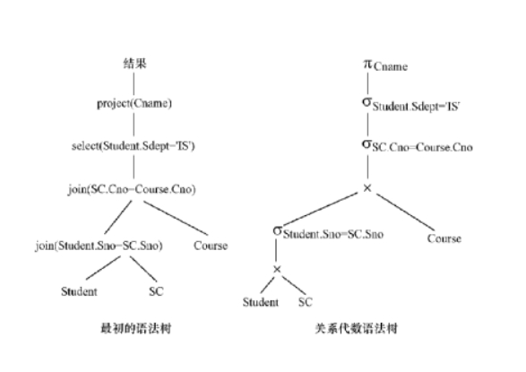
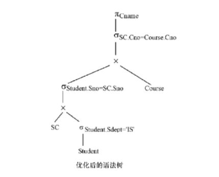

第9章 关系查询处理和查询优化

[toc]

### 1 ．试述查询优化在关系数据库系统中的重要性和可能性。

答：重要性：关系系统的查询优化既是 RDBMS 实现的**关键技术**又是关系系统的**优点**所在。它减轻了用户选择存取路径的负担。用户只要提出“干什么”，不必指出“怎么干”。查询优化的优点不仅在于用户不必考虑如何最好地表达查询以获得较好的效率，而且在于<u>系统可以比用户程序的优化做得更好</u>。

可能性：这是因为： 

1. 优化器可以从数据字典中获取许多统计信息，例如关系中的元组数、关系中每个属性值的分布情况、这些属性上是否有索引、是什么索引（ B ＋树索引还是 HASH 索引或惟一索引或组合索引）等。优化器可以根据这些信息选择有效的执行计划，而用户程序则难以获得这些信息。
2. 如果数据库的物理统计信息改变了，系统可以自动对查询进行重新优化以选择相适应的执行计划。在非关系系统中必须重写程序，而重写程序在实际应用中往往是不太可能的。
3. <u>优化器可以考虑数十甚至数百种不同的执行计划</u>，从中选出较优的一个，而程序员一般只能考虑有限的几种可能性。 
4. 优化器中包括了很多复杂的优化技术，这些优化技术往往只有最好的程序员才能掌握。<u>系统的自动优化相当于使得所有人都拥有这些优化技术。</u>

  

 

### 2 ．对学生一课程数据库有如下的查询

```sql
SELECT Cname
FROM Student,Course, SC
WHERE Student.Sno=SC.Sno AND
	  SC.Cno=Course.Cno  AND
	  Student.Sdept='IS';
```

此查询要求信息系学生选修了的所有课程名称。试画出用关系代数表示的语法树，并用关系代数表达式优化算法**对原始的语法树进行优化处理**，画出优化后的标准语法树。

答：

  

很显然可以看到选择运算被先做了，这样可以减少后序的连接操作

 

 

### 3 ．试述查询优化的一般准则。

答：下面的优化策略一般能提高查询效率：
 ( l ）选**择运算应尽可能先做**；
 ( 2 ）把**投影运算和选择运算同时进行**；
 ( 3 ）把投影同其前或其后的双目运算结合起来执行；
 ( 4 ）把某些选择同在它前面要执行的笛卡儿积结合起来成为一个连接运算；
 ( 5 ）找出公共子表达式；（这个其实都不咋用）
 ( 6 ）选取合适的连接算法。（自然连接，等值连接还是其他方法）

 

### 4 ．试述查询优化的一般步骤。

答：各个关系系统的优化方法不尽相同，大致的步骤可以归纳如下：
( l ）把查询转换成某种内部表示，通常用的内部表示是**语法树**。 
( 2 ）把语法树转换成标准（优化）形式。即利用优化算法，把原始的语法树转换成优化的形式。
( 3 ）选择低层的存取路径。
( 4 ）生成查询计划，选择代价最小的。