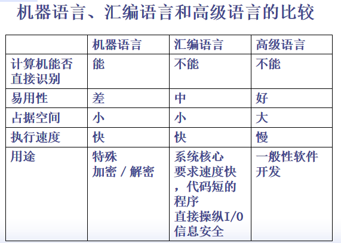
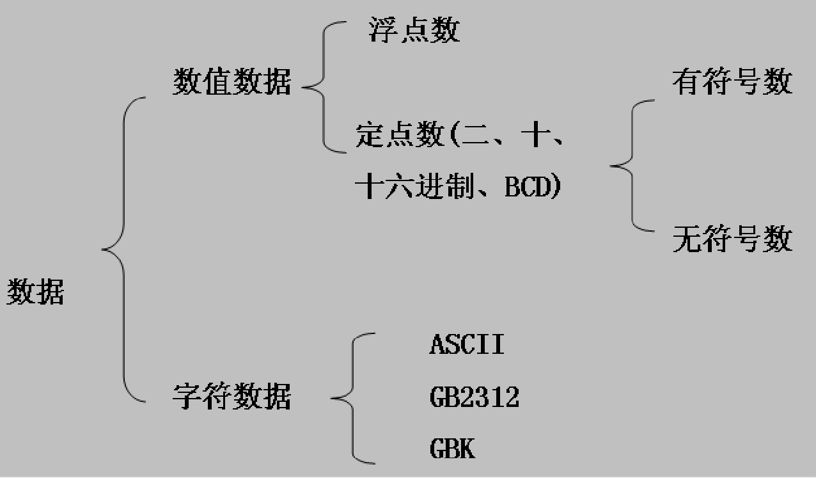

[toc]

 

# 本章学习的难点：

1. 寄存器组各个寄存器的名称和用途
2. PUSH/POP指令、堆栈指示器的变化
3. 保护模式下物理地址的形成
4. 有符号数、无符号数及其运算对于标志寄存器的影响

# 1.1 机器语言与汇编语言

## 1.1.1 机器语言

机器语言的特点：

1. 由0和1组成的二进制码。
2. 能为计算机识别并执行。      
3. 不同类型的机器，不同类型的CPU都有自己特有的、一定数量的基本指令。

>  又被称作硬指令

- 指令系统：每台计算机都规定了自己所特有的、一定数量的基本命令，这批指令的全体为计算机的指令系统
- 机器语言：机器指令的集合
- 机器语言程序：用机器语言编写的程序

## 1.1.2 汇编语言

汇编语言：一种用符号书写的、其操作与机器指令一一对应的，并遵循一定语法规则的计算机语言。


> 因为显然用二进制或者16进制书写难的记，用符号更好记

### 汇编源程序

  用汇编语言编写的程序——类似于高级语言编写的源程序 

> 例如.cpp之类的，就是.asm

### 汇编程序

  像一个翻译器：把汇编源程序**翻译**成目标程序的（语言加工）程序——类似于高级语言的**编译程序**


### 汇编

  汇编程序对源程序**进行翻译的过程** —— 类似于高级语言的**编译过程**

### 机器语言、汇编语言和高级语言的比较



### 伪指令（汇编控制指令）

告诉汇编程序如何进行汇编工作的命令，例如源程序从什么位置开始安放，汇编到什么位置结束，数据放在什么位置。

这个就是那些例如  堆栈段，数据段，程序段的分段命令，以及ENDS ，END这类命令

---

### 总结

助记符：ADD ,DEC等，*把机器指令封装成助记符，ADD本身的机器指令可能是0100010101这种*
语句标号：  BEGIN:  LOP1: LOP2:这种 
数据变量：自己在DATA段里定义的
伪指令： DS:DATA这种，告诉汇编程序(masm.exe)如何工作的，从哪里找东西的。

==上面4个东西，以及他们的使用规则，构成了整个汇编语言的内容==

### 书中使用符号的说明

1. （...） 表示**地址...中的内容**，如EA为100的存储单元中的内容为50，则(100)=50;寄存器BX的内容是0FFFFH，则(BX)=0FFFFH
2. [...] 表示**...中的内容为偏移地址**。 如(BX)=03A2H 而  （03A2H)=100 则  （[BX]）=100，表示以BX的内容为偏移，
3. EA指偏移地址，指改存储单元到它所在段的段首址的字节举例
4. PA某一个存储单元的物理地址
5. R指某寄存器的名字
6. ^逻辑乘
7. V逻辑加
8. FLAGS 表示16位的标志寄存器
9. EFLAGS 表示32位的标志寄存器

# 1.2 Intel系列机简介


> 更详细的见计算机组成原理

## 1.2.1 80x86微处理器结构

1978年推出16位的8086，内外数据总线都是16根，地址总线为20根，2^20=1MB，主存寻址范围1MB

1982推出80286，16条数据线，但有24根地址线，主存寻址范围16MB

1985推出80386，32根地址总线和数据总线，支持主存寻址4GB

> 这个支持主存的寻址范围也就是支持内存的大小，你看32位系统最多只支持4G内存，因为寻址范围只到4G。
>
> 而64位系统内存寻址可以达到 2的64次幂, 也就是1677万G。
>
> 但是实际上由于主板的原因,32位系统只能识别3.25G左右。
> 64为系统最多能识别128G,因为民用主板,最大支持内存就是128G。


### 1.总线接口部件:

是CPU与计算机系统中其它功能部件之间的**高速接口**功能：接受所有的总线操作请求，并按优先权进行选择，最大限度地利用本身的资源为这些请求服务。

### 2.执行部件：

寄存器组、标志寄存器、算逻部件、控制部件等组成
 功能：从译码指令队列中**取出指令并且执行**

> 其实我们写16位程序一般只用到16位寄存器

寄存器组中有8个32位寄存器，分两组：

#### （1）数据寄存器组(EAX，EBX，ECX，EDX)

​    EAX (累加器)Accumulator
​    EBX (基址寄存器)Base 
​    ECX (计数寄存器)Count
​    EDX (数据寄存器)Data

作用 ：用来保存操作数、运算结果或作指示器、变址寄存器，减少存取操作数所需要的访问总线和主存储器的时间，加快运行速度。


>  **8位的寄存器**不能作指示器或变址寄存器。 **只能是数据寄存器**。从上面的图就能看出来
>
>  注意最前面的是高位，31。最后面的是低位，0。共32位。
>
>  至于它为什么这么叫，是因为有些指令里默认的寄存器是这样的，例如LOOPA，默认执行CX次，这是约定好的参数。

#### （2）指示器，变址寄存器组(ESI、EDI、ESP、EBP)

作用：一般用来存放操作数的**偏移地址**，用作指示器或变址寄存器。

​	ESP（Stack Pointer），称为**堆栈**指示器，存放的是当前堆栈段中栈顶的**偏移地址**； 
​	EBP  (Base Pointer)，为对**堆栈**操作的**基址寄存器**；
​	ESI    (Source Index)，称为源变址寄址器；  **字符串指令**中取源操作数的指示器
​	EDI    (Destination Index)，称为目的变址寄存器；**字符串指令**中送目的操作数的指示器

> ESI,EDI,EBP不做指示器和变址寄存器时，**可以当做数据寄存器使用**
>
> <u>**ESP不行**，专用于堆栈的指示器</u>

### 3. 指令预取部件和指令译码部件

- 指令预取部件：通过**总线接口部件**，把将要执行的指令从主存中取出，送入指令排队机构中排队。
- 指令译码部件：从指令预取部件中读出指令并**译码**，再送入译码指令队列排队供执行部件使用。 
- 执行部件：取出译码指令队列的指令来执行

这三个部件形成了一个指令流水线，大大提高了指令的执行速度。

指令（地址）指示器:它总是保存着下一条将要被CPU执行的指令的偏移地址(简称EA)，其值为该指令到所在段首址的字节距离。

指令存在EIP/IP中，由硬件自动设置，**不能供程序直接访问**，但有些指令（例如转移指令，子程序调用指令）可以改变它。

### 4．分段部件和分页部件[^5]

使用分段部件和分页部件实现**虚拟存储空间映射到物理存储空间**

程序使用二维地址     `段地址：段内偏移地址`

#### 1.分段部件

> 二维的逻辑地址（段地址：段内偏移地址）  $\rightarrow$ 一维的==线性地址==

- 实方式下，段的大小最多是64KB，这时，取数据或指令的物理地址直接通过段寄存器的内容和EA生成，就是后面常见的DS:EA
- 保护方式下，段的大小可达4GB，这时，段寄存器的内容叫选择符，通过选择符找到描述符表，取出描述符之后才能确定所需访问的段和存储单元。
- 分段部件构造了**虚拟存储空间**

#### 2.分页部件

>  虚拟的线性的地址  $\rightarrow$  **主存储器**的==物理地址==
>
> 

**分页部件主要用于物理存储器的管理**

分页机制的思想是:通过映射，可以使连续的线性地址与物理地址相关联，逻辑上连续的线性地址对应的物理地址可以不连续。 分页的作用 - 将线性地址转换为物理地址 - 用大小相同的页替换大小不同的段

> 主存储器：主机内部的半导体存储器，相对外存，容量小，速度快，成本高。
>
> 其实就是内存。
>
> 为什么要分页可以见计算机组成原理。


#### 网上的总结

- 数据总线：是计算机中各个组成部件间进行数据传输时的公共通道；
- “内数据总线宽度”是指CPU芯片内部数据传送的宽度；
- “外数据总线宽度”是指CPU与外部交换数据时的数据宽度。显然，数据总线位数越多，数据交换的速度就越快。
- 地址总线：是載对存储器或I/O端口进行访问时，传送由CPU提供的要访问的存储单元或I/O端口的地址信息的总线，其宽度决定了处理器能直接访问的主存容量的大小。


#### 段寄存器（6个）：

​    代码段寄存器 CS
​    堆栈段寄存器 SS
​    数据段寄存器 DS
​    附加段寄存器 ES,FS,GS（一般都是用ES）

#### 指令执行过程：

(1) 指令预取部件和指令译码部件 
		EIP  $\rightarrow$  指令的偏移地址
     EIP增量，形成下一条指令的地址

(2) 分段部件和分页部件
		CS : EIP   $\rightarrow$  指令的物理地址
(3) 总线接口部件
		从主存中取指令  $\rightarrow$  预取指令队列

(4) CPU按序从预取指令队列中取出指令   $\rightarrow$   指令译码部件。

(5) 指令译码部件译码   $\rightarrow$   执行部件执行指令;

(6) 执行过程中若需要取主存操作数  $\rightarrow$  操作数偏移地址

(7) 分段部件和分页部件
		偏移地址 , 段寄存器  $\rightarrow$  操作数的物理地址

(8) 总线接口部件
		从主存中取数据  $\rightarrow$  执行部件

> EIP取EA，分段分页部件拿到CS:EA即指令的物理地址，总线接口从主存中取指令，放入队列，译码，执行部件执行。

## 1.2.2 80x86的三种工作方式

实地址方式是**为了与16位8086兼容而保留的工作方式**，计算机上电或复位后，32位CPU首先初始化为实地址方式，再通过实地址方式进入<u>32位保护公共模式，这个方式下才能发挥全部性能</u>，如果想在保护方式下运行16位程序，就要进入虚拟8086方式。

### 1.实方式（实际地址）

操作相当于一个可进行32位快速运算的8086（内部32位、**外部总线16位数据**、**20位地址**）

> 为了兼容8086而出现的机制，因为当年的CPU都是数据总线16位，程序段的大小不超过64KB。地址总线20位，寻址**1MB**的物理存储空间。
>
> 1MB内存安排如下图（DOS） 	
>
> 
>
> A0000H（即640KB）开始的384KB都不能用，只能用从500H到A0000H**不到640KB的内存**，程序不能用这640KB以外的内存，这就是著名的640KB限制

实方式下的寻址就是         段地址*10H+ES=PA  ，这样就能用16根数据线寻址20位地址

### 2.保护方式（虚地址）

> 进入操作系统就是这个模式。32位windows进入就是这个，寻址4GB，段寄存器失去原有意义，因为32位足够寻址了。
>
> 段寄存器存放优先级，保护方式等东西。段描述符64位，段寄存器16位，放不下，所以整了个段描述符表。

是80X86设计目标全部达到的工作方式，通过对程序使用的存储区采用**分段、==分页==**的存储管理机制，达到分级使用互不干扰的保护目的。**能为每个任务提供一台虚拟处理器，使每个任务单独执行，快速切换**。

- 多了两个段寄存器FS,GS
- 分页和分段的存储管理机制对每个任务分配不同的虚拟存储空间，实施执行环境的隔离和保护，对不同的段设立特权级并进行访问权限检查。防止不同用户程序，系统程序之间的非法访问和干扰破坏，使操作系统和各应用程序都收到保护，所以叫保护模式。

> 也就是80386的时代，32位地址线，即可实现4G内存的机制。虚拟存储空间可达64TB，32位数据总线，程序段大小也可达4GB

### 3.虚拟8086方式

- 是在保护方式下提供的运行类似实方式的工作环境
- 保护方式下所提供的同时模拟多个8086处理器。 

例如Windows下是保护方式运行的
DOS是实方式运行的
如果我想在Window下运行DOS的16位程序，还要关机重启去开DOS，麻烦，于是出现了虚拟8086方式，在保护方式下提供多个类似于实模式的8086处理器

> 听起来有点像DosBox这种东西

# 1.3 主存储器和物理地址的形成

## 1.3.1 主存储器

存储器：用来存放程序和数据的装置，包括**主存和外存（辅存，硬盘，光盘等）**。
主存储器：主机内部的半导体存储器，相对外存，容量小，速度快，成本高——**内存**

### 主存储器编址方式

​	主存储器的基本记忆单元是位，它能记忆/容纳一个二进制数0或1。

​	8位组成一个字节，当前微机一个存储单元存放一个字节。

​	为了区别不同的存储单元，每一存储单元都被指定一个编号，编号作为存储单元的物理地址。


> 规定字地址由两个字节地址中较小的那一位确定
> 同理可得双字的

## 1.3.2 堆栈

从逻辑上来看：是内存中开辟的一片存贮区，这片存贮区采用的存贮方式是一端固定，一端活动，即只允许在一端插入或删除(访问可任意)。

由SS段寄存器指定

> 堆栈中数据的存取原则: “先进后出”， 
> 堆栈中的数据也称元素或栈项。
> 元素进栈称压入，出栈称弹出。
>
> 这都是老生常谈了，与数据结构里的无异

### 问题：为什么要用堆栈？

​		程序中经常用到子程序或处理中断，此时，主程序需要把子程序或中断程序将用到的寄存器内容保护起来，以便子程序或中断返回后，主程序能够从调用点或中断点处继续执行。

此外，堆栈还经常用于：

- 保护和恢复现场
- 主程序和子程序之间传递参数
- 子程序中的**局部变量**——这个倒是没见到用过

### 1.进栈指令PUSH

  格式：PUSH  OPS
  功能：将立即数、寄存器、段寄存器或存贮器中的一个字/双字数据压入堆栈。
  例：PUSH  AX
  设：(AX)=4241H  (SP)=10000H
	执行：① (SP)-2→SP 
	           ② (AX)→[SP\][^6]


> 储存地址默认上面低，下面高。由于是一个字，所以进栈是-2，地址变低了。这个之前内存的逻辑是一样的。
>
> 但是有的书，例如一些C++书里面讲堆栈的时候，内存上面是高地址，下面是低地址，这个看各个书的。

### 2.出栈指令POP

格式：POP  OPD
功能：将栈顶元素弹出送至某一寄存器、段寄存器(除CS外)或字/双字存贮单元中。
例：POP  BX
设指令执行前：(BX)=1111H，堆栈内容如上题所示。 

执行：① ([SP])→BX
	       ② (SP)+2→SP 


### 3.将8个16位寄存器入栈 PUSHA

按AX,CX,DX,BX,SP,BP,SI,DI顺序入栈，SP值是压入栈之前的SP值

对应出栈就是POPA

### 4.将8个32位寄存器入栈PUSHAD

没啥好讲的。变成栈指针每次-4了。


## 1.3.3 物理地址的形成

一个问题	  8086的限制，20位地址总线，寻址1MB，但8086内部却是16位的——16位寄存器(SP，BP，SI，DI)。

问题：如何通过16位寄存器访问1MB的内存

> 2^16^ 就是64K字节

解决：将1M字节主存分段，==每段最多64K字节==

### 分段管理的方法：

​    `段寄存器保存起始首地址 + 段内偏移地址的总体策略`——也就是所谓的==二维的逻辑地址==

段首地址分别存放在：段寄存器CS、DS、ES、SS、FS、GS中 

> 实际上一般只用前四个

段内偏移地址：段内相对于段起始地址的**偏移值**，往往由SP、BP、SI、DI、IP给出。

> 1. 在代码段中取指令时
>
>    PA(指令物理地址)=(CS)*10H+(IP)
>
> 2. 在数据段中读/写指令时
>
>    PA=(DS/ES)*10H+EA
>
> 3. 在堆栈中操作时
>
>    PA=(SS)*10H+SP
>
> 或者程序它特别指定哪个段，就用那个段

#### 1. 实模式

PA = 段寄存器保存的16位二进制数后补4个0 + EA


> 这一部分在笔记上有记
>
> 就是  段址*16(10H)+偏移地址(EA)=物理地址
>
> 如果用16进制表示的话，*10H这一步就是直接在后面加个0即可


**分段的实际作用：**

1. **实现了16位表示20位的地址**；
2. 当程序和数据的大小<64KB时，编制的程序可只关心EA，而不用管它的起始地址在哪（便于程序在主存中任何位置运行）
3. 便于不同目的的程序或数据分开存放，使程序各部分的含义更加明确。


几点说明

1. 段的大小可以根据需要而定，但必须小于等于64KB，段在主存中的具体位置由操作系统觉定
2. **分段并不是唯一的**，对于一片具体的存储单元，<u>可以属于一个段，也可以同时属于几个段</u>——例如后面可以吧DS和ES都指向DATA段。
3. 汇编程序中，用户必须将数据段置入DS或ES、FS、GS中。而**CS、SS 由系统自动置入**
4. 多个段在主存中不一定是连续存放的，中间很可能有间隔，<u>不过当然这也只是线性地址，后面还可以去分页</u>。

#### 2. 保护模式

保护什么：
**分清不同程序使用的存储区域，不允许随便使用别的程序的数据和代码**。

必要条件：

1. 段描述符
   操作系统每次将某块存储区分给某程序使用时，用8个字节的描述符描述这段存储区的特征。具体解释见书P17，考试也不会考。

   

   全局描述符表 （GDT) 是  描述符的集合，这玩意统一存在主存的某个地方，应该是开头

   - LDT（局部描述符表）：对计算机的每一个执行程序都有一个LDT，包含该程序中各段的描述符。最大64KB，存**8192个**描述符。
   - GDT（全局描述符表）：只有一个，最大64KB，包括
     - 系统各任务共享段的描述符，如操作系统的代码段，数据段的描述符
     - 每个任务LDT的描述符。
     - 存**8192个**描述符。
   - IDT（中断描述符表）：在第6.2节还会介绍中断描述符表IDT

   

2. 特权级
   要标记使用者是谁（权限级别）

   

3. 段选择符

   - 保护模式下，段寄存器不再保存段的开始地址，而是<u>指出从描述符表中选择相应的段描述符的方式</u>。
   - 程序的权限由程序所在的段决定，由当前程序正在使用的段寄存器内的**段选择符反映**。
     - TI=0，表示从全局描述符表中选描述符
     - TI=1，表示从局部描述符表中选描述符
     - 13位索引，所以是8192个描述符项的范围
     - 特权级用于特权级别的检查


4. 中间环节：CPU要去判断此次访问是否合法。

##### 保护模式下物理地址形成的方式

> 见书P19

1. 根据段描述符中的三个东西从段描述符表中得到<u>描述符</u>，检查合法性等，如果合格，将该描述符送入对应的描述符高速缓冲寄存器。
2. 从描述符高速缓冲寄存器里取出**段基址**，与放在EIP/ESP内的偏移地址相加，形成32位的线性地址
3. 如果没有分页部件，线性地址就是物理地址，如果有分页部件，则还需要经过分页部件的映射


#### 保护方式的实际含义

程序知道的“段首址”实际上是一个代号，是一个**虚拟的起始地址**，CPU通过查表转换才能获得真正的段首地址。
在这个由CPU完成的**转换过程中**，==实现了访问权限的判断，达到了保护的目的。==

# 1.4 数据在计算机内的表示形式

## 1.4.1 数值数据



补码表示的几个特点： 

1. 所有正数的补码表示的最左(高)位为0，其二进制补码表示为本身

2. 所有负数的补码表示的最左(高)位为1，其补码表示为：(原码)除符号位保持不变外，其它位取反加1。

   > [50]补 = [00110010B]补 = 00110010B
   > [-50]补 = [-00110010B]补 =11001110B
   
3.   一个二进制补码的最高位向左延伸（即符号扩展），所得到的仍是此数的补码表示。

     正数向左延伸0，负数向左延伸1

     

### 溢出

[X1+X2]补 = [X1]补+[X2]补
                   = 1010 1001B+1100 1011B 
                   =  <u>1</u> 0111 0100B(116) > 0

​     相加后，原本8位的二进制数变成了9位，这多出的一位称为进位位。由于一个字节只能是8位，**多出的一位(即进位位)就<u>被丢掉了</u>**，这种情况称为溢出。

### 无符号数表示范围


### 有符号数表示范围


> 看那个80H，即1000,0000 除符号位外取反加1，即-128

## 1.4.2 BCD码

用4位二进制数（例如0000～1001）表示1位十进制数（0～9）。

如：1983 = 0001 1001 1000 0011 BCD

非压缩的BCD码：一个字节存放一个十进制数位

00000000=0   00000001=1    00000010=2

> 前面那4个0纯属多余。

压缩的BCD码：一个字节存放2个十进制数码
00010000=10      10001001=89

> 注意存放到主存中还是从下到上，从左到右的顺序[^1]

# 1.5 标志寄存器

标志寄存器用来保存在一条指令执行之后，CPU所处状态的信息及运算结果的特征

16位标志寄存器：FLAGS
32位标志寄存器：EFLAGS

## 1.5.1 标志位

### 一、条件标志位

是CPU完成一条指令后根据运算结果自动设置的。

1. 符号标志SF (Symbol)
		若运算结果**为负**则SF=1，否则SF=0；
	这里负是指运算结果的最高位为1则SF=1
2. 零标志ZF (Zero)
		若运算结果为0则ZF=1，否则ZF=0
3. 溢出标志OF (Overflow)
    	当将操作数作为==**有符号数**==看时，使用该**标志位**判断运算结果是否溢出。

加法：若同符号数相加，**结果的符号与之相反**则OF=1，否则OF置0。
减法：被减数与减数异号，而**结果的符号与减数相同**则OF=1，否则置0。

> 例如正-负=负，自然是溢出了，负-正=正，也是溢出

4．进位标志CF （Carry set）
	将操作数看作==**无符号数**==时，使用该标志位判断运算结果是否发生了==进位或者借位==。

​	加法：若运算结果从字或字节的最高位向前产生了进位则CF置1，否则置0。
​	减法：两数相减，若将它们看作无符号数，则够减无借位置0，有借位置1。

> 
>
> 实际运算结果是2
>
> 作为有符号数，正+负结果为正，看不出溢出，所以OF=0，是对的
>
> 作为**无符号数**，结果有进位，CF=1，导致结果应该为258，实际上为无符号数2 ，结果与预期不同。
>
> ==所以说每个运算，先当成有符号数，看结果又没有溢出。再当成无符号数，看有没有进位。==
>
> 

5．奇偶标志位PF 

> 奇偶校验位（*Parity*）

1的个数为偶数时，PF置1，否则置0。该标志位主要用于检测数据在传输过程中的错误。

6．辅助进位标志位AF[^2]

 标识作**字节运算**的时候低半字节向高半字节的进位和借位。**有进位和借位时AF置1** ，否则置0。
即第三位位第四位进位或借位时AF=1，主要用于对压缩和非压缩的BCD码的计算中。

### 二、控制标志位[^3]

1．方向标志DF 
	控制**串操作指令的处理方向**
	DF=0，地址递增（从低地址向高地址变化）
	DF=1，地址递减（从高地址向低地址变化）
2．中断允许标志IF
	控制CPU是否允许响应外设的中断请求。
	IF=0，关中断（CPU屏蔽外设的中断请求）
	IF=1，开中断（CPU响应外设的中断请求）
3．跟踪(单步)标志TF 
	控制单步执行。
	TF=0，CPU连续工作
	TF=1，CPU单步执行

## 1.5.2 标志寄存器操作指令[^4]

专用用于操作标志寄存器的操作指令

### 1. 标志寄存器传送指令

① LAHF
   功能：将标志寄存器的低8位→AH
   说明：本指令不带操作数，也不影响标志位。

② SAHF
   功能：将(AH)→标志寄存器的低8位。
   说明：标志寄存器原来低8位的内容全部被冲掉，以AH的内容来取代。AH内容不变。

### 2. 标志寄存器进栈指令PUSHFD

**这玩意儿可能还常用一点。**

   功能：将标志寄存器内容压入堆栈 即：
      （SP）–2→SP  或  (ESP)-4 → ESP
		（EFLAGS）→↓（SP/ESP）

### 3. 标志寄存器出栈指令POPFD

   功能：将栈顶的内容送入标志寄存器
 就和上面是反的

# 1.6  汇编源程序举例

```asm
.386;开头必写，表明是80386模式？有点忘了，后面有讲。
;数据段
DATA   SEGMENT USE16  ;段为16位段
SUM    DW  ?   ;SUM为字变量，初值不定
DATA   ENDS
;堆栈段 
STACK SEGMENT USE16 STACK;段名和组合类型
      DB 200 DUP(0) ;定义堆栈为200个字节
STACK ENDS
;代码段
CODE  SEGMENT  USE16
      ASSUME  CS:CODE, SS:STACK,DS:DATA ;把各个段放入相应的段寄存器
START: MOV  AX，DATA ;好像是这里不能直接吧DATA送到DS中，所以要间接来
       MOV  DS，AX  ;数据段首址送DS
       MOV  CX，50   ;循环计数器置初值
       MOV  AX，0    ;累加器置初值
       MOV  BX，1    ;1→BX
NEXT： ADD  AX，BX   ;(AX)+(BX)→AX
       INC  BX
       INC  BX       ;(BX)+2→BX
       DEC  CX       ;(CX)-1→CX
       JNE  NEXT     ;(CX)≠0转NEXT，一共要执行50次，这里用JNZ 也可以吧。或者用LOOPA
       MOV  SUM，AX  ;累加结果→SUM
       MOV  AH，4CH  ;
       INT  21H      ;软中断语句，这两句是DOS功能调用指令，执行完后，结束本程序运行，返回DOS状态。
CODE   ENDS
       END   START   ;源程序结束语句。程序运行时，启动地址为START。 
```

显而易见，功能是1+3+...+99，共50个奇数的和。

> C语言程序编译成可执行文件之后，大小为24K字节。汇编语言为几百字节。


# 汇编语言语句的格式

[名字]  操作符  [操作数或地址]   [;注释]

> [  ] 是可选的意思。

名字：段名、变量名、标号名——字母、数字、特殊符号（_、@等）组成，不能以数字开始，不可重名、不可与关键字相同

# 总结

本章应掌握的主要问题：

- [x] 汇编语言、汇编源程序、汇编程序的概念。

- [x] 通用寄存器组(EAX  EBX  ECX  EDX)、作指示和变址寄存器的寄存器组(ESI  EDI  EBP  ESP)、段寄存器组(CS  DS  ES  SS)、指令指示器(EIP)的作用。

- [x] 主存编址方式、物理地址的形成方式。堆栈的概念和堆栈操作指令  **PUSH、POP的功能及使用格式**。

- [x] 在80x86机中，数的表示范围（有符号、无符号），压缩和非压缩BCD码的表示形式

- [x] 字符在机内的表示形式。

  > 这玩意儿重要么？PPT就一页，书上也就一点，P22
  >
  > 就是从上到下放的啊，没啥特殊的，系统自动完成

- [x] 标志寄存器 SF、ZF、OF、CF标志位改变方法

- [x] **汇编源程序的基本结构**


[^1]: 见书P22
[^2]: 很少用到
[^3]: 看一眼，这三个东西都是第6章的。
[^4]: 好像也没见到用到过

[^5]: 这部分挺难也挺恶心的，OS和组成原理里都有涉及，可以看印象笔记里有保存相关笔记，搞不懂就算了。
[^6]: 这两者一个是SP，一个是[SP]，要体会不同哦。